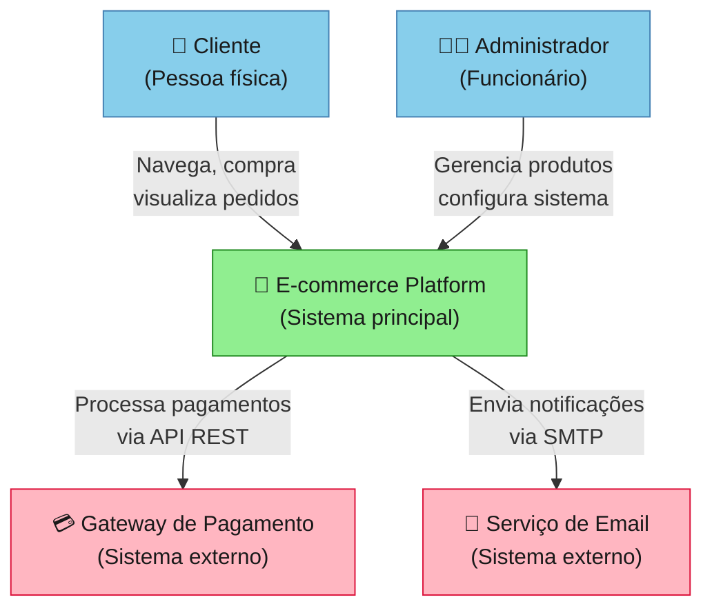
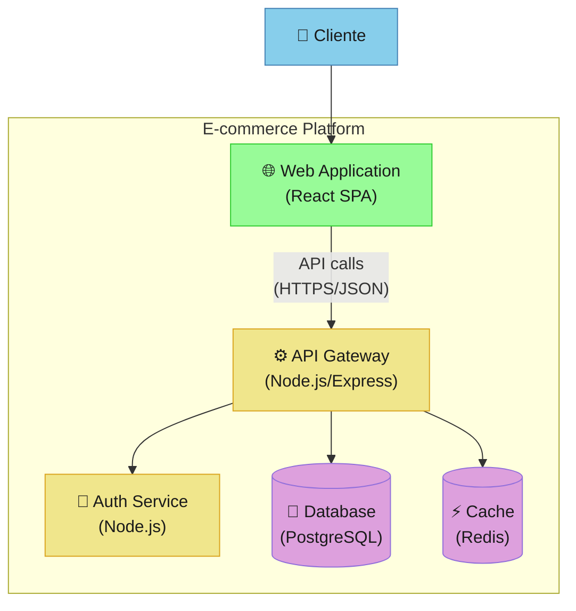
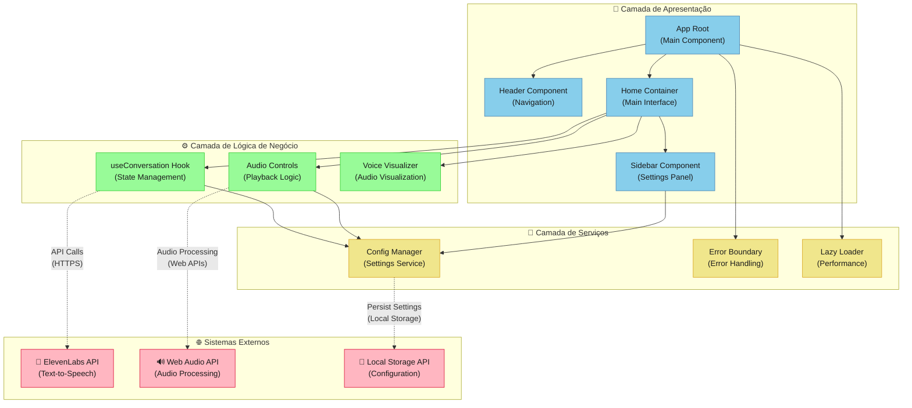
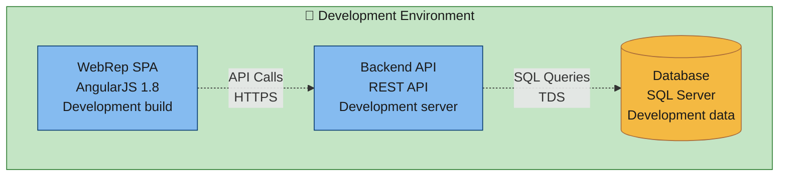
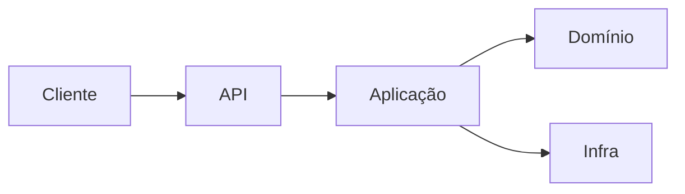
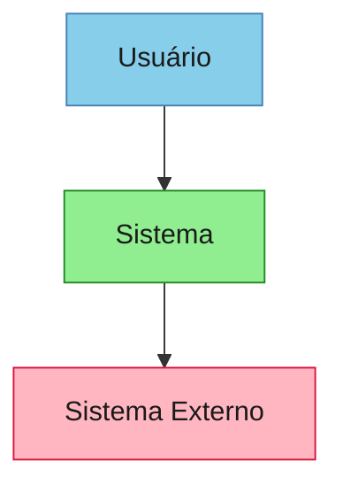
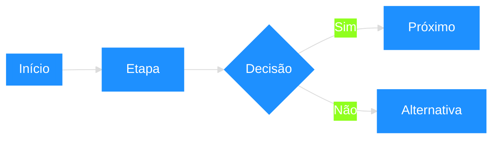
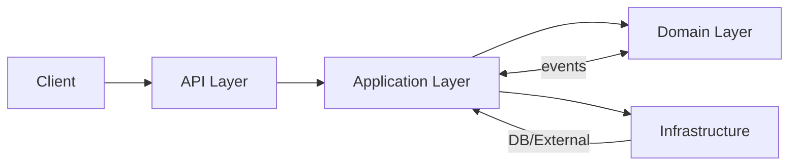
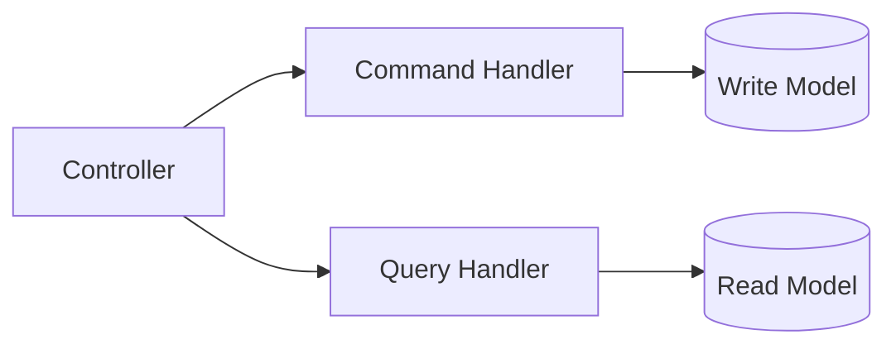
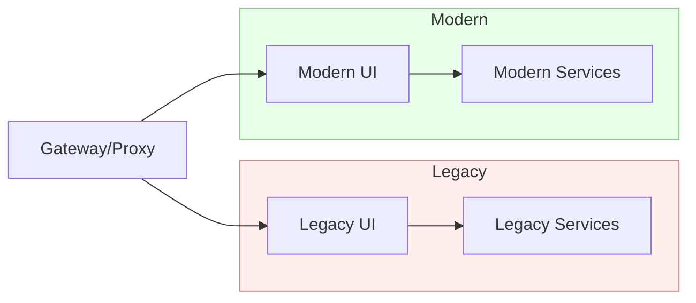

# Global Rules – Regras Gerais para Qualquer Projeto (versão detalhada)

### Sumário

#### 🏗️ **FUNDAMENTOS** (1-12)
- [1) Princípios Production‑First (obrigatórios)](#1-princípios-productionfirst-obrigatórios)
- [2) Qualidade de Código e Padrões](#2-qualidade-de-código-e-padrões)
- [3) Documentação (padrão)](#3-documentação-padrão)
- [4) Arquitetura e Organização](#4-arquitetura-e-organização)
- [5) Estratégias Comprovadas de Resolução de Problemas](#5-estratégias-comprovadas-de-resolução-de-problemas)
- [6) Testes Unificados (Unit + Integration + E2E + NFR)](#6-testes-unificados-unit--integration--e2e--nfr)
- [7) CI/CD e Deploy](#7-cicd-e-deploy)
- [8) Observabilidade Completa (Logs, Métricas, Traces, Dashboards)](#8-observabilidade-completa-logs-métricas-traces-dashboards)
- [9) Segurança (OWASP Top 10 + práticas)](#9-segurança-owasp-top-10--práticas)
- [10) Frontend – Padrões Gerais](#10-frontend--padrões-gerais)
- [11) Modernização de Legacy](#11-modernização-de-legacy)
  - [11.1 Processo de Análise Comparativa](#111-processo-de-análise-comparativa)
  - [11.2 Checklist Executável de Inventário](#112-checklist-executável-de-inventário)
  - [11.3 Regras de Completude](#113-regras-de-completude)
  - [11.4 Processo Integrado e Gates de Qualidade](#114-processo-integrado-e-gates-de-qualidade)
  - [11.5 Análise de Completude Obrigatória em Migrações](#115-análise-de-completude-obrigatória-em-migrações)
  - [11.14 Validação de Migração Frontend (CRÍTICO)](#1114-validação-de-migração-frontend-crítico)
- [12) Padrões para Resolução em Massa (alto ROI)](#12-padrões-para-resolução-em-massa-alto-roi)

#### 🧪 **DESENVOLVIMENTO & QUALIDADE** (13-32)
- [13) Padrões .NET Enterprise (Backend Moderno)](#13-padrões-net-enterprise-backend-moderno)
- [14) SLO/SLI/SLA e Orçamento de Erros](#14-sloslisl-e-orçamento-de-erros)
- [15) Gestão de Incidentes e Postmortem](#15-gestão-de-incidentes-e-postmortem)
- [16) Change Management e Feature Flags](#16-change-management-e-feature-flags)
- [17) Dados, Privacidade e LGPD/GDPR](#17-dados-privacidade-e-lgpdgdpr)
- [18) Design de APIs (REST/GraphQL)](#18-design-de-apis-restgraphql)
- [19) Performance e Caching](#19-performance-e-caching)
- [20) Segurança Avançada](#20-segurança-avançada)
- [21) Frontend – Seções Específicas](#21-frontend--seções-específicas)
- [22) Kubernetes (produção)](#22-kubernetes-produção)
- [23) CI/CD Avançado](#23-cicd-avançado)
- [24) Governança de Repositório](#24-governança-de-repositório)
- [25) ROI, Riscos e Roadmap Técnico](#25-roi-riscos-e-roadmap-técnico)
- [26) Onboarding e Conhecimento](#26-onboarding-e-conhecimento)
- [27) Débito Técnico e Triagem](#27-débito-técnico-e-triagem)
- [28) Multi‑Ambientes e Configuração](#28-multi-ambientes-e-configuração)
- [29) Requisitos Não Funcionais (NFR) e Testes](#29-requisitos-não-funcionais-nfr-e-testes)
- [30) Banco de Dados e Migrações](#30-banco-de-dados-e-migrações)
- [31) Internacionalização (i18n) e Localização (l10n)](#31-internacionalização-i18n-e-localização-l10n)
- [32) CORS e Headers de Segurança](#32-cors-e-headers-de-segurança)

#### 🎨 **FRONTEND & UX** (33-47)
- [33) ADR – Template](#33-adr--template)
- [34) Preservação de Identidade Visual (PIV) – Guia Definitivo](#34-preservação-de-identidade-visual-piv--guia-definitivo)
- [35) Modernização de Legado – Estratégia Completa](#35-modernização-de-legado--estratégia-completa)
- [36) Integrações Externas – Padrões de Resiliência](#36-integrações-externas--padrões-de-resiliência)
- [37) Storybook e Catálogo de Componentes (opcional, recomendado)](#37-storybook-e-catálogo-de-componentes-opcional-recomendado)
- [38) Fluxo de Handoff com Design (Figma)](#38-fluxo-de-handoff-com-design-figma)
- [39) Visual Regression Pipeline](#39-visual-regression-pipeline)
- [40) Performance Visual e UX](#40-performance-visual-e-ux)
- [41) Responsividade Fiel ao Legado](#41-responsividade-fiel-ao-legado)
- [42) Catálogo de Ícones e Ilustrações](#42-catálogo-de-ícones-e-ilustrações)
- [43) Gestão de Assets](#43-gestão-de-assets)
- [44) Template de Aprovação de Mudanças Visuais no PR](#44-template-de-aprovação-de-mudanças-visuais-no-pr)
- [45) Métricas de Preservação Visual](#45-métricas-de-preservação-visual)
- [46) Guia de Nomenclatura de Classes (BEM/Utilitários)](#46-guia-de-nomenclatura-de-classes-bemutilitários)
- [47) Revisões Periódicas de Marca](#47-revisões-periódicas-de-marca)

#### 🔒 **ARQUITETURA & PADRÕES** (48-58)
- [48) Estrutura de Pastas – Boas Práticas](#48-estrutura-de-pastas--boas-práticas)
- [49) SOLID – Aplicação Prática](#49-solid--aplicação-prática)
- [50) DDD – Diretrizes Objetivas](#50-ddd--diretrizes-objetivas)
- [51) CQRS – Padrão Pragmático](#51-cqrs--padrão-pragmático)
- [52) Clean Architecture – Contratos e Fluxo](#52-clean-architecture--contratos-e-fluxo)
- [53) Padrões de Projeto Relevantes](#53-padrões-de-projeto-relevantes)
- [54) Política de Repositórios (Sem Duplicações)](#54-política-de-repositórios-sem-duplicações)
- [55) Lições Aprendidas – Catálogo Resumido (com cross‑refs)](#55-lições-aprendidas--catálogo-resumido-com-crossrefs)
- [56) API Governance e Versionamento](#56-api-governance-e-versionamento)
- [57) Convenções de Commits, Branches e Releases](#57-convenções-de-commits-branches-e-releases)
- [58) Dados de Teste, Mascaramento e Síntese](#58-dados-de-teste-mascaramento-e-síntese)

#### 🚀 **PRODUÇÃO & DEVOPS** (59-70)
- [59) Taxonomia de Erros e Correlação](#59-taxonomia-de-erros-e-correlação)
- [60) FinOps/Cloud Cost Management](#60-finopscloud-cost-management)
- [61) Backup/DR – Política e Testes](#61-backupdr--política-e-testes)
- [62) Regras de Interação (Chat/Agente)](#62-regras-de-interação-chatagente)
- [63) Data Governance e Lineage](#63-data-governance-e-lineage)
- [64) Telemetria de Produto](#64-telemetria-de-produto)
- [65) Dev Environment Padrão](#65-dev-environment-padrão)
- [66) Monorepo vs Polyrepo](#66-monorepo-vs-polyrepo)
- [67) Multi‑Região](#67-multi-região)
- [68) Mobile (se aplicável)](#68-mobile-se-aplicável)
- [69) Acessibilidade em Canais Digitais - Padrões WCAG e Implementação](#69-acessibilidade-em-canais-digitais---padrões-wcag-e-implementação)
- [70) (Seção vazia - reservada)](#70-seção-vazia---reservada)

#### 📋 **DOMÍNIOS ESPECÍFICOS** (71-80)
- [71) AI/ML (se aplicável)](#71-aiml-se-aplicável)
- [72) Política de Licenças](#72-política-de-licenças)
- [73) Mermaid – Padrões de Uso](#73-mermaid--padrões-de-uso)
- [74) Tailwind CSS + SASS – Abordagem Híbrida](#74-tailwind-css--sass--abordagem-híbrida)
- [75) Análise Automatizada de PDFs com MCPs](#75-análise-automatizada-de-pdfs-com-mcps)
- [76) Versões LTS - Política Obrigatória](#76-versões-lts---política-obrigatória)
- [77) Serverless Framework - Padrões AWS Lambda](#77-serverless-framework---padrões-aws-lambda)
- [78) Micro-frontends - Padrões de Federação e Comunicação](#78-micro-frontends---padrões-de-federação-e-comunicação)
- [79) Edge Computing - Estratégias de Distribuição e Cache na Borda](#79-edge-computing---estratégias-de-distribuição-e-cache-na-borda)
- [80) Multi-Cloud - Padrões de Portabilidade e Governança](#80-multi-cloud---padrões-de-portabilidade-e-governança)
- [81) Steering Documents - Governança de Projetos Estratégicos](#81-steering-documents---governança-de-projetos-estratégicos)

## 1) Princípios Production‑First (obrigatórios)
<!-- tags: production, fundamentals, mandatory, configuration, logging, health-checks -->
<!-- category: core-principles -->
<!-- priority: critical -->
<!-- audience: all-developers -->

**Princípios orientadores fundamentais:**
- **Paridade funcional 100% (AS-IS) primeiro**: nenhuma evolução de jornada entra antes de migrar 100% do comportamento atual (funcionalidades, integrações e regras), mesmo com UI/arquitetura modernizadas. Não pode haver perda de capacidade para o usuário final.
- **Contratos claros e estáveis**: APIs e integrações evoluem por contrato (versionado), não por convenção implícita.
- **Qualidade como gate, não como atividade**: builds, testes e validações bloqueiam merge/deploy automaticamente.
- **Observabilidade e reversibilidade**: toda mudança é rastreável (logs/metrics/traces) e reversível (feature flags/rollbacks).
- **Simplicidade intencional**: evite soluções "clever"; priorize clareza, consistência e padronização.

1.1 Configuração por ambiente
- Variáveis de ambiente como fonte de verdade; zero secrets no repositório.
- Validação de configuração no startup (fail‑fast com mensagem clara).

Exemplos:
```ts
// Node/TS
function ensureEnv(name: string): string {
  const v = process.env[name];
  if (!v) throw new Error(`Missing env var ${name}`);
  return v;
}
export const config = {
  NODE_ENV: process.env.NODE_ENV ?? 'development',
  PORT: Number(process.env.PORT ?? 3000),
  DATABASE_URL: ensureEnv('DATABASE_URL'),
  LOG_LEVEL: process.env.LOG_LEVEL ?? 'info'
};
```
```csharp
// .NET
var builder = WebApplication.CreateBuilder(args);
string conn = builder.Configuration["ConnectionStrings:Default"]
  ?? throw new InvalidOperationException("Missing ConnectionStrings:Default");
```

1.2 Logging estruturado
- JSON, correlação (correlationId/requestId), níveis (`error`, `warn`, `info`, `debug`).
- Não vazar dados sensíveis nos logs.

```ts
// Winston
import winston from 'winston';
export const logger = winston.createLogger({
  level: process.env.LOG_LEVEL ?? 'info',
  format: winston.format.combine(
    winston.format.timestamp(),
    winston.format.errors({ stack: true }),
    winston.format.json()
  ),
  transports: [new winston.transports.Console()]
});
```

1.3 Health checks e readiness
- Endpoints `/health` (liveness), `/ready` (readiness) e `/live` quando aplicável.
- Readiness só true após dependências críticas (DB/cache) estarem OK.

1.4 Tratamento de erros
- Taxonomia clara (negócio vs técnica); Problem Details (HTTP APIs).
- Mensagens amigáveis ao cliente; detalhes técnicos nos logs apenas.

1.5 Resiliência: timeouts/retries/backoff/circuit breaker
- Timeouts sensatos (cliente e servidor). Retries com jitter exponencial para idempotentes.
- Circuit breaker para integrações instáveis.

1.6 Rate limiting e segurança transversal
- Rate limit por IP/rota/usuário. Headers de segurança, TLS obrigatório, CORS restritivo.

Checklist rápido (produção)
- [ ] Env validated on startup
- [ ] Logs estruturados + correlação
- [ ] Health/Ready/Live habilitados
- [ ] Timeouts + retries + circuit breaker
- [ ] Rate limiting + CORS + headers segurança
- [ ] Métricas/Traces + dashboards
- [ ] CI/CD com quality gates & scans

## 2) Qualidade de Código e Padrões
<!-- tags: code-quality, standards, typescript, linting, naming-conventions -->
<!-- category: development-standards -->
<!-- priority: high -->
<!-- audience: all-developers -->
2.1 Tipagem e lint
- TypeScript `strict`; evitar `any` genérico; preferir unions/literais.
- ESLint/Prettier/netequivalentes com import/order e path aliases quando aplicável.

2.2 Nomenclatura e coesão
- Funções: verbos; variáveis: substantivos descritivos; componentes puros onde possível.
- Evitar comentários óbvios; documentar o “porquê”.

2.3 Zero simulações
- Evitar placeholders; implementar lógica real; valores configuráveis via env/feature flags.

2.4 Documentação mínima por mudança
- Atualizar README/ADR/guia de uso; diagramas quando houver mudanças arquiteturais.

2.5 Zero Warnings Policy
- **Política obrigatória**: Build limpo = 0 warnings (não apenas 0 erros).
- **Processo de resolução**:
  ```bash
  # Listar warnings
  dotnet build 2>&1 | grep "warning"  # ou npm run build, mvn clean install
  
  # Para cada warning: entender → documentar → resolver → validar
  ```
- **Warnings comuns e soluções**:
  | Warning | Causa | Solução |
  |---------|-------|---------|
  | Nullability | Propriedade não inicializada | Inicializar ou tornar nullable |
  | Unused var | Variável não usada | Usar, remover ou `_` discard |
  | Missing await | Async sem await | Adicionar `await` ou remover `async` |
  | Deprecated | API antiga | Migrar para nova API |
- **Rationale**: Warnings ignorados acumulam débito técnico e mascaram problemas reais.

## 3) Documentação (padrão)
<!-- tags: documentation, readme, adr, diagrams, changelog -->
<!-- category: documentation -->
<!-- priority: medium -->
<!-- audience: all-developers, architects -->
- Documentação viva: README por módulo/feature, ADRs para decisões (ver Seção 35), diagramas atualizados (Mermaid). 
- Padrões resumidos:
  - README por módulo: objetivo, como rodar, dependências, endpoints/rotas, variáveis de ambiente, troubleshooting.
  - ADR curto (Seção 35): contexto → decisão → consequências; 1 ADR por decisão relevante.
  - Comentários de código: explicar “porquê”; evitar comentários óbvios.
  - Diagramas: manter simples e atualizados (fluxos principais e integrações).
  - Change log por release (resumo executivo: riscos, rollback, métricas de sucesso).

Modelos embutidos (inline):

Visual Approval – Checklist
```markdown
# Aprovação de Mudanças Visuais

## Checklist
- [ ] Capturas antes/depois anexadas
- [ ] Impacto em componentes reutilizados listado
- [ ] Aprovação do design/branding anexada
- [ ] Testes visuais passam (link do report)

## Descrição
Explique objetivo, escopo e impacto visual.
```

Gap Analysis – Template
```markdown
# Gap Analysis – {Módulo}

## Escopo
## Fluxos de negócio
## Regras e validações
## Integrações
## UI/Visual (capturas/links)
## Riscos e mitigação
## Plano de migração por fatias
## Métricas de sucesso
```

Migration Plan – Template
```markdown
# Migration Plan – {Módulo}

## Fase 1 (Discovery/ACL)
## Fase 2 (Shadow/Canary)
## Fase 3 (Cutover)
## Fase 4 (Decomission)
## Rollback Plan
## Owners e prazos
```

Tokens – Base (Sass)
```scss
:root {
  /* Brand */
  --brand-primary: #1E90FF;
  --brand-secondary: #FF7A59;
  /* Text */
  --text-primary: #222;  --text-secondary: #555;
  /* Surfaces */
  --surface-base: #fff;  --surface-muted: #f7f7f7;
  /* Border */
  --border-strong: #dcdcdc;
  /* Spacing */
  --space-4: 4px; --space-8: 8px; --space-12: 12px; --space-16: 16px; --space-24: 24px; --space-32: 32px; --space-48: 48px;
  /* Typography */
  --font-family-base: Inter, system-ui, -apple-system, Segoe UI, Roboto, Arial, sans-serif;
  --font-size-14: 14px; --font-size-16: 16px; --font-size-18: 18px;
  --line-height-140: 1.4; --line-height-150: 1.5;
  /* Radius & Shadows */
  --radius-4: 4px; --radius-8: 8px; --radius-12: 12px;
  --shadow-sm: 0 1px 2px rgba(0,0,0,.06);
  --shadow-md: 0 2px 8px rgba(0,0,0,.08);
  --shadow-lg: 0 6px 24px rgba(0,0,0,.12);
}
```

### 3.1) Diagrams as Code – Práticas Obrigatórias
**Princípios fundamentais**
- **Versionamento**: diagramas devem estar no mesmo repositório do código, tratados como artefatos de primeira classe.
- **Descoberta**: estrutura padronizada de pastas e nomenclatura para facilitar localização.
- **Automação**: validação e geração automática via CI/CD pipeline.
- **Sincronização**: diagramas devem ser atualizados junto com mudanças de código.

**3.1.1 Estrutura de pastas obrigatória**
```
/docs/
  /architecture/
    /c4-model/
      /01-system-context/
        - overview-v1.md
        - integrations-v2.md
      /02-containers/
        - [service-name]-containers-v1.md
      /03-components/
        - [service-name]-[component]-v1.md
    /flows/
      - [business-process]-flow-v1.md
    /deployment/
      - [environment]-deployment-v1.md
```

**3.1.2 Convenções de nomenclatura**
- **Arquivos**: `[nivel/tipo]-[contexto]-[versao].md` (ex: `01-system-context-v2.md`)
- **Elementos**: Ver seção 4.1.6 para convenções completas de nomenclatura de elementos de diagrama
- **Versionamento**: incremental (v1, v2, v3) para mudanças significativas

**3.1.3 Metadados obrigatórios**
Todo diagrama deve incluir header com:
```markdown
---
title: "[Título do Diagrama]"
version: "v1.0"
date: "2025-01-15"
author: "[Nome do Autor]"
reviewer: "[Nome do Revisor]"
status: "draft|review|approved|deprecated"
last_updated: "2025-01-15"
related_code: "[links para código relevante]"
---
```

**3.1.4 Integração com código**
- **Comentários bidirecionais**: código deve referenciar diagramas relevantes
- **Links automáticos**: usar ferramentas para detectar mudanças que afetam diagramas
- **Validação**: pipeline deve verificar se diagramas estão atualizados após mudanças arquiteturais

**3.1.5 Ferramentas e automação**
- **Mermaid**: ferramenta principal para diagramas (integração nativa com GitHub/GitLab)
- **PlantUML**: alternativa para diagramas mais complexos (C4-PlantUML)
- **Validação CI/CD**: 
  ```yaml
  - name: Validate Mermaid Diagrams
    run: |
      npm install -g @mermaid-js/mermaid-cli
      find docs/ -name "*.md" -exec mmdc -i {} -o /tmp/validation.png \;
  ```
- **Geração automática**: converter .md para PNG/SVG em releases
- **Notificações**: alertar equipe quando diagramas ficam desatualizados

**3.1.6 Responsabilidades e governança**
- **Responsabilidades específicas**: ver seção 4.1.5 para ownership detalhado por tipo de diagrama
- **Auditoria geral**: revisão trimestral de diagramas órfãos ou desatualizados em todo o repositório

## 4) Arquitetura e Organização
<!-- tags: architecture, organization, clean-architecture, ddd, cqrs, solid -->
<!-- category: architecture -->
<!-- priority: high -->
<!-- audience: architects, senior-developers -->
- Modularidade por domínio/feature; dependências para interfaces/abstrações.
- DDD/CQRS quando houver ganho: entidades ricas, value objects, eventos; queries otimizadas (ver [Seção 52 - DDD](#52-ddd--diretrizes-objetivas) e [Seção 53 - CQRS](#53-cqrs--padrão-pragmático)).
- Separação de camadas (Domain/Application/Infra/API) em backends enterprise (ver [Seção 54 - Clean Architecture](#54-clean-architecture--contratos-e-fluxo)).
- Observabilidade cross‑cutting (logging, métricas, tracing) integrada desde o início (ver [Seção 8 - Observabilidade](#8-observabilidade-logs-métricas-traces)).
- Padrões SOLID aplicados consistentemente (ver [Seção 51 - SOLID](#51-solid--aplicação-prática)).

### 4.1) C4 Model – Padrão de Documentação Arquitetural
4.1.1 Princípios fundamentais
- **Hierarquia de abstração**: 4 níveis progressivos de detalhamento (System Context → Container → Component → Code).
- **Diagrams as Code**: diagramas versionados junto com o código, tratados como artefatos de primeira classe.
- **Padronização visual**: convenções de cores, formas e nomenclatura consistentes em toda a organização.
- **Manutenibilidade**: diagramas atualizados automaticamente ou com responsabilidades claras de manutenção.

4.1.2 Níveis do C4 Model
**Nível 1 - System Context (Contexto do Sistema)**
- **Objetivo**: visão geral do sistema e suas interações com usuários e sistemas externos.
- **Audiência**: stakeholders, product owners, arquitetos de solução.
- **Elementos**: sistema principal, usuários (personas), sistemas externos.
- **Quando usar**: documentação inicial, apresentações executivas, onboarding de novos membros.

**Nível 2 - Container (Contêineres)**
- **Objetivo**: decomposição do sistema em contêineres executáveis (aplicações, bancos, serviços).
- **Audiência**: arquitetos, tech leads, desenvolvedores sênior.
- **Elementos**: aplicações web, APIs, bancos de dados, message brokers, CDNs.
- **Quando usar**: planejamento de deployment, definição de responsabilidades de equipes.

**Nível 3 - Component (Componentes)**
- **Objetivo**: estrutura interna de cada contêiner, mostrando componentes e suas interações.
- **Audiência**: desenvolvedores, arquitetos de software.
- **Elementos**: controllers, services, repositories, facades, adapters.
- **Quando usar**: design detalhado, code reviews, refatorações arquiteturais.

**Nível 4 - Code (Código)**
- **Objetivo**: implementação específica de componentes críticos (classes, interfaces, métodos).
- **Audiência**: desenvolvedores trabalhando no componente específico.
- **Elementos**: classes, interfaces, enums, métodos principais.
- **Quando usar**: raramente necessário; apenas para lógicas complexas ou críticas.

4.1.3 Implementação com Mermaid
**System Context - Exemplo**


**Container - Exemplo**


4.1.4 Convenções obrigatórias
**Nomenclatura**
- Sistemas: `PascalCase` (ex: `EcommercePlatform`, `PaymentGateway`)
- Contêineres: `PascalCase + Tipo` (ex: `WebApplication`, `ApiGateway`, `UserDatabase`)
- Componentes: `PascalCase` (ex: `UserController`, `PaymentService`, `ProductRepository`)
- Relacionamentos: verbos no presente (ex: "envia", "consulta", "armazena")

**Cores padronizadas**
- Pessoas/Atores: `#87CEEB` (azul claro)
- Sistema principal: `#90EE90` (verde claro)
- Sistemas externos: `#FFB6C1` (rosa claro)
- Web Applications: `#98FB98` (verde menta)
- APIs/Services: `#F0E68C` (amarelo claro)
- Databases: `#DDA0DD` (roxo claro)
- **Texto sempre**: `color:#1a1a1a` para legibilidade

**Ícones recomendados**
- Pessoas: 👤, 👨‍💼, 👩‍💻
- Web: 🌐, 💻, 📱
- APIs: ⚙️, 🔧, 🛠️
- Databases: 💾, 🗄️, 📊
- Segurança: 🔐, 🛡️, 🔑
- Comunicação: 📧, 📞, 💬

4.1.5 Responsabilidades e manutenção
**Ownership por nível**
- **System Context**: Arquiteto de Solução + Product Owner
  - **Responsabilidades**: definir escopo do sistema, identificar stakeholders, mapear integrações externas
  - **Frequência de revisão**: trimestral ou quando há mudanças de negócio significativas
  - **Critérios de atualização**: novos sistemas externos, mudanças de personas, alterações de escopo

- **Container**: Tech Lead + Arquiteto de Software
  - **Responsabilidades**: definir arquitetura de deployment, tecnologias, protocolos de comunicação
  - **Frequência de revisão**: a cada release major ou mudança arquitetural
  - **Critérios de atualização**: novos serviços, mudanças de tecnologia, alterações de deployment

- **Component**: Desenvolvedores Sênior da equipe
  - **Responsabilidades**: estrutura interna dos serviços, padrões de design, interfaces
  - **Frequência de revisão**: a cada sprint ou refatoração significativa
  - **Critérios de atualização**: novos componentes, mudanças de responsabilidades, refatorações

- **Code**: Desenvolvedor responsável pelo componente
  - **Responsabilidades**: implementação específica, apenas para componentes críticos
  - **Frequência de revisão**: conforme necessário, raramente usado
  - **Critérios de atualização**: mudanças em lógicas complexas ou algoritmos críticos

**Templates obrigatórios por nível**

**Template System Context**
```markdown
# System Context - [Nome do Sistema]

## Metadados
- **Versão**: v1.0
- **Data**: [YYYY-MM-DD]
- **Autor**: [Nome]
- **Revisor**: [Arquiteto de Solução]
- **Status**: draft|approved|deprecated

## Descrição
[Propósito do sistema em 2-3 frases]

## Stakeholders
### Usuários Primários
- **[Persona]**: [Descrição do papel e necessidades]

### Usuários Secundários
- **[Persona]**: [Descrição do papel e necessidades]

### Sistemas Externos
- **[Sistema]**: [Propósito da integração]

## Diagrama
[Mermaid diagram aqui]

## Fluxos Principais
1. **[Fluxo]**: [Descrição]
2. **[Fluxo]**: [Descrição]

## Integrações
| Sistema | Protocolo | Dados | Frequência |
|---------|-----------|-------|------------|
| [Nome] | [REST/SOAP/etc] | [Tipo] | [Tempo real/Batch] |

## Próximos Passos
- [ ] Definir containers (Nível 2)
- [ ] Validar com stakeholders
```

**Template Container**
```markdown
# Container Diagram - [Nome do Sistema]

## Metadados
- **Versão**: v1.0
- **Data**: [YYYY-MM-DD]
- **Autor**: [Nome]
- **Revisor**: [Tech Lead]
- **Status**: draft|approved|deprecated
- **Relacionado**: [Link para System Context]

## Arquitetura
[Descrição da estratégia arquitetural]

## Containers
### [Nome do Container]
- **Tipo**: Web App|API|Database|Service
- **Tecnologia**: [Stack tecnológico]
- **Responsabilidades**: [O que faz]
- **Dados**: [Que dados manipula]
- **Escalabilidade**: [Estratégia de escala]

## Diagrama
[Mermaid diagram aqui]

## Protocolos de Comunicação
| De | Para | Protocolo | Formato | Autenticação |
|----|------|-----------|---------|-------------|
| [Container] | [Container] | [HTTP/gRPC/etc] | [JSON/XML] | [JWT/OAuth] |

## Deployment
- **Ambiente**: [Docker/K8s/VM]
- **Dependências**: [Serviços externos]
- **Configuração**: [Variáveis de ambiente]

## Próximos Passos
- [ ] Definir componentes internos (Nível 3)
- [ ] Validar com equipe de desenvolvimento
```

**Template Component**
```markdown
# Component Diagram - [Nome do Container]

## Metadados
- **Versão**: v1.0
- **Data**: [YYYY-MM-DD]
- **Autor**: [Nome]
- **Revisor**: [Desenvolvedor Sênior]
- **Status**: draft|approved|deprecated
- **Relacionado**: [Link para Container Diagram]

## Arquitetura Interna
[Padrões arquiteturais utilizados: MVC, Clean Architecture, etc.]

## Componentes
### [Nome do Componente]
- **Tipo**: Controller|Service|Repository|Adapter
- **Responsabilidades**: [O que faz]
- **Dependências**: [Outros componentes]
- **Interfaces**: [Contratos expostos]

## Diagrama
[Mermaid diagram aqui]

## Fluxo de Dados
1. **[Entrada]** → [Componente] → [Processamento] → **[Saída]**

## Padrões Implementados
- **[Padrão]**: [Como é usado]

## Testes
- **Unitários**: [Cobertura por componente]
- **Integração**: [Testes entre componentes]

## Próximos Passos
- [ ] Implementar componentes
- [ ] Definir testes
- [ ] Code review
```

**Component - Exemplo (Padrão Melhorado)**


**Observações importantes sobre o padrão Component:**
- **Uso de `flowchart TB`**: O Mermaid não possui suporte nativo para `C4Component`, então utilizamos `flowchart TB` (Top-Bottom) com subgraphs para organizar por camadas arquiteturais.
- **Organização em camadas**: Separação clara entre Apresentação, Lógica de Negócio e Serviços para melhor legibilidade.
- **Cores diferenciadas**: Cada camada possui uma cor específica para facilitar a identificação visual.
- **Relacionamentos claros**: Linhas sólidas para dependências internas e pontilhadas para integrações externas.
- **Nomenclatura consistente**: Componentes seguem padrão PascalCase com descrição funcional.

**Padrões visuais obrigatórios para diagramas C4 Component:**

*Paleta de cores por camada (obrigatória)*
```css
/* Sistemas Externos */
--external-fill: #FFB6C1;      /* Rosa claro */
--external-stroke: #DC143C;    /* Vermelho */

/* Camada de Apresentação */
--presentation-fill: #87CEEB;  /* Azul claro */
--presentation-stroke: #4682B4; /* Azul médio */

/* Camada de Lógica de Negócio */
--business-fill: #98FB98;      /* Verde menta */
--business-stroke: #32CD32;    /* Verde lima */

/* Camada de Serviços */
--service-fill: #F0E68C;       /* Amarelo claro */
--service-stroke: #DAA520;     /* Dourado */

/* Texto (sempre obrigatório) */
--text-color: #1a1a1a;         /* Preto suave para legibilidade */
```

*Tipos de setas e relacionamentos*
- **Setas sólidas (`-->`)**: Dependências diretas entre componentes internos
- **Setas pontilhadas (`-.->`)**: Integrações com sistemas externos ou APIs
- **Labels nas setas**: Formato `"Ação\nvia Protocolo"` (ex: `"API Calls\n(HTTPS)"`)

*Nomenclatura de componentes*
- **Formato**: `[NomeComponente]\n([Descrição Funcional])`
- **Exemplos**: `"App Root\n(Main Component)"`, `"Config Manager\n(Settings Service)"`
- **Subgraphs**: `[Emoji] [Nome da Camada]` (ex: `"📱 Camada de Apresentação"`)

*Aplicação das classes CSS no Mermaid*
```mermaid
classDef external fill:#FFB6C1,stroke:#DC143C,color:#1a1a1a
classDef presentation fill:#87CEEB,stroke:#4682B4,color:#1a1a1a
classDef business fill:#98FB98,stroke:#32CD32,color:#1a1a1a
classDef service fill:#F0E68C,stroke:#DAA520,color:#1a1a1a

class ComponenteExterno1,ComponenteExterno2 external
class ComponenteApresentacao1,ComponenteApresentacao2 presentation
class ComponenteNegocio1,ComponenteNegocio2 business
class ComponenteServico1,ComponenteServico2 service
```

4.1.6 Convenções de nomenclatura e padrões visuais
**Nomenclatura obrigatória**

*Elementos do diagrama*
- **Pessoas/Atores**: `[Emoji] [Papel/Persona]\n([Descrição breve])`
  - Exemplos: `👤 Cliente\n(Pessoa física)`, `👨‍💼 Administrador\n(Funcionário interno)`

- **Sistemas**: `[Emoji] [Nome do Sistema]\n([Propósito principal])`
  - Exemplos: `📱 E-commerce Platform\n(Sistema de vendas online)`, `🔗 Payment Gateway\n(Sistema externo)`

- **Containers**: `[Emoji] [Nome + Tipo]\n([Tecnologia])`
  - Exemplos: `🌐 Web Application\n(React SPA)`, `⚙️ API Gateway\n(Node.js/Express)`

- **Componentes**: `[Nome][Tipo]` (sem emoji, mais limpo)
  - Exemplos: `UserController`, `PaymentService`, `ProductRepository`

*Relacionamentos*
- **Formato**: `"[Ação/Verbo]\nvia [Protocolo/Meio]"`
- **Exemplos**: 
  - `"Navega e compra\nvia HTTPS"`
  - `"Processa pagamentos\nvia API REST"`
  - `"Envia notificações\nvia SMTP"`

**Paleta de cores padronizada**

*Cores primárias (obrigatórias)*
```css
/* Pessoas/Atores */
--person-fill: #87CEEB;     /* Azul claro */
--person-stroke: #4682B4;   /* Azul médio */

/* Sistema principal */
--system-fill: #90EE90;     /* Verde claro */
--system-stroke: #228B22;   /* Verde escuro */

/* Sistemas externos */
--external-fill: #FFB6C1;   /* Rosa claro */
--external-stroke: #DC143C; /* Vermelho */

/* Web Applications */
--webapp-fill: #98FB98;     /* Verde menta */
--webapp-stroke: #32CD32;   /* Verde lima */

/* APIs/Services */
--service-fill: #F0E68C;    /* Amarelo claro */
--service-stroke: #DAA520;  /* Dourado */

/* Databases */
--database-fill: #DDA0DD;   /* Roxo claro */
--database-stroke: #9370DB; /* Roxo médio */

/* Texto (sempre) */
--text-color: #1a1a1a;      /* Preto suave */
```

*Cores secundárias (opcionais)*
```css
/* Message Brokers */
--broker-fill: #FFA07A;     /* Salmão */
--broker-stroke: #FF6347;   /* Tomate */

/* Cache/Storage */
--cache-fill: #20B2AA;      /* Verde água */
--cache-stroke: #008B8B;    /* Ciano escuro */

/* Security/Auth */
--security-fill: #FFD700;   /* Dourado */
--security-stroke: #FFA500; /* Laranja */

/* Monitoring */
--monitoring-fill: #D3D3D3; /* Cinza claro */
--monitoring-stroke: #A9A9A9; /* Cinza escuro */
```

**Ícones padronizados por categoria**

*Pessoas e Atores*
- 👤 Usuário genérico
- 👨‍💼 Administrador/Funcionário
- 👩‍💻 Desenvolvedor/Técnico
- 🏢 Sistema corporativo
- 🌐 Usuário externo

*Aplicações e Interfaces*
- 🌐 Web Application
- 📱 Mobile App
- 💻 Desktop App
- 🖥️ Admin Panel
- 📊 Dashboard

*Serviços e APIs*
- ⚙️ API Gateway
- 🔧 Microservice
- 🛠️ Background Service
- 🔄 Message Broker
- 📡 Event Bus

*Dados e Armazenamento*
- 💾 Database
- 🗄️ Data Warehouse
- 📊 Analytics DB
- ⚡ Cache (Redis)
- 📁 File Storage

*Segurança e Autenticação*
- 🔐 Auth Service
- 🛡️ Security Gateway
- 🔑 Key Management
- 🎫 Token Service
- 🔒 Encryption

*Comunicação e Integração*
- 📧 Email Service
- 📞 SMS Service
- 💬 Chat/Messaging
- 🔗 External API
- 🌉 Integration Bridge

**Regras de aplicação**
1. **Consistência**: usar sempre os mesmos ícones para os mesmos tipos de componentes
2. **Legibilidade**: texto sempre em `#1a1a1a` para contraste adequado
3. **Hierarquia**: cores mais vibrantes para elementos principais, mais suaves para secundários
4. **Acessibilidade**: verificar contraste mínimo de 4.5:1 entre texto e fundo
5. **Documentação**: manter guia de cores e ícones atualizado no repositório

**Governança e auditoria**
- **Revisão trimestral**: verificar diagramas órfãos ou desatualizados
- **Métricas de qualidade**: % de diagramas atualizados, tempo médio de atualização
- **Automação**: alertas quando código muda sem atualizar diagramas relacionados
- **Treinamento**: onboarding obrigatório sobre C4 para novos desenvolvedores
- **Style guide**: manter documento com exemplos visuais das convenções
- **Code**: Desenvolvedor responsável pelo componente

**Critérios de atualização**
- Mudanças arquiteturais significativas (novos serviços, integrações)
- Alterações em fluxos de dados críticos
- Refatorações que impactem múltiplos componentes
- Onboarding de novos membros da equipe
- Reviews trimestrais de arquitetura

**Templates obrigatórios**
- Cada nível deve ter template padrão no repositório
- Validação automática de sintaxe Mermaid no CI/CD
- Links para diagramas atualizados no README principal
- Versionamento junto com releases do sistema

## 5) Estratégias Comprovadas de Resolução de Problemas
5.1 Protocolos de segurança (mudanças massivas)
- Backup/checkpoint antes; validação incremental (lint/build/test) a cada passo.
- Limite de regressão: ≤ 10 novos erros; acima disso, rollback automático.

5.2 Análise de frequência e concentração
- Priorize top 3 tipos de erro por contagem; ataque arquivos com ≥ 3 ocorrências (efeito cascata).

5.3 Padrões de alto ROI (genéricos)
- Ordem de argumentos incorreta em construtores/métodos (corrige vários errors de conversão).
- Comparações com sentinelas incorretas (use `null`/`default` quando apropriado, não “mágicos”).
- Conversão de value objects → primitivos esperados (e.g., `.Value`/`.ToString()`/`.ToNumber()`).
- Eliminar duplicações de repositórios/contratos (interface + base concreta).

## 6) Testes Unificados (Unit + Integration + E2E + NFR)
<!-- tags: testing, unit-tests, integration-tests, e2e, nfr, quality-assurance -->
<!-- category: testing -->
<!-- priority: high -->
<!-- audience: developers, qa-engineers -->

### 6.1 Pirâmide de Testes e Estratégia
- **Unit (70%)**: rápidos, puros, isolados; mocks para dependências externas
- **Integration (20%)**: com DB/serviços reais; validação de contratos
- **E2E (10%)**: fluxos críticos de negócio; cenários happy path + edge cases principais
- **NFR**: performance, segurança, caos engineering (executados periodicamente)

### 6.2 Testes Unitários
- **Cobertura mínima**: 80% para código novo, 60% para legacy
- **Padrões**: AAA (Arrange/Act/Assert), nomes descritivos, um assert por teste
- **Mocks**: usar para I/O, APIs externas, tempo; evitar over-mocking
- **Ferramentas**: Jest/Vitest (JS/TS), xUnit (.NET), JUnit (Java)

### 6.3 Testes de Integração
- **Escopo**: APIs + DB, message queues, file system
- **Dados**: seeds controlados, transações rollback, containers isolados
- **Contratos**: Pact/OpenAPI para fronteiras entre serviços
- **Performance**: timeouts adequados, cleanup automático

### 6.4 Testes E2E (End-to-End)
- **Ferramentas**: Playwright (recomendado), Cypress, Selenium
- **Cenários mínimos**: login, fluxo principal, checkout/transação
- **Determinismo**: aguardar elementos, fixar dados de teste, evitar flakiness
- **Artefatos**: screenshots, traces, vídeos em falhas
- **Ambientes**: staging dedicado, dados sintéticos

### 6.5 Testes de NFR (Não Funcionais)
- **Performance**: k6, JMeter, Artillery para load/stress testing
- **Segurança**: OWASP ZAP, Burp Suite, análise estática (SAST)
- **Chaos Engineering**: Chaos Mesh, Gremlin para resiliência
- **Acessibilidade**: axe-core, Lighthouse CI

### 6.6 Dados de Teste
- **Estratégia**: fixtures versionadas, factories, builders pattern
- **Isolamento**: cada teste com dados próprios, cleanup automático
- **Mascaramento**: PII/PHI mascarados em ambientes não-produção
- **Síntese**: dados sintéticos para volume, ferramentas como Faker.js

### 6.7 CI/CD e Quality Gates
- **Pipeline**: lint → unit → integration → build → security → e2e → deploy
- **Gates obrigatórios**: cobertura ≥80% (unit), ≥60% (integration), zero vulnerabilidades críticas
- **Paralelização**: testes independentes, matrix builds por navegador/OS
- **Relatórios**: HTML reports, métricas de tendência, alertas de regressão

### 6.8 Checklist de Implementação
- [ ] Pirâmide de testes implementada (70/20/10)
- [ ] Cobertura de código ≥80% para novo código
- [ ] Testes de contrato para APIs públicas (ver [Seção 18 - Design de APIs](#18-design-de-apis-restgraphql))
- [ ] E2E para fluxos críticos de negócio
- [ ] Dados de teste isolados e determinísticos (ver [Seção 60 - Dados de Teste](#60-dados-de-teste-mascaramento-e-síntese))
- [ ] Pipeline com quality gates automáticos (ver [Seção 7 - CI/CD](#7-cicd-e-deploy))
- [ ] Relatórios de teste integrados ao CI/CD
- [ ] Testes de performance em staging (ver [Seção 19 - Performance](#19-performance-e-caching))
- [ ] Monitoramento de flakiness e tempo de execução (ver [Seção 8 - Observabilidade](#8-observabilidade-logs-métricas-traces))
- [ ] Testes de segurança automatizados (ver [Seção 9 - Segurança](#9-segurança-owasp-top-10--práticas))

### 6.9 Testes Isolados Executáveis
**Objetivo**: Validar componentes de forma independente ANTES de integrar ao sistema principal.

**Estrutura obrigatória**:
```
TestProject/
├── TestProject.csproj (ou package.json)
├── appsettings.json (configuração própria)
├── Program.cs (ou index.ts)
└── README.md (como executar)
```

**Características essenciais**:
- ✅ **Executável**: `dotnet run` ou `npm start` funciona standalone
- ✅ **Independente**: Não depende de outros sistemas/serviços
- ✅ **Configurável**: appsettings/env próprio
- ✅ **Verboso**: Logs detalhados com emojis (ver [Seção 8.1.4](#814-padrão-de-logs-com-emojis))
- ✅ **Validador**: Verifica resultados automaticamente

**Template mínimo**:
```csharp
// C# Console Test
Console.WriteLine("🔄 Iniciando teste...");

// 1. Setup
var config = LoadConfig();
var component = CreateComponent(config);

// 2. Execução
var startTime = DateTime.UtcNow;
var result = await component.ExecuteAsync();
var duration = (DateTime.UtcNow - startTime).TotalSeconds;

// 3. Validação
if (!result.IsSuccess)
    throw new Exception($"❌ Falha: {result.Error}");

// 4. Métricas
Console.WriteLine($"✅ Sucesso!");
Console.WriteLine($"📊 Itens processados: {result.Count}");
Console.WriteLine($"⏱️ Duração: {duration:F2}s");
```

**Quando usar**:
- Validar refatorações antes de integrar
- Testar componentes com dependências externas (DB, APIs)
- Debugging de problemas complexos
- Demonstração de funcionalidades para stakeholders

## 7) CI/CD e Deploy
7.1 Pipeline padrão (ex.: GitHub Actions)
- Jobs: lint → testes unit/integration → build → security scans (SCA/CodeQL) → e2e (opcional) → build artifacts → deploy.

Exemplo (resumo):
```yaml
name: CI
on: [push, pull_request]
jobs:
  lint_test:
    runs-on: ubuntu-latest
    steps:
      - uses: actions/checkout@v4
      - uses: actions/setup-node@v4
        with: { node-version: 20 }
      - run: npm ci
      - run: npm run lint && npm run test -- --coverage
  build:
    needs: lint_test
    runs-on: ubuntu-latest
    steps:
      - uses: actions/checkout@v4
      - run: npm ci && npm run build
```

6.2 Deploy
- Zero‑downtime (blue‑green/rolling), health checks e rollback automático.
- Infra como código (Docker/Kubernetes/Terraform) quando aplicável.

6.3 Quality Gates (Automáticos e Obrigatórios)
- **Princípio fundamental**: qualidade como gate, não como atividade. Builds, testes e validações bloqueiam merge/deploy automaticamente.
- **Gates obrigatórios que bloqueiam pipeline**:
  - Cobertura de testes ≥ 80% (unit) e ≥ 60% (integration)
  - Zero vulnerabilidades críticas/altas (SAST/SCA)
  - Complexidade ciclomática ≤ 10 por método
  - Performance: build time ≤ 10min, testes ≤ 5min
  - Lint/formatting: zero warnings em código novo
  - Testes de contrato passando (APIs)
  - Smoke tests em ambiente de staging
- **Políticas de exceção**: apenas com aprovação formal (change control) e plano de mitigação documentado.
- **Métricas de qualidade**: dashboards públicos com trends de cobertura, vulnerabilidades e tempo de build por equipe/repositório.

## 8) Observabilidade Completa (Logs, Métricas, Traces, Dashboards)
<!-- tags: observability, logging, metrics, tracing, monitoring, dashboards -->
<!-- category: observability -->
<!-- priority: high -->
<!-- audience: developers, sre, devops -->

### 8.1 Logs estruturados

**8.1.1 Formato e metadados obrigatórios**
- **Formato**: JSON estruturado com campos padronizados.
- **Metadados essenciais**: `timestamp`, `level`, `service`, `version`, `environment`, `correlationId`, `userId` (quando aplicável).
- **Segurança**: NUNCA logar dados sensíveis (senhas, tokens, PII); usar mascaramento quando necessário.

**8.1.2 Níveis de log**
- `ERROR`: falhas que impedem operação; sempre incluir stack trace.
- `WARN`: situações anômalas que não impedem operação; degradação de performance.
- `INFO`: eventos importantes de negócio; início/fim de operações críticas.
- `DEBUG`: informações detalhadas para troubleshooting; apenas em desenvolvimento/staging.

**8.1.3 Exemplo de implementação**
```ts
// Node.js/TypeScript com Winston
import winston from 'winston';

const logger = winston.createLogger({
  level: process.env.LOG_LEVEL || 'info',
  format: winston.format.combine(
    winston.format.timestamp(),
    winston.format.errors({ stack: true }),
    winston.format.json()
  ),
  defaultMeta: {
    service: process.env.SERVICE_NAME || 'unknown',
    version: process.env.SERVICE_VERSION || '1.0.0',
    environment: process.env.NODE_ENV || 'development'
  },
  transports: [new winston.transports.Console()]
});

// Uso com correlação
function logWithCorrelation(correlationId: string, level: string, message: string, meta?: any) {
  logger.log(level, message, { correlationId, ...meta });
}
```

**8.1.4 Padrão de Logs com Emojis**
**Objetivo**: Facilitar identificação visual rápida de logs em ambientes de desenvolvimento e troubleshooting.

**Padrão obrigatório**:
```csharp
// C# / .NET
_logger.LogInformation("🔄 [Componente] Iniciando processamento");
_logger.LogInformation("📊 [Componente] {Count} itens processados", count);
_logger.LogDebug("ℹ️ [Componente] Detalhe: {Detail}", detail);
_logger.LogInformation("✅ [Componente] Concluído! Duração: {Duration:F2}s", duration);
_logger.LogWarning("⚠️ [Componente] Atenção: {Message}", msg);
_logger.LogError(ex, "❌ [Componente] Erro ao processar: {Item}", item);
```

```typescript
// TypeScript / Node.js
logger.info("🔄 [Component] Starting process");
logger.info(`📊 [Component] ${count} items processed`);
logger.debug(`ℹ️ [Component] Detail: ${detail}`);
logger.info(`✅ [Component] Completed! Duration: ${duration}s`);
logger.warn(`⚠️ [Component] Warning: ${msg}`);
logger.error(`❌ [Component] Error processing: ${item}`, { error });
```

**Conjunto padronizado de emojis**:
| Emoji | Uso | Nível |
|-------|-----|-------|
| 🔄 | Início de operação | INFO |
| ✅ | Sucesso/Conclusão | INFO |
| ❌ | Erro/Falha | ERROR |
| ⚠️ | Aviso/Atenção | WARN |
| 📊 | Métricas/Contadores | INFO |
| ⏱️ | Duração/Performance | INFO |
| ℹ️ | Informação detalhada | DEBUG |
| 🔍 | Busca/Query | DEBUG |
| 💾 | Operação de dados/DB | DEBUG |
| 🌐 | Chamada HTTP/API externa | DEBUG |

**Rationale**: Emojis melhoram scan visual em logs extensos, especialmente útil em desenvolvimento e debugging. Em produção, logs estruturados JSON permitem filtragem programática.

### 8.2 Métricas (RED/USE/SLI)

**8.2.1 Metodologias de métricas**
- **RED (Request-based)**: Rate (req/s), Errors (%), Duration (latência p50/p95/p99).
- **USE (Resource-based)**: Utilization (%), Saturation (queue depth), Errors (count).
- **SLI/SLO**: Service Level Indicators e Objectives para medir confiabilidade.

**8.2.2 Métricas obrigatórias por camada**
- **API/HTTP**: request rate, response time, error rate, status codes.
- **Database**: query time, connection pool usage, slow queries, deadlocks.
- **Cache**: hit rate, miss rate, eviction rate, memory usage.
- **Business**: conversões, transações, usuários ativos, revenue impact.

**8.2.3 Implementação com Prometheus**
```ts
// Node.js com prom-client
import { register, Counter, Histogram, Gauge } from 'prom-client';

// Métricas RED para HTTP
const httpRequestsTotal = new Counter({
  name: 'http_requests_total',
  help: 'Total HTTP requests',
  labelNames: ['method', 'route', 'status_code']
});

const httpRequestDuration = new Histogram({
  name: 'http_request_duration_seconds',
  help: 'HTTP request duration',
  labelNames: ['method', 'route'],
  buckets: [0.1, 0.5, 1, 2, 5]
});

// Métricas de negócio
const activeUsers = new Gauge({
  name: 'active_users_total',
  help: 'Currently active users'
});

// Middleware para coleta automática
function metricsMiddleware(req: Request, res: Response, next: NextFunction) {
  const start = Date.now();
  
  res.on('finish', () => {
    const duration = (Date.now() - start) / 1000;
    httpRequestsTotal.inc({ 
      method: req.method, 
      route: req.route?.path || 'unknown', 
      status_code: res.statusCode 
    });
    httpRequestDuration.observe({ 
      method: req.method, 
      route: req.route?.path || 'unknown' 
    }, duration);
  });
  
  next();
}
```

### 8.3 Tracing distribuído

**8.3.1 OpenTelemetry setup**
- **Propagação de contexto**: trace ID e span ID através de serviços.
- **Spans críticos**: operações de I/O, chamadas de API, queries de banco.
- **Sampling**: 100% em desenvolvimento, 1-10% em produção (ajustar conforme volume).

**8.3.2 Implementação**
```ts
import { trace, context, SpanStatusCode } from '@opentelemetry/api';
import { NodeSDK } from '@opentelemetry/sdk-node';
import { JaegerExporter } from '@opentelemetry/exporter-jaeger';

// Configuração do SDK
const sdk = new NodeSDK({
  traceExporter: new JaegerExporter({
    endpoint: process.env.JAEGER_ENDPOINT || 'http://localhost:14268/api/traces'
  }),
  serviceName: process.env.SERVICE_NAME || 'unknown-service'
});

sdk.start();

// Uso em operações críticas
const tracer = trace.getTracer('yourproject');

async function processOrder(orderId: string) {
  const span = tracer.startSpan('process_order', {
    attributes: { 'order.id': orderId }
  });
  
  try {
    // Operação crítica
    const order = await getOrder(orderId);
    span.setAttributes({ 'order.amount': order.amount });
    
    const result = await processPayment(order);
    span.setStatus({ code: SpanStatusCode.OK });
    return result;
  } catch (error) {
    span.recordException(error as Error);
    span.setStatus({ code: SpanStatusCode.ERROR, message: (error as Error).message });
    throw error;
  } finally {
    span.end();
  }
}
```

### 8.4 Dashboards e alertas

**8.4.1 Tipos de dashboards**
- **Executive**: KPIs de negócio, SLOs, revenue impact, user satisfaction.
- **Operational**: RED/USE metrics, error rates, performance trends.
- **Infrastructure**: CPU, memory, disk, network por serviço/pod.
- **Security**: tentativas de login, rate limiting, anomalias de acesso.

**8.4.2 Alertas inteligentes**
- **Multinível**: INFO (FYI), WARN (investigar), CRITICAL (ação imediata).
- **Anti-fatigue**: agrupamento por janela de tempo, supressão de duplicatas.
- **Runbooks**: cada alerta deve ter procedimento de resolução documentado.

**8.4.3 Exemplo de configuração Grafana + Prometheus**
```yaml
# prometheus.yml
global:
  scrape_interval: 15s
  evaluation_interval: 15s

rule_files:
  - "alert_rules.yml"

scrape_configs:
  - job_name: 'yourproject-api'
    static_configs:
      - targets: ['localhost:3000']
    metrics_path: '/metrics'
    scrape_interval: 5s

alerting:
  alertmanagers:
    - static_configs:
        - targets: ['localhost:9093']
```

```yaml
# alert_rules.yml
groups:
  - name: yourproject.rules
    rules:
      - alert: HighErrorRate
        expr: rate(http_requests_total{status_code=~"5.."}[5m]) > 0.1
        for: 2m
        labels:
          severity: critical
        annotations:
          summary: "High error rate detected"
          description: "Error rate is {{ $value }} errors per second"
          runbook_url: "https://wiki.company.com/runbooks/high-error-rate"
      
      - alert: HighLatency
        expr: histogram_quantile(0.95, rate(http_request_duration_seconds_bucket[5m])) > 2
        for: 5m
        labels:
          severity: warning
        annotations:
          summary: "High latency detected"
          description: "95th percentile latency is {{ $value }}s"
```

### 8.5 Correlação e troubleshooting

**8.5.1 Correlation ID**
- **Geração**: UUID v4 no ponto de entrada (API Gateway/Load Balancer).
- **Propagação**: header `X-Correlation-ID` em todas as chamadas internas.
- **Logging**: incluir em todos os logs para rastreabilidade fim-a-fim.

**8.5.2 Distributed tracing correlation**
- **Trace ID**: identificador único para toda a transação.
- **Span ID**: identificador único para cada operação dentro da transação.
- **Baggage**: metadados propagados através de spans (usar com moderação).

### 8.6 Checklist de implementação
- [ ] Logs estruturados em JSON com metadados obrigatórios (ver [Seção 1 - Production-First](#1-princípios-productionfirst-obrigatórios))
- [ ] Métricas RED/USE expostas para Prometheus
- [ ] Tracing distribuído com OpenTelemetry
- [ ] Dashboards por audiência (exec, ops, infra, security)
- [ ] Alertas com runbooks e anti-fatigue (ver [Seção 15 - Gestão de Incidentes](#15-gestão-de-incidentes-e-postmortem))
- [ ] Correlation ID em todas as transações (ver [Seção 61 - Taxonomia de Erros](#61-taxonomia-de-erros-e-correlação))
- [ ] SLIs/SLOs definidos e monitorados (ver [Seção 14 - SLO/SLI/SLA](#14-sloslisl-e-orçamento-de-erros))
- [ ] Retenção de dados configurada (logs 30d, métricas 1y, traces 7d)
- [ ] Testes de observabilidade em CI/CD (ver [Seção 6 - Testes](#6-testes-unificados-unit--integration--e2e--nfr))
- [ ] Integração com ferramentas de performance (ver [Seção 19 - Performance](#19-performance-e-caching))

## 9) Segurança (OWASP Top 10 + práticas)
<!-- tags: security, owasp, authentication, authorization, encryption -->
<!-- category: security -->
<!-- priority: critical -->
<!-- audience: all-developers, security-engineers -->
- **Controle de acesso**: autorização por função/escopo; princípio do menor privilégio.
- **Criptografia**: TLS 1.2+; dados sensíveis em repouso (KMS/Vault); rotação de chaves.
- **Injeção**: ORMs/parametrização; nunca concatenar SQL; validação de inputs.
- **Configuração segura**: headers (CSP, HSTS, XFO, XSS), CORS restrito, cookies `HttpOnly/Secure` (ver [Seção 34 - CORS e Headers](#34-cors-e-headers-de-segurança)).
- **Componentes vulneráveis**: SCA em pipeline; CVEs críticos bloqueiam deploy (ver [Seção 7 - CI/CD](#7-cicd-e-deploy)).
- **Autenticação**: MFA/2FA quando aplicável; proteção contra brute force (rate limit/lockout).
- **Segurança avançada**: consulte [Seção 20 - Segurança Avançada](#20-segurança-avançada) para práticas específicas.
- **Dados e privacidade**: ver [Seção 17 - LGPD/GDPR](#17-dados-privacidade-e-lgpdgdpr) para compliance.

Checklist segurança rápida
- [ ] Inputs saneados e validados
- [ ] Secrets fora do código (env/secret manager)
- [ ] TLS/headers/hardening aplicados
- [ ] Rate limit e detecção de abuso
- [ ] Scans automáticos (SCA/DAST) e correções

## 10) Frontend – Padrões Gerais
**Nota**: Para padrões específicos de React/Angular, consulte [Seção 21 - Frontend Específico](#21-frontend--seções-específicas).

10.1 Arquitetura
- Rotas lazy; ErrorBoundary/Suspense (ou equivalentes) para quedas e carregamentos.
- Split por features; colocation de componentes/hooks/estilos.

10.2 Estado
- Hooks/signals/observables; memos para valores derivados; evitar duplicação de estado.

10.3 Formulários e validação
- RHF/Formik/etc + Zod/Yup; mensagens consistentes; máscaras quando necessário.

10.4 Acessibilidade (A11y)
- Semântica (landmarks/headings), `label/htmlFor`, foco visível, navegação por teclado, contrastes.

10.5 Performance
- Memoização criteriosa, virtualização (listas grandes), imagens otimizadas, code splitting (ver [Seção 19 - Performance](#19-performance-e-caching)).

10.6 Estilos
- Tokens (CSS vars), Sass modular, utilitários (`nx-stack-*`, `nx-row-*`), resets e temas via data‑attributes.
- **Abordagem híbrida**: Para projetos modernos, consulte [Seção 74 - Tailwind CSS + SASS](#74-tailwind-css--sass--abordagem-híbrida) sobre integração Tailwind CSS + SASS.
- **Preservação visual**: ver [Seção 36 - PIV](#36-preservação-de-identidade-visual-piv--guia-definitivo) para manter consistência de marca.

## 11) Modernização de Legacy
- **Inventário completo**: código, assets, integrações, jobs, configs, bancos.
- **Preservação de identidade visual/UX**; modernizar implementação técnica (ver [Seção 36 - PIV](#36-preservação-de-identidade-visual-piv--guia-definitivo)).
- **Estratégia incremental**: priorize alto valor/baixo risco; feature flags e paralelização (ver [Seção 16 - Feature Flags](#16-change-management-e-feature-flags)).
- **KPIs de modernização**: dívida técnica, custo de manutenção, performance, segurança.
- **Estratégia completa**: consulte [Seção 37 - Modernização de Legado](#37-modernização-de-legado--estratégia-completa) para abordagem detalhada.
- **Débito técnico**: ver [Seção 27 - Débito Técnico](#27-débito-técnico-e-triagem) para gestão sistemática.

### 11.1 Processo de Análise Comparativa
- **Análise exaustiva obrigatória**: mapear 100% dos componentes antes de iniciar implementação.
- **Gaps críticos identificados**: autenticação completa, jobs complexos, cache distribuído, notificações.
- **Plano de migração em fases**: Crítico (imediato) → Alto impacto (1-2 sprints) → Médio impacto (2-3 sprints) → Melhorias (3-4 sprints).
- **Riscos mapeados**: perda de funcionalidade, segurança incompleta, performance degradada.
- **Métricas de sucesso**: 100% funcionalidades migradas, performance igual/superior, zero downtime.

### 11.2 Checklist Executável de Inventário
- **Comandos automatizados**: use `find` e `grep` para inventário sistemático de controllers, services, jobs, componentes.
- **Estatísticas obrigatórias**: contar arquivos de código, configuração, frontend por categoria.
- **Análise de padrões críticos**: autenticação, jobs background, cache, integrações externas, notificações.
- **Documentação de gaps**: cada componente não migrado deve ter análise completa de impacto.
- **Validação cruzada**: confirmar achados por múltiplas fontes antes de prosseguir.

#### **11.2.5 Validação de Completude (OBRIGATÓRIO)**
- [ ] Análise de completude executada conforme Seção 11.5
- [ ] Relatório de gaps documentado e aprovado
- [ ] Teste de independência operacional realizado
- [ ] Roadmap de migração definido para itens pendentes

### 11.3 Regras de Completude
- **Princípio fundamental**: 0% de componentes esquecidos através de análise exaustiva.
- **Inventário por camadas**: Backend (controllers, services, jobs), Frontend (components, guards, pipes), Infraestrutura (cache, logging, config), Integrações (APIs, webhooks, notificações).
- **Busca sistemática obrigatória**: executar comandos específicos para cada padrão (interfaces, DI, jobs, middlewares, validações).
- **Análise de dependências**: mapear cross-references, componentes órfãos, registros de DI/IoC.
- **Gate de completude**: todos os itens do checklist devem estar ✅ antes de considerar análise completa.

### 11.4 Processo Integrado e Gates de Qualidade
- **Fluxo em 3 fases**: Preparação (1-2 dias) → Análise Profunda (3-5 dias) → Validação e Aprovação (1-2 dias).
- **Artefatos obrigatórios**: análise comparativa, evidências técnicas, documentação de gaps, aprovações formais.
- **Critérios de qualidade**: Completude (100% obrigatório), Precisão (validação cruzada), Rastreabilidade (gaps linkados ao código).
- **Gates obrigatórios**: Gate 1 (Inventário Completo), Gate 2 (Gaps Documentados), Gate 3 (Aprovações Coletadas), Gate 4 (Completude Validation).
- **Sign-offs necessários**: aprovação técnica (arquiteto), validação de negócio (PO), estratégia de testes (QA).

#### **Gate 4: Completude Validation**
**Critério:** Análise de completude obrigatória antes de declarar migração funcional
**Artefatos:** Relatório de completude, gap analysis, teste de independência
**Aprovação:** Arquiteto de Solução + Tech Lead
**Bloqueio:** Migração não pode ser declarada funcional sem este gate

### 11.4.1 Estratégias de Preservação Funcional
**Princípio fundamental**: Paridade funcional 100% (AS-IS) antes de qualquer evolução.

**Controles de paridade obrigatórios**:
- **Inventário funcional completo**: mapear todas as funcionalidades, regras de negócio, validações e integrações
- **Migração incremental**: implementar por módulos/features com validação contínua
- **Validação rigorosa**: testes automatizados comparando comportamento legacy vs moderno
- **Preservação de UX/UI**: manter experiência do usuário idêntica durante migração
- **Rollback garantido**: capacidade de reverter para sistema legacy a qualquer momento

**Ferramentas de validação**:
```bash
# Comparação de endpoints
curl -s legacy.com/api/users | jq . > legacy_response.json
curl -s modern.com/api/users | jq . > modern_response.json
diff legacy_response.json modern_response.json

# Validação de performance
ab -n 1000 -c 10 legacy.com/api/endpoint
ab -n 1000 -c 10 modern.com/api/endpoint
```

**Métricas de preservação**:
- **Funcionalidade**: 100% das features migradas sem perda
- **Performance**: tempo de resposta ≤ sistema legacy
- **Disponibilidade**: uptime ≥ 99.9% durante migração
- **Dados**: 0% de perda ou corrupção de dados
- **Integração**: 100% das integrações funcionando

### 11.5 Análise de Completude Obrigatória em Migrações
<!-- tags: migration, completeness-analysis, gap-analysis, legacy-modernization -->
<!-- category: migration-governance -->
<!-- priority: critical -->
<!-- audience: architects, tech-leads, developers -->

**Princípios fundamentais:**
- **Análise ANTES da declaração**: Nenhuma migração pode ser declarada "funcional" ou "completa" sem análise de completude detalhada.
- **Inventário obrigatório**: Mapeamento completo de módulos/funcionalidades legado vs moderno.
- **Teste de independência**: Sistema moderno deve ser testado sem dependência do legado.
- **Documentação de gaps**: Todos os módulos não migrados devem ser documentados com impacto de negócio.

#### **11.5.1 Checklist de Completude Obrigatório**

**ANTES de declarar qualquer migração como "funcional":**

**📊 Inventário Completo**
- [ ] Lista completa de módulos/serviços do sistema legado
- [ ] Lista completa de módulos/serviços do sistema moderno  
- [ ] Mapeamento 1:1 entre legado e moderno
- [ ] Identificação de módulos não migrados com justificativa

**🔍 Gap Analysis Detalhado**
- [ ] Análise funcional por módulo (CRUD, regras de negócio, validações)
- [ ] Análise de integrações externas (APIs, sistemas terceiros)
- [ ] Análise de jobs/processamento em background
- [ ] Análise de configurações e parametrizações

**🧪 Teste de Independência Operacional**
- [ ] Sistema moderno funciona 100% sem o legado
- [ ] Todos os fluxos críticos de negócio funcionam
- [ ] Integrações externas funcionam via sistema moderno
- [ ] Jobs críticos executam no sistema moderno

**📋 Documentação de Impacto**
- [ ] Lista de funcionalidades não migradas com impacto de negócio
- [ ] Roadmap de migração para módulos restantes
- [ ] Plano de contingência/rollback
- [ ] Métricas de sucesso definidas

#### **11.5.2 Processo de Validação**

**Etapa 1: Descoberta Automática**
```bash
# Exemplo de comandos para análise
find legacy/src -name "*.cs" -type f | grep -E "(Controller|Service|Job)" | wc -l
find modern/src -name "*.cs" -type f | grep -E "(Controller|Service|Job)" | wc -l

# Análise de endpoints
grep -r "Route\|HttpGet\|HttpPost" legacy/src --include="*.cs" | wc -l
grep -r "Route\|HttpGet\|HttpPost" modern/src --include="*.cs" | wc -l
```

**Etapa 2: Análise Semântica**
- Usar ferramentas de busca semântica para identificar funcionalidades
- Comparar estruturas de pastas e namespaces
- Analisar dependências e referências entre módulos

**Etapa 3: Validação Funcional**
- Testes de integração end-to-end
- Validação de regras de negócio críticas
- Teste de performance comparativa

**Etapa 4: Documentação Obrigatória**
- Relatório de completude com percentuais
- Lista detalhada de gaps identificados
- Roadmap de migração para itens restantes

#### **11.5.3 Templates Obrigatórios**

**Template: Relatório de Completude**
```markdown
# Relatório de Completude - [Sistema/Módulo]

## Resumo Executivo
- **Percentual Migrado:** X% (Y de Z módulos)
- **Status Operacional:** [Independente/Dependente do Legado]
- **Módulos Críticos Pendentes:** [Lista]

## Inventário Detalhado
### Módulos Migrados (X)
- [Lista com status funcional]

### Módulos NÃO Migrados (Y)
- [Lista com impacto de negócio e prioridade]

## Análise de Impacto
### Funcionalidades Críticas Pendentes
- [Lista com impacto operacional]

### Integrações Pendentes
- [Lista com sistemas afetados]

## Roadmap de Migração
### Fase 1 - Crítico (prazo)
### Fase 2 - Importante (prazo)
### Fase 3 - Complementar (prazo)

## Riscos e Mitigações
## Métricas de Sucesso
```

**Template: Gap Analysis**
```markdown
# Gap Analysis - [Módulo/Sistema]

## Escopo da Análise
## Metodologia Utilizada
## Funcionalidades Mapeadas
### Legado: [Lista detalhada]
### Moderno: [Lista detalhada]
### Gaps Identificados: [Lista com impacto]

## Regras de Negócio
### Migradas: [Lista]
### Pendentes: [Lista com complexidade]

## Integrações
### Migradas: [Lista]
### Pendentes: [Lista com dependências]

## Recomendações
### Prioridade Alta: [Lista]
### Prioridade Média: [Lista]
### Prioridade Baixa: [Lista]
```

#### **11.5.4 Critérios de Aprovação**

**Para declarar migração como "FUNCIONAL":**
- ✅ Completude ≥ 95% dos módulos críticos
- ✅ Sistema opera independentemente do legado
- ✅ Todos os fluxos de negócio principais funcionam
- ✅ Performance igual ou superior ao legado

**Para declarar migração como "COMPLETA":**
- ✅ Completude = 100% de todos os módulos
- ✅ Sistema legado pode ser descomissionado
- ✅ Documentação completa e atualizada
- ✅ Equipe treinada no novo sistema

#### **11.5.5 Responsabilidades**

**Arquiteto de Solução:**
- Definir escopo da análise de completude
- Validar metodologia e critérios
- Aprovar relatórios de completude

**Tech Lead:**
- Executar análise detalhada de gaps
- Coordenar testes de independência
- Manter documentação atualizada

**Desenvolvedor:**
- Implementar checklist de completude
- Documentar gaps identificados durante desenvolvimento
- Executar testes funcionais comparativos

#### **11.5.6 Ferramentas Recomendadas**

**Análise Automática:**
- Scripts de comparação de estruturas
- Ferramentas de análise estática de código
- Comparadores de APIs (Swagger diff)

**Documentação:**
- Templates padronizados (Markdown)
- Diagramas de arquitetura (Mermaid)
- Dashboards de progresso

**Validação:**
- Testes de integração automatizados
- Ferramentas de performance testing
- Monitoramento comparativo

### 11.6 Migration Analysis Automation
**Objetivo**: Automatizar análise de progresso e geração de relatórios de migração.

**Scripts padrão obrigatórios**:
```bash
#!/bin/bash
# migration-inventory.sh - Análise automatizada de componentes

echo "=== INVENTÁRIO LEGACY ==="
echo "Controllers: $(find ./legacy -name '*.cs' -path '*/Controllers/*' | wc -l)"
echo "Services: $(find ./legacy -name '*.cs' -path '*/Services/*' | wc -l)"
echo "Entities: $(find ./legacy -name '*.cs' -path '*/Entities/*' | wc -l)"
echo "Views: $(find ./legacy -name '*.cshtml' | wc -l)"

echo "\n=== INVENTÁRIO MODERNO ==="
echo "Controllers: $(find ./modern -name '*.cs' -path '*/Controllers/*' | wc -l)"
echo "Components: $(find ./modern -name '*.component.ts' | wc -l)"
echo "Services: $(find ./modern -name '*.service.ts' | wc -l)"
echo "Guards: $(find ./modern -name '*.guard.ts' | wc -l)"

# Gap Analysis Automatizado
./scripts/migration-gap-analysis.sh
./scripts/generate-migration-report.sh
```

**Ferramentas avançadas de automação**:
```bash
#!/bin/bash
# migration-progress-tracker.sh - Tracking automatizado de progresso

# Análise de cobertura de migração
echo "=== ANÁLISE DE COBERTURA ==="
legacy_endpoints=$(grep -r "@RequestMapping\|@GetMapping\|@PostMapping" ./legacy | wc -l)
modern_endpoints=$(grep -r "@GetMapping\|@PostMapping\|@PutMapping" ./modern | wc -l)
coverage=$((modern_endpoints * 100 / legacy_endpoints))
echo "Cobertura de endpoints: $coverage% ($modern_endpoints/$legacy_endpoints)"

# Análise de complexidade
echo "\n=== ANÁLISE DE COMPLEXIDADE ==="
find ./legacy -name "*.cs" -exec wc -l {} + | sort -n | tail -10
echo "\nArquivos mais complexos identificados para priorização"

# Detecção de dependências críticas
echo "\n=== DEPENDÊNCIAS CRÍTICAS ==="
grep -r "@Autowired\|@Inject" ./legacy | cut -d: -f1 | sort | uniq -c | sort -nr

# Geração de relatório JSON para dashboards
cat > migration-progress.json << EOF
{
  "timestamp": "$(date -Iseconds)",
  "legacy_components": $legacy_endpoints,
  "modern_components": $modern_endpoints,
  "coverage_percentage": $coverage,
  "risk_level": "$([ $coverage -lt 50 ] && echo 'HIGH' || echo 'MEDIUM')"
}
EOF
```

**Dashboard de progresso automatizado**:
```typescript
// migration-dashboard.ts - Dashboard em tempo real
interface MigrationMetrics {
  timestamp: string;
  legacyComponents: number;
  modernComponents: number;
  coveragePercentage: number;
  riskLevel: 'LOW' | 'MEDIUM' | 'HIGH';
  blockers: string[];
}

class MigrationTracker {
  async generateReport(): Promise<MigrationMetrics> {
    const legacyCount = await this.countLegacyComponents();
    const modernCount = await this.countModernComponents();
    const coverage = (modernCount / legacyCount) * 100;
    
    return {
      timestamp: new Date().toISOString(),
      legacyComponents: legacyCount,
      modernComponents: modernCount,
      coveragePercentage: Math.round(coverage),
      riskLevel: coverage < 50 ? 'HIGH' : coverage < 80 ? 'MEDIUM' : 'LOW',
      blockers: await this.identifyBlockers()
    };
  }
  
  async identifyBlockers(): Promise<string[]> {
    // Análise automatizada de bloqueadores
    const blockers = [];
    
    // Verificar dependências não migradas
    const unmigrated = await this.findUnmigratedDependencies();
    if (unmigrated.length > 0) {
      blockers.push(`${unmigrated.length} dependências críticas não migradas`);
    }
    
    // Verificar testes faltantes
    const testCoverage = await this.calculateTestCoverage();
    if (testCoverage < 80) {
      blockers.push(`Cobertura de testes baixa: ${testCoverage}%`);
    }
    
    return blockers;
  }
}
```

**Estrutura de automação obrigatória**:
```
/migration-artifacts/
  /scripts/
    - inventory-legacy.sh
    - inventory-modern.sh
    - gap-analysis.sh
    - progress-report.sh
    - risk-assessment.sh
  /templates/
    - migration-status-report.md
    - module-analysis.md
    - risk-assessment.md
  /automation/
    - migration-tracker.ts
    - quality-gates.yml
    - progress-dashboard.html
```

### 11.7 Database-First Legacy Preservation
**Contexto**: Estratégia específica para preservação total de bases legadas durante modernização, sem migração de dados.

**11.7.1 Princípios fundamentais**
- **NUNCA migrar dados**: Base legada permanece como fonte de verdade
- **Zero alterações no schema**: Nenhuma modificação estrutural na base existente
- **Compatibilidade 100%**: Sistema moderno consome dados exatamente como estão
- **Database-First obrigatório**: Gerar modelos a partir do schema existente

**11.7.2 Estratégia de acesso Database-First**
```csharp
// REGRA: Sempre usar Entity Framework Database-First
// Gerar modelos a partir do schema existente
Scaffold-DbContext "ConnectionString" Microsoft.EntityFrameworkCore.SqlServer -OutputDir Models/Legacy -Force

// REGRA: Modelos legados são imutáveis
[Table("AirportsWeatherMinimums")] // Nome exato da tabela legada
public partial class LegacyAirportsWeatherMinimum
{
    // Propriedades geradas automaticamente - NÃO MODIFICAR
    public int Id { get; set; }
    public string AirportICAO { get; set; }
    public string AirportIATA { get; set; }
    public decimal? VisibilityMinimum { get; set; }
    public decimal? CeilingMinimum { get; set; }
    // ... outras propriedades geradas
}
```

**11.6.3 Nomenclatura obrigatória**
- **Modelos legados**: Prefixo `Legacy` + nome original da entidade
- **Adapters**: Sufixo `Adapter` (ex: `AirportWeatherMinimumAdapter`)
- **Repositories híbridos**: Prefixo `Hybrid` + nome da entidade + `Repository`
- **Controllers híbridos**: Prefixo `Hybrid` + nome da entidade + `Controller`

**11.6.4 Anti-Corruption Layer (ACL) obrigatório**
```csharp
public interface I{Entity}Adapter
{
    // Conversão legado → moderno
    Modern{Entity} AdaptFromLegacy(Legacy{Entity} legacy);
    
    // Conversão moderno → legado (para persistência)
    Legacy{Entity} AdaptToLegacy(Modern{Entity} modern);
    
    // Validação de integridade
    ValidationResult ValidateAdaptation(Legacy{Entity} legacy, Modern{Entity} modern);
    
    // Backup para auditoria
    string SerializeForBackup(Legacy{Entity} legacy);
}

// Implementação com preservação de dados originais
public class AirportWeatherMinimumAdapter : I{Entity}Adapter
{
    public ModernAirportWeatherMinimum AdaptFromLegacy(LegacyAirportsWeatherMinimum legacy)
    {
        return new ModernAirportWeatherMinimum
        {
            // Preservar dados originais
            LegacyId = legacy.Id,
            LegacyData = JsonSerializer.Serialize(legacy),
            
            // Campos adaptados
            AirportCode = legacy.AirportICAO ?? legacy.AirportIATA,
            WeatherMinimums = AdaptWeatherData(legacy),
            
            // Metadados de adaptação
            AdaptedAt = DateTime.UtcNow,
            AdaptationVersion = "1.0"
        };
    }
}
```

**11.6.5 Regras de mapeamento**
- **Campos obrigatórios**: Todos os campos legados devem ser mapeados, mesmo que nulos
- **Preservação de tipos**: Manter tipos originais quando possível
- **Campos calculados**: Criar propriedades calculadas no modelo moderno, não alterar legado
- **Relacionamentos**: Preservar FKs legadas, criar navegação no modelo moderno
- **Auditoria**: Sempre preservar dados originais + metadados de adaptação

**11.6.6 Padrões avançados de ACL**
```csharp
// PADRÃO: Interface base reutilizável para todos os adapters
public abstract class BaseEntityAdapter<TLegacy, TModern> : IEntityAdapter<TLegacy, TModern>
    where TLegacy : class
    where TModern : class
{
    protected readonly ILogger<BaseEntityAdapter<TLegacy, TModern>> _logger;
    protected readonly IMetricsCollector _metrics;
    
    public virtual TModern AdaptFromLegacy(TLegacy legacy)
    {
        using var activity = _metrics.StartActivity("adaptation.from_legacy");
        
        try
        {
            // Validação de entrada
            if (!CanAdapt(legacy))
            {
                throw new AdaptationException($"Cannot adapt legacy entity: {typeof(TLegacy).Name}");
            }
            
            // Adaptação específica (implementada pela classe filha)
            var modern = DoAdaptFromLegacy(legacy);
            
            // Validação de saída
            var validation = ValidateAdaptation(legacy, modern);
            if (!validation.IsValid)
            {
                _logger.LogWarning("Adaptation validation failed: {Errors}", 
                    string.Join(", ", validation.Errors));
            }
            
            // Métricas
            _metrics.IncrementCounter("adaptation.success");
            
            return modern;
        }
        catch (Exception ex)
        {
            _metrics.IncrementCounter("adaptation.error");
            _logger.LogError(ex, "Failed to adapt legacy entity");
            throw;
        }
    }
    
    // Método abstrato para implementação específica
    protected abstract TModern DoAdaptFromLegacy(TLegacy legacy);
    protected abstract TLegacy DoAdaptToLegacy(TModern modern);
}

// PADRÃO: Mapeamento com transformação e validação
public class WeatherMinimumAdapter : BaseEntityAdapter<LegacyWeatherMinimum, ModernWeatherMinimum>
{
    protected override ModernWeatherMinimum DoAdaptFromLegacy(LegacyWeatherMinimum legacy)
    {
        return new ModernWeatherMinimum
        {
            // Transformação de unidades
            VisibilityMeters = ConvertVisibilityToMeters(legacy.VisibilityMiles),
            
            // Normalização de dados
            AirportCode = NormalizeAirportCode(legacy.AirportICAO, legacy.AirportIATA),
            
            // Enriquecimento com dados calculados
            WeatherCategory = CalculateWeatherCategory(legacy),
            
            // Preservação do estado original
            OriginalValues = new Dictionary<string, object>
            {
                ["VisibilityMiles"] = legacy.VisibilityMiles,
                ["AirportICAO"] = legacy.AirportICAO,
                ["AirportIATA"] = legacy.AirportIATA
            },
            
            // Metadados obrigatórios
            LegacyId = legacy.Id,
            LegacyData = JsonSerializer.Serialize(legacy),
            AdaptedAt = DateTime.UtcNow,
            AdaptationVersion = "1.0"
        };
    }
}

// PADRÃO: Validação de integridade obrigatória
public class DataIntegrityValidation
{
    public ValidationResult ValidateAdaptation(LegacyEntity legacy, ModernEntity modern)
    {
        var result = new ValidationResult();
        
        // Validação de campos obrigatórios
        if (legacy.Id != modern.LegacyId)
        {
            result.AddError("Legacy ID must be preserved");
        }
        
        if (string.IsNullOrEmpty(modern.LegacyData))
        {
            result.AddError("Legacy data backup is required");
        }
        
        // Validação de round-trip (ida e volta)
        var roundTripLegacy = AdaptToLegacy(modern);
        var roundTripResult = CompareEntities(legacy, roundTripLegacy);
        
        if (!roundTripResult.IsIdentical)
        {
            result.AddError("Round-trip validation failed");
        }
        
        return result;
    }
}
```

### 11.7 Migration Tracking Standards
**Objetivo**: Padronizar formato de relatórios e métricas de progresso.

**Template obrigatório - Migration Status Report**:
```markdown
# Migration Status Report - [Projeto] - [Data]

## 📊 Métricas Quantitativas
- **Backend Legacy:** X controllers, Y services, Z entities
- **Backend Moderno:** X controllers, Y services, Z entities
- **Frontend Legacy:** X views, Y scripts
- **Frontend Moderno:** X components, Y services, Z guards
- **Progresso Geral:** X% concluído (baseado em contagem de componentes)

## 🎯 Status por Módulo
- ✅ **[Módulo A]:** Funcional (backend + frontend completos)
- 🟡 **[Módulo B]:** Backend pronto, frontend em desenvolvimento
- 🔴 **[Módulo C]:** Não iniciado - aguardando dependências

## 🚀 Próximas Prioridades
1. **[Módulo]** - [Justificativa de prioridade] - [Prazo estimado]
2. **[Módulo]** - [Justificativa de prioridade] - [Prazo estimado]
3. **[Módulo]** - [Justificativa de prioridade] - [Prazo estimado]

## ⚠️ Riscos e Bloqueadores
- **[Risco]** - Impacto: [Alto/Médio/Baixo] - Mitigação: [Ação]
- **[Bloqueador]** - Owner: [Responsável] - Prazo: [Data]

## 📈 Métricas de Qualidade
- **Cobertura de Testes:** X% (meta: >= 80%)
- **Performance:** X ms (meta: <= Y ms)
- **Bugs Críticos:** X (meta: 0)
- **Debt Técnico:** X pontos (tendência: ↓)
```

**Cadência de relatórios**:
- **Daily**: Status de bloqueadores (Slack/Teams)
- **Weekly**: Relatório completo de progresso
- **Bi-weekly**: Revisão de riscos e replanejamento
- **Monthly**: Apresentação executiva para stakeholders

### 11.7 Migration Quality Gates
**Objetivo**: Estabelecer gates automáticos obrigatórios para cada fase da migração.

**Gates obrigatórios por fase**:
```yaml
# quality-gates.yml - Configuração de Gates Automáticos

Phase_1_Discovery:
  required_artifacts:
    - legacy_inventory_complete: true
    - modern_inventory_complete: true
    - gap_analysis_documented: true
    - migration_plan_approved: true
    - risk_assessment_complete: true
  metrics:
    - inventory_accuracy: ">= 95%"
    - stakeholder_approval: true

Phase_2_Implementation:
  required_tests:
    - unit_tests_coverage: ">= 80%"
    - integration_tests_passing: true
    - functional_parity_validated: true
    - performance_benchmarks_met: true
  quality_checks:
    - code_review_approved: true
    - security_scan_passed: true
    - accessibility_validated: true

Phase_3_Validation:
  acceptance_criteria:
    - user_acceptance_complete: true
    - rollback_plan_tested: true
    - monitoring_configured: true
    - documentation_updated: true
    - training_completed: true
  go_live_requirements:
    - stakeholder_signoff: true
    - support_team_ready: true
    - incident_response_plan: true
```

**Automação de gates**:
```bash
#!/bin/bash
# validate-migration-gate.sh

PHASE=$1
GATE_CONFIG="quality-gates.yml"

case $PHASE in
  "discovery")
    echo "Validating Discovery Gate..."
    # Verificar artefatos obrigatórios
    ;;
  "implementation")
    echo "Validating Implementation Gate..."
    # Executar testes e validações
    ;;
  "validation")
    echo "Validating Go-Live Gate..."
    # Verificar critérios de aceitação
    ;;
esac
```

### 11.9 Automated Compatibility Validation
**Objetivo**: Garantir compatibilidade funcional entre sistemas legados e modernos através de validação automatizada.

**11.9.1 Princípios fundamentais**
- **Validação contínua**: Testes de compatibilidade executados a cada build/deploy
- **Cobertura completa**: Validar APIs, dados, comportamentos e integrações
- **Feedback rápido**: Falhas de compatibilidade detectadas em < 5 minutos
- **Rastreabilidade**: Logs detalhados de todas as validações para auditoria

**11.9.2 Schema Validation Pipeline**
```typescript
// compatibility-validator.ts - Pipeline de validação automatizada

interface ValidationConfig {
  legacyEndpoint: string;
  modernEndpoint: string;
  testCases: TestCase[];
  tolerances: ValidationTolerances;
  notifications: NotificationConfig;
}

interface ValidationTolerances {
  responseTimeDifferenceMs: number;
  numericPrecisionDigits: number;
  allowedMissingFields: string[];
  dateFormatVariations: string[];
}

class CompatibilityValidator {
  async validateEndpointCompatibility(config: ValidationConfig): Promise<ValidationResult> {
    const results: ValidationResult[] = [];
    
    for (const testCase of config.testCases) {
      // Executar requisição no sistema legado
      const legacyResponse = await this.callLegacyEndpoint(
        config.legacyEndpoint, 
        testCase.request
      );
      
      // Executar requisição no sistema moderno
      const modernResponse = await this.callModernEndpoint(
        config.modernEndpoint, 
        testCase.request
      );
      
      // Validar compatibilidade
      const validation = await this.compareResponses(
        legacyResponse, 
        modernResponse, 
        config.tolerances
      );
      
      results.push({
        testCase: testCase.name,
        status: validation.isCompatible ? 'PASS' : 'FAIL',
        differences: validation.differences,
        metrics: {
          legacyResponseTime: legacyResponse.responseTime,
          modernResponseTime: modernResponse.responseTime,
          dataDifferences: validation.differences.length
        }
      });
    }
    
    return this.aggregateResults(results);
  }
  
  private async compareResponses(
    legacy: ApiResponse, 
    modern: ApiResponse, 
    tolerances: ValidationTolerances
  ): Promise<ComparisonResult> {
    const differences: Difference[] = [];
    
    // Validação de schema
    const schemaDiff = this.validateSchema(legacy.data, modern.data);
    if (schemaDiff.length > 0) {
      differences.push(...schemaDiff);
    }
    
    // Validação de dados
    const dataDiff = this.validateDataEquivalence(
      legacy.data, 
      modern.data, 
      tolerances
    );
    if (dataDiff.length > 0) {
      differences.push(...dataDiff);
    }
    
    // Validação de performance
    const perfDiff = Math.abs(legacy.responseTime - modern.responseTime);
    if (perfDiff > tolerances.responseTimeDifferenceMs) {
      differences.push({
        type: 'performance',
        field: 'responseTime',
        legacy: legacy.responseTime,
        modern: modern.responseTime,
        difference: perfDiff
      });
    }
    
    return {
      isCompatible: differences.length === 0,
      differences
    };
  }
}

// Configuração de pipeline CI/CD
// .github/workflows/compatibility-validation.yml
name: Compatibility Validation
on: [push, pull_request]

jobs:
  validate-compatibility:
    runs-on: ubuntu-latest
    steps:
      - uses: actions/checkout@v3
      
      - name: Setup Legacy Environment
        run: |
          docker-compose -f docker-compose.legacy.yml up -d
          
      - name: Setup Modern Environment  
        run: |
          docker-compose -f docker-compose.modern.yml up -d
          
      - name: Run Compatibility Tests
        run: |
          npm run test:compatibility
          
      - name: Generate Compatibility Report
        run: |
          npm run report:compatibility
          
      - name: Upload Results
        uses: actions/upload-artifact@v3
        with:
          name: compatibility-report
          path: reports/compatibility/
```

**11.9.3 Data Validation Patterns**
```csharp
// DataCompatibilityValidator.cs - Validação de dados

public class DataCompatibilityValidator
{
    private readonly ILogger<DataCompatibilityValidator> _logger;
    private readonly ValidationConfig _config;
    
    public async Task<ValidationResult> ValidateDataMigration(
        string legacyConnectionString, 
        string modernConnectionString,
        MigrationSpec spec)
    {
        var results = new List<TableValidationResult>();
        
        foreach (var table in spec.Tables)
        {
            // Contar registros
            var legacyCount = await CountRecords(legacyConnectionString, table.LegacyName);
            var modernCount = await CountRecords(modernConnectionString, table.ModernName);
            
            // Validar integridade referencial
            var integrityResult = await ValidateReferentialIntegrity(table);
            
            // Validar amostra de dados
            var sampleResult = await ValidateDataSample(table, spec.SampleSize);
            
            results.Add(new TableValidationResult
            {
                TableName = table.ModernName,
                RecordCountMatch = legacyCount == modernCount,
                LegacyCount = legacyCount,
                ModernCount = modernCount,
                IntegrityValid = integrityResult.IsValid,
                SampleValidation = sampleResult
            });
        }
        
        return new ValidationResult
        {
            IsValid = results.All(r => r.IsValid),
            TableResults = results,
            Summary = GenerateSummary(results)
        };
    }
    
    private async Task<SampleValidationResult> ValidateDataSample(
        TableSpec table, 
        int sampleSize)
    {
        // Selecionar amostra aleatória
        var legacyRecords = await GetRandomSample(table.LegacyName, sampleSize);
        var modernRecords = await GetRandomSample(table.ModernName, sampleSize);
        
        var mismatches = new List<DataMismatch>();
        
        foreach (var legacyRecord in legacyRecords)
        {
            var modernRecord = modernRecords.FirstOrDefault(m => 
                m.GetValue(table.KeyField).Equals(legacyRecord.GetValue(table.KeyField)));
                
            if (modernRecord == null)
            {
                mismatches.Add(new DataMismatch
                {
                    Type = MismatchType.MissingRecord,
                    LegacyValue = legacyRecord,
                    ModernValue = null
                });
                continue;
            }
            
            // Comparar campos mapeados
            foreach (var mapping in table.FieldMappings)
            {
                var legacyValue = legacyRecord.GetValue(mapping.LegacyField);
                var modernValue = modernRecord.GetValue(mapping.ModernField);
                
                if (!AreValuesEquivalent(legacyValue, modernValue, mapping.Tolerance))
                {
                    mismatches.Add(new DataMismatch
                    {
                        Type = MismatchType.FieldValue,
                        Field = mapping.ModernField,
                        LegacyValue = legacyValue,
                        ModernValue = modernValue
                    });
                }
            }
        }
        
        return new SampleValidationResult
        {
            SampleSize = sampleSize,
            MismatchCount = mismatches.Count,
            Mismatches = mismatches,
            AccuracyPercentage = ((double)(sampleSize - mismatches.Count) / sampleSize) * 100
        };
    }
}
```

### 11.9 Migration Automation Tools
**Objetivo**: Fornecer ferramentas padronizadas para tracking e automação de migrações.

**Migration Progress Tracker - Implementação TypeScript**:
```typescript
// migration-tracker.ts - Ferramenta padrão de tracking

interface MigrationModule {
  name: string;
  legacyComponents: ComponentInventory;
  modernComponents: ComponentInventory;
  status: 'not_started' | 'in_progress' | 'completed' | 'blocked';
  completionPercentage: number;
  blockers: Blocker[];
  owner: string;
  estimatedCompletion: Date;
  actualCompletion?: Date;
  qualityMetrics: QualityMetrics;
}

interface ComponentInventory {
  controllers: number;
  services: number;
  entities: number;
  components: number;
  tests: number;
}

interface QualityMetrics {
  testCoverage: number;
  performanceScore: number;
  securityScore: number;
  codeQualityScore: number;
}

class MigrationTracker {
  private modules: MigrationModule[] = [];

  generateProgressReport(): MigrationReport {
    const totalModules = this.modules.length;
    const completedModules = this.modules.filter(m => m.status === 'completed').length;
    const overallProgress = (completedModules / totalModules) * 100;

    return {
      overallProgress,
      moduleStatus: this.modules.map(m => ({
        name: m.name,
        status: m.status,
        completion: m.completionPercentage,
        blockers: m.blockers.length
      })),
      qualityMetrics: this.calculateAverageQuality(),
      risks: this.identifyRisks()
    };
  }

  validateCompleteness(module: MigrationModule): ValidationResult {
    const checks = [
      { name: 'Functional Parity', passed: module.completionPercentage >= 95 },
      { name: 'Test Coverage', passed: module.qualityMetrics.testCoverage >= 80 },
      { name: 'Performance', passed: module.qualityMetrics.performanceScore >= 85 },
      { name: 'Security', passed: module.qualityMetrics.securityScore >= 90 }
    ];

    return {
      isValid: checks.every(c => c.passed),
      checks,
      recommendations: this.generateRecommendations(checks)
    };
  }

  identifyRisks(): Risk[] {
    const risks: Risk[] = [];
    
    // Identificar módulos atrasados
    const delayedModules = this.modules.filter(m => 
      m.estimatedCompletion < new Date() && m.status !== 'completed'
    );
    
    if (delayedModules.length > 0) {
      risks.push({
        type: 'schedule_delay',
        severity: 'high',
        description: `${delayedModules.length} módulos atrasados`,
        mitigation: 'Revisar estimativas e realocar recursos'
      });
    }

    // Identificar problemas de qualidade
    const lowQualityModules = this.modules.filter(m => 
      m.qualityMetrics.testCoverage < 80
    );
    
    if (lowQualityModules.length > 0) {
      risks.push({
        type: 'quality_risk',
        severity: 'medium',
        description: `${lowQualityModules.length} módulos com baixa cobertura de testes`,
        mitigation: 'Priorizar criação de testes antes do go-live'
      });
    }

    return risks;
  }
}
```

### 11.9 Migration Reporting Cadence
**Objetivo**: Estabelecer cadência obrigatória de comunicação e revisões.

**Reuniões obrigatórias**:

**Daily Standup (15 min)**:
- **Participantes**: Migration team core
- **Agenda**: Bloqueadores, progresso do dia anterior, plano do dia
- **Artefato**: Status update no Slack/Teams

**Weekly Progress Review (1h)**:
- **Participantes**: Migration team + stakeholders técnicos
- **Agenda**: Métricas de progresso, qualidade, riscos emergentes
- **Artefato**: Migration Status Report atualizado

**Bi-weekly Risk & Planning Review (2h)**:
- **Participantes**: Migration leads + product owners
- **Agenda**: Revisão de riscos, ajuste de prioridades, replanejamento
- **Artefato**: Risk assessment atualizado, roadmap ajustado

**Monthly Executive Review (1h)**:
- **Participantes**: C-level + migration leads
- **Agenda**: Status executivo, ROI, decisões estratégicas
- **Artefato**: Executive summary, budget review

**Templates de comunicação**:
```markdown
# Daily Standup Template
**Data**: [Data]
**Módulo**: [Nome do módulo]

## ✅ Concluído ontem:
- [Item 1]
- [Item 2]

## 🎯 Planejado para hoje:
- [Item 1]
- [Item 2]

## 🚫 Bloqueadores:
- [Bloqueador] - Owner: [Nome] - Prazo: [Data]

## 📊 Progresso:
- **Módulo**: X% concluído
- **Geral**: Y% concluído
```

### 11.10 Migration Risk Management
**Objetivo**: Estabelecer processo sistemático de identificação e mitigação de riscos.

**Categorias de risco obrigatórias**:

**1. Riscos Técnicos**:
- **Incompatibilidade de dados**: Schemas divergentes entre legacy e moderno
- **Performance degradation**: Sistema moderno mais lento que legacy
- **Integração quebrada**: APIs ou serviços externos incompatíveis
- **Perda de funcionalidade**: Features não migradas ou com comportamento diferente

**2. Riscos de Cronograma**:
- **Estimativas incorretas**: Complexidade subestimada
- **Dependências externas**: Atrasos em integrações ou aprovações
- **Recursos insuficientes**: Falta de desenvolvedores ou especialistas
- **Scope creep**: Adição de funcionalidades não planejadas

**3. Riscos de Negócio**:
- **Resistência de usuários**: Rejeição ao novo sistema
- **Downtime excessivo**: Impacto operacional durante migração
- **Perda de dados**: Falhas na migração de dados críticos
- **Compliance**: Não conformidade com regulamentações

**Matriz de risco**:
```yaml
# risk-matrix.yml
risks:
  - id: "TECH-001"
    category: "technical"
    description: "Performance degradation in critical modules"
    probability: "medium"  # low/medium/high
    impact: "high"         # low/medium/high
    severity: "high"       # low/medium/high/critical
    mitigation:
      - "Performance benchmarking before migration"
      - "Load testing with production data"
      - "Rollback plan ready"
    owner: "Tech Lead"
    status: "active"       # active/mitigated/closed
    
  - id: "SCHED-001"
    category: "schedule"
    description: "Delay in external API integration"
    probability: "high"
    impact: "medium"
    severity: "medium"
    mitigation:
      - "Parallel development of mock services"
      - "Early engagement with external team"
      - "Buffer time in schedule"
    owner: "Project Manager"
    status: "active"
```

**Processo de gestão de riscos**:
```bash
#!/bin/bash
# risk-assessment.sh - Avaliação automática de riscos

echo "=== MIGRATION RISK ASSESSMENT ==="
echo "Data: $(date)"

# Verificar riscos técnicos
echo "\n🔧 Riscos Técnicos:"
if [ $(git log --since="1 week ago" --grep="performance" | wc -l) -gt 5 ]; then
    echo "⚠️  ALTO: Múltiplos commits relacionados a performance"
fi

# Verificar riscos de cronograma
echo "\n📅 Riscos de Cronograma:"
DELAYED_MODULES=$(grep -c "🔴" migration-status.md)
if [ $DELAYED_MODULES -gt 2 ]; then
    echo "⚠️  ALTO: $DELAYED_MODULES módulos atrasados"
fi

# Verificar riscos de qualidade
echo "\n🎯 Riscos de Qualidade:"
TEST_COVERAGE=$(npm run test:coverage | grep "All files" | awk '{print $4}' | sed 's/%//')
if [ $TEST_COVERAGE -lt 80 ]; then
    echo "⚠️  MÉDIO: Cobertura de testes abaixo de 80% ($TEST_COVERAGE%)"
fi

echo "\n📊 Resumo gerado em: risk-assessment-$(date +%Y%m%d).md"
```

**Responsabilidades de risk management**:
- **Migration Lead**: Coordenação geral de riscos
- **Tech Lead**: Riscos técnicos e arquiteturais
- **Project Manager**: Riscos de cronograma e recursos
- **Product Owner**: Riscos de negócio e compliance
- **QA Lead**: Riscos de qualidade e testing

### 11.10 Hybrid Architecture Integration
**Objetivo**: Complementar estratégias de migração com padrões de coexistência Legacy/Moderno.

**11.10.1 Estratégia de Roteamento Híbrido**
- **Implementação gradual**: Migrar funcionalidades uma por vez mantendo coexistência
- **Validação paralela**: Executar ambas as implementações e comparar resultados
- **Rollback instantâneo**: Capacidade de reverter para legado sem downtime

**11.10.2 Padrões de Integração**
```csharp
// MigrationOrchestrator.cs - Orquestração de migração híbrida

public class MigrationOrchestrator
{
    private readonly IFeatureFlagService _featureFlags;
    private readonly ICompatibilityValidator _validator;
    
    public async Task<TResult> ExecuteHybridOperation<TResult>(
        string operationName,
        Func<Task<TResult>> legacyOperation,
        Func<Task<TResult>> modernOperation,
        HybridExecutionContext context)
    {
        var strategy = await DetermineExecutionStrategy(operationName, context);
        
        return strategy switch
        {
            HybridStrategy.LegacyOnly => await legacyOperation(),
            HybridStrategy.ModernOnly => await ExecuteWithFallback(modernOperation, legacyOperation),
            HybridStrategy.ShadowMode => await ExecuteShadowMode(legacyOperation, modernOperation),
            HybridStrategy.CompareMode => await ExecuteCompareMode(legacyOperation, modernOperation),
            _ => throw new InvalidOperationException($"Unknown strategy: {strategy}")
        };
    }
    
    private async Task<TResult> ExecuteShadowMode<TResult>(
        Func<Task<TResult>> primaryOperation,
        Func<Task<TResult>> shadowOperation)
    {
        var primaryResult = await primaryOperation();
        
        // Executar shadow operation em background (não bloquear)
        _ = Task.Run(async () =>
        {
            try
            {
                var shadowResult = await shadowOperation();
                await _validator.CompareResults(primaryResult, shadowResult);
            }
            catch (Exception ex)
            {
                // Log mas não falhar operação principal
                _logger.LogWarning(ex, "Shadow operation failed");
            }
        });
        
        return primaryResult;
    }
}
```

**11.10.3 Métricas de Coexistência**
- **Adoption Rate**: % de tráfego roteado para versão moderna
- **Compatibility Score**: % de compatibilidade entre implementações
- **Fallback Rate**: Frequência de fallbacks para versão legada
- **Performance Delta**: Diferença de performance entre versões

### 11.11 Validação de Schema Database-First (CRÍTICO)
**Problema**: Criar entidades baseadas em suposições causa 2-4h de debugging.

**Processo obrigatório**:

**1. Consultar schema real**:
```sql
SELECT 
    COLUMN_NAME,
    DATA_TYPE,
    CHARACTER_MAXIMUM_LENGTH,
    IS_NULLABLE,
    COLUMN_DEFAULT
FROM INFORMATION_SCHEMA.COLUMNS
WHERE TABLE_NAME = 'NomeDaTabela'
ORDER BY ORDINAL_POSITION;
```

**2. Documentar em SCHEMA_REAL_[Tabela].md**:
```markdown
| Campo | Tipo | Tamanho | Nullable | Observações |
|-------|------|---------|----------|-------------|
| Id | int | - | NO | PK, IDENTITY |
| Name | varchar | 255 | NO | - |
```

**3. Implementar com precisão**:
```csharp
[Table("NomeDaTabela")]
public class HybridEntity
{
    [Column("Id")]
    [Required]
    public int Id { get; set; }
    
    [Column("Name")]
    [Required]
    [MaxLength(255)]
    public string Name { get; set; }
}
```

**Checklist obrigatório**:
- [ ] Schema consultado via SQL
- [ ] Tipos de dados validados (int vs string, nullable vs required)
- [ ] Nomes de colunas exatos confirmados
- [ ] Tamanhos de campos validados
- [ ] OnModelCreating verificado (sobrescreve atributos!)

### 11.12 Gestão de Código Legado (Desabilitar vs Deletar)
**Regra**: Desabilitar, NÃO deletar código legado imediatamente.

**Processo**:

**1. Renomear (não deletar)**:
```bash
# Arquivos
OriginalFile.cs → OriginalFile.OLD.cs

# Classes
public class MyService → public class MyService_DEPRECATED
```

**2. Documentar impacto** (template ANALISE_IMPACTO_[Componente].md):
```markdown
## Arquivo Desabilitado
- Path: caminho/completo
- Motivo: razão técnica
- Problema: o que estava errado

## Componentes Afetados
| Componente | Impacto | Criticidade |
|------------|---------|-------------|
| Controller | Alto | 🔴 Crítico |

## Funcionalidades Perdidas
- Funcionalidade X: alternativa Y

## Plano de Ação
- [ ] Implementar alternativa
- [ ] Atualizar dependentes
- [ ] Validar
- [ ] Deletar após 30 dias
```

**3. Buscar dependências**:
```bash
grep -r "NomeDoArquivo" --include="*.cs" .
grep -r "NomeDaClasse" --include="*.json" .
```

**4. Matriz de decisão**:
| Impacto | Usado? | Crítico? | Ação |
|---------|--------|----------|------|
| Alto | Sim | Sim | ❌ NÃO deletar - Refatorar |
| Alto | Não | - | ⚠️ Desabilitar - Monitorar 30 dias |
| Baixo | Não | - | ✅ Pode deletar (com backup) |

### 11.13 Análise de Impacto Obrigatória
**Regra**: Analisar ANTES de desabilitar/deletar qualquer componente.

**Template ANALISE_IMPACTO_[Mudança].md**:
```markdown
## Componentes Afetados
| Componente | Tipo | Impacto | Criticidade |
|------------|------|---------|-------------|
| Arquivo1 | Service | Alto | 🔴 Crítico |

## Funcionalidades Perdidas
- Funcionalidade X
  - O que fazia
  - Usado por
  - Alternativa
  - Ação

## Dependências
- Diretas: lista
- Indiretas: lista
- Externas: APIs, frontend

## Plano de Ação
- [ ] Validar necessidade
- [ ] Implementar alternativa
- [ ] Atualizar dependentes
- [ ] Testar
- [ ] Desabilitar/deletar
```

**Ferramentas de análise**:
```bash
# Buscar referências diretas
grep -r "NomeDaClasse" --include="*.cs" .

# Buscar em configurações
grep -r "NomeDaClasse" --include="*.json" .

# Buscar em frontend
grep -r "endpoint" --include="*.ts" frontend/

# Análise de dependências (usando ferramentas específicas)
dotnet list package --include-transitive
npm ls --all
```

### 11.14 Validação de Migração Frontend (CRÍTICO)
**Problema**: Migrações frontend frequentemente perdem funcionalidades, campos ou experiência do usuário por análise superficial.

**Regras obrigatórias**:

**1. Análise Profunda de Código-Fonte**

**1.1 Ler Templates Completos (não apenas lógica)**
```bash
# ✅ CORRETO: Ler template + lógica + estilos
# ❌ ERRADO: Ler apenas arquivo de lógica (TS/JS)
```

**Motivo**: Templates contêm:
- Estrutura real da UI (tabelas, formulários, cards)
- Campos visíveis ao usuário
- Eventos de interação (cliques, submits, hovers)
- Diretivas visuais (cores, estilos condicionais)
- Componentes aninhados e slots

**1.2 Comparar Campo por Campo**

Para cada tela/componente legado:
1. Listar TODOS os elementos da UI legada
2. Listar TODOS os elementos da UI moderna
3. Comparar um a um:
   - ✅ Elementos presentes
   - ❌ Elementos faltando
   - ⚠️ Elementos com comportamento diferente

**1.3 Identificar Componentes Interativos**

SEMPRE verificar:
- Modais/dialogs que abrem em eventos
- Formulários de edição (inline ou modal)
- Tooltips/popovers com informações adicionais
- Eventos de clique/hover
- Funcionalidades de ordenação/paginação
- Filtros avançados e busca
- Drag & drop
- Ações em massa (bulk actions)
- Exportação de dados (CSV, PDF)

**2. Checklist de Validação de Migração**

**Estrutura de Dados**:
- [ ] Todos os campos do modelo legado no moderno
- [ ] Campos calculados/derivados migrados
- [ ] Relacionamentos preservados
- [ ] Enums, constantes e tipos migrados
- [ ] Formatação de dados (datas, moedas) correta

**Elementos Visuais**:
- [ ] Todas as colunas de tabelas migradas
- [ ] Todos os campos de formulário migrados
- [ ] Labels, placeholders e hints corretos
- [ ] Validações de campo migradas
- [ ] Máscaras de input implementadas
- [ ] Estados de loading/erro/sucesso implementados

**Funcionalidades Interativas**:
- [ ] Modais/dialogs implementados
- [ ] Eventos de clique/hover migrados
- [ ] Ordenação de colunas funciona
- [ ] Filtros avançados implementados
- [ ] Ações em massa migradas
- [ ] Navegação entre telas funciona
- [ ] Breadcrumbs/navegação contextual implementada

**Aspectos Visuais Críticos**:
- [ ] Cores condicionais (status, alertas) implementadas
- [ ] Ícones de alerta/atenção migrados
- [ ] Indicadores visuais (badges, tags) implementados
- [ ] Tooltips informativos migrados
- [ ] Estilos condicionais (linhas destacadas) implementados

**3. Template de Gap Analysis**

```markdown
## Gap Identificado: [Nome]

### Contexto
- **Componente Legado**: [caminho:linha]
- **Componente Moderno**: [caminho:linha]

### Descrição do Gap
[Descrição detalhada]

### Código Legado vs Moderno
[Comparação]

### Impacto
- **Usuários Afetados**: [número/percentual]
- **Frequência de Uso**: [diária/semanal/mensal/rara]
- **Criticidade**: [P0-Bloqueador / P1-Importante / P2-Desejável / P3-Nice-to-have]
- **Impacto no Negócio**: [Alto/Médio/Baixo]

### Ação Necessária
1. [Passo 1]
2. [Passo 2]

### Estimativa
- **Desenvolvimento**: [horas]
- **Testes**: [horas]
```

**4. Matriz de Priorização**

**P0 - BLOQUEADORES** (Impedem Go-Live):
- Funcionalidades core ausentes
- Campos críticos de dados faltando
- Integrações essenciais quebradas
- Perda de dados do usuário
- Violação de compliance/regulamentação

**P1 - IMPORTANTES** (Impactam UX):
- Campos de dados faltando (não críticos)
- Funcionalidades secundárias ausentes
- Indicadores visuais faltando
- Filtros/ordenação incompletos

**P2 - DESEJÁVEIS** (Melhorias de UX):
- Tooltips informativos
- Atalhos de teclado
- Otimizações visuais

**P3 - NICE-TO-HAVE** (Futuro):
- Funcionalidades raramente usadas
- Melhorias estéticas

**5. Anti-Padrões (O Que NÃO Fazer)**

❌ **Análise Superficial**:
```
ERRADO: "Analisei e está tudo OK"
CORRETO: "22 campos no legado, 15 no moderno, 7 faltando (documentados)"
```

❌ **Assumir Equivalência**:
```
ERRADO: "O componente data-table tem suporte para colunas customizadas"
CORRETO: "Tem suporte MAS não tem formatação condicional (crítico)"
```

❌ **Ignorar Detalhes Visuais**:
```
ERRADO: "A coluna de status existe"
CORRETO: "Existe MAS sem cores (verde/amarelo/vermelho) - usuários não identificam itens críticos"
```

❌ **Não Testar Interações**:
```
ERRADO: "A coluna de ações está implementada"
CORRETO: "Implementada MAS sem menu contextual - usuários perderam 4 ações importantes (P0)"
```

**6. Critérios de Sucesso**

Migração frontend é **COMPLETA** quando:
- ✅ 100% dos elementos críticos do legado no moderno
- ✅ 100% dos componentes interativos implementados
- ✅ 100% das funcionalidades core funcionam
- ✅ 100% dos indicadores visuais críticos migrados
- ✅ Usuários-chave validaram e aprovaram
- ✅ 0 bugs críticos (P0)
- ✅ Performance ≥ legado
- ✅ Documentação completa

**7. Documentos Obrigatórios**

- `MIGRATION_GAPS_ANALYSIS.md` - Análise detalhada de gaps
- `MIGRATION_SUMMARY.md` - Resumo executivo com recomendação
- `LEGACY_VS_MODERN_TECHNICAL_ANALYSIS.md` - Análise técnica completa
- `GAPS_RESOLUTION_REPORT.md` - Status de resolução

**8. Validação com Usuários**

Antes de go-live:
1. **Testes com Usuários-Chave**: 3-5 usuários reais por perfil
2. **Cenários de uso diário**: Comparação lado a lado
3. **Critérios de Aceitação**:
   - 100% funcionalidades críticas (P0) implementadas
   - 90%+ funcionalidades importantes (P1) implementadas
   - 0 bugs críticos
   - NPS > 70 dos usuários-chave
   - Tempo de execução ≤ legado

**Rationale**: Análise superficial causa retrabalho de semanas/meses. Validação rigorosa previne perda de funcionalidades e insatisfação de usuários.

## 12) Padrões para Resolução em Massa (alto ROI)
- **Date/Time**: use `== default` para “não definido” em tipos não anuláveis; evite `.Value` indevido.
- **Conversões**: value objects → primitivos (ex.: `.ToString()`/`.Value`); decimal↔double com casts explícitos.
- **Construtores**: corrigir ordem de argumentos; alinhar com assinatura real.
- **Repos/contratos**: unificação sob interface/base comum para reduzir duplicações.
- **Protocolos de segurança**: backup/rollback, limite de regressão, validação incremental.

## 13) Padrões .NET Enterprise (Backend Moderno)

### 13.1 Arquitetura Clean + DDD + CQRS

**13.1.1 Estrutura de camadas obrigatória**
- **Domain**: entidades, value objects, domain services, repository interfaces, domain events.
- **Application**: use cases, CQRS handlers (MediatR), DTOs, validators (FluentValidation).
- **Infrastructure**: EF Core, repository implementations, external services, configurações.
- **API**: controllers, middleware, dependency injection setup.

**13.1.2 Stack tecnológica recomendada**
- **MediatR 12.2+**: implementação CQRS com pipeline de behaviors.
- **FluentValidation 11.9+**: validação centralizada de comandos e queries.
- **EF Core 8+**: ORM com mapeamentos explícitos e performance otimizada.
- **Result<T>**: tratamento funcional de erros sem exceptions.
- **AutoMapper**: mapeamento entre entidades e DTOs.

```csharp
// Domain.Common - Tipos fundamentais
namespace YourProject.Domain.Common;

public class Result<T>
{
    public bool IsSuccess { get; }
    public T Value { get; }
    public string Error { get; }
    
    private Result(T value) => (IsSuccess, Value) = (true, value);
    private Result(string error) => (IsSuccess, Error) = (false, error);
    
    public static Result<T> Success(T value) => new(value);
    public static Result<T> Failure(string error) => new(error);
}

public class PagedResult<T>
{
    public IReadOnlyList<T> Items { get; }
    public int TotalCount { get; }
    public int PageNumber { get; }
    public int PageSize { get; }
    public int TotalPages => (int)Math.Ceiling(TotalCount / (double)PageSize);
    
    public PagedResult(IReadOnlyList<T> items, int totalCount, int pageNumber, int pageSize)
    {
        Items = items;
        TotalCount = totalCount;
        PageNumber = pageNumber;
        PageSize = pageSize;
    }
}

public class Unit
{
    public static readonly Unit Value = new();
    private Unit() { }
}
```

### 13.2 CQRS com MediatR

**13.2.1 Separação comando/query**
- **Commands**: operações que modificam estado; retornam `Result<T>` ou `Unit`.
- **Queries**: operações de leitura; retornam DTOs ou `PagedResult<T>`.
- **Handlers**: uma responsabilidade por handler; injeção de dependências via construtor.

**13.2.2 Pipeline behaviors**
```csharp
// Validation behavior
public class ValidationBehavior<TRequest, TResponse> : IPipelineBehavior<TRequest, TResponse>
    where TRequest : IRequest<TResponse>
{
    private readonly IEnumerable<IValidator<TRequest>> _validators;
    
    public ValidationBehavior(IEnumerable<IValidator<TRequest>> validators)
    {
        _validators = validators;
    }
    
    public async Task<TResponse> Handle(TRequest request, RequestHandlerDelegate<TResponse> next, CancellationToken cancellationToken)
    {
        if (!_validators.Any()) return await next();
        
        var context = new ValidationContext<TRequest>(request);
        var failures = _validators
            .Select(v => v.Validate(context))
            .SelectMany(result => result.Errors)
            .Where(error => error != null)
            .ToList();
            
        if (failures.Any())
            throw new ValidationException(failures);
            
        return await next();
    }
}

// Logging behavior
public class LoggingBehavior<TRequest, TResponse> : IPipelineBehavior<TRequest, TResponse>
    where TRequest : IRequest<TResponse>
{
    private readonly ILogger<LoggingBehavior<TRequest, TResponse>> _logger;
    
    public async Task<TResponse> Handle(TRequest request, RequestHandlerDelegate<TResponse> next, CancellationToken cancellationToken)
    {
        var requestName = typeof(TRequest).Name;
        _logger.LogInformation("Handling {RequestName}", requestName);
        
        var stopwatch = Stopwatch.StartNew();
        var response = await next();
        stopwatch.Stop();
        
        _logger.LogInformation("Handled {RequestName} in {ElapsedMs}ms", requestName, stopwatch.ElapsedMilliseconds);
        return response;
    }
}
```

### 13.3 EF Core – Configurações Enterprise

**13.3.1 Mapeamentos explícitos**
```csharp
public class UserConfiguration : IEntityTypeConfiguration<User>
{
    public void Configure(EntityTypeBuilder<User> builder)
    {
        builder.HasKey(u => u.Id);
        
        builder.Property(u => u.Email)
            .IsRequired()
            .HasMaxLength(255)
            .HasAnnotation("EmailIndex", true);
        
        // Value Object conversion
        builder.Property(u => u.Address)
            .HasConversion(
                v => JsonSerializer.Serialize(v, (JsonSerializerOptions)null),
                v => JsonSerializer.Deserialize<Address>(v, (JsonSerializerOptions)null));
        
        // Explicit relationships
        builder.HasOne(u => u.Profile)
            .WithOne(p => p.User)
            .HasForeignKey<UserProfile>(p => p.UserId)
            .OnDelete(DeleteBehavior.Cascade);
        
        // Indexes for performance
        builder.HasIndex(u => u.Email).IsUnique();
        builder.HasIndex(u => new { u.TenantId, u.CreatedAt });
    }
}
```

**13.3.2 Repository pattern moderno**
```csharp
public interface IRepository<T> where T : class
{
    Task<T?> GetByIdAsync(Guid id, CancellationToken cancellationToken = default);
    Task<PagedResult<T>> GetPagedAsync(int page, int size, CancellationToken cancellationToken = default);
    Task<T> AddAsync(T entity, CancellationToken cancellationToken = default);
    Task UpdateAsync(T entity, CancellationToken cancellationToken = default);
    Task DeleteAsync(T entity, CancellationToken cancellationToken = default);
}

public class Repository<T> : IRepository<T> where T : class
{
    protected readonly DbContext _context;
    protected readonly DbSet<T> _dbSet;
    
    public Repository(DbContext context)
    {
        _context = context;
        _dbSet = context.Set<T>();
    }
    
    public virtual async Task<PagedResult<T>> GetPagedAsync(int page, int size, CancellationToken cancellationToken = default)
    {
        var totalCount = await _dbSet.CountAsync(cancellationToken);
        var items = await _dbSet
            .Skip((page - 1) * size)
            .Take(size)
            .ToListAsync(cancellationToken);
            
        return new PagedResult<T>(items, totalCount, page, size);
    }
}
```

### 13.4 Dependency Injection e Lifetimes

**13.4.1 Configuração de serviços**
```csharp
// Program.cs - .NET 8
var builder = WebApplication.CreateBuilder(args);

// MediatR com behaviors
builder.Services.AddMediatR(cfg => {
    cfg.RegisterServicesFromAssembly(Assembly.GetExecutingAssembly());
    cfg.AddBehavior<ValidationBehavior<,>>();
    cfg.AddBehavior<LoggingBehavior<,>>();
});

// FluentValidation
builder.Services.AddValidatorsFromAssembly(Assembly.GetExecutingAssembly());

// EF Core
builder.Services.AddDbContext<AppDbContext>(options =>
    options.UseSqlServer(builder.Configuration.GetConnectionString("Default"),
        b => b.MigrationsAssembly("YourProject.Infrastructure")));

// HttpClient com resiliência
builder.Services.AddHttpClient<IExternalApiClient, ExternalApiClient>()
    .AddPolicyHandler(GetRetryPolicy())
    .AddPolicyHandler(GetCircuitBreakerPolicy());

// Repositories
builder.Services.AddScoped(typeof(IRepository<>), typeof(Repository<>));

// Health checks
builder.Services.AddHealthChecks()
    .AddDbContext<AppDbContext>()
    .AddHttpClient<IExternalApiClient>();
```

**13.4.2 Políticas de resiliência**
```csharp
static IAsyncPolicy<HttpResponseMessage> GetRetryPolicy()
{
    return Policy
        .HandleResult<HttpResponseMessage>(r => !r.IsSuccessStatusCode)
        .WaitAndRetryAsync(
            retryCount: 3,
            sleepDurationProvider: retryAttempt => TimeSpan.FromSeconds(Math.Pow(2, retryAttempt)),
            onRetry: (outcome, timespan, retryCount, context) =>
            {
                Console.WriteLine($"Retry {retryCount} after {timespan}s");
            });
}

static IAsyncPolicy<HttpResponseMessage> GetCircuitBreakerPolicy()
{
    return Policy
        .HandleResult<HttpResponseMessage>(r => !r.IsSuccessStatusCode)
        .CircuitBreakerAsync(
            handledEventsAllowedBeforeBreaking: 3,
            durationOfBreak: TimeSpan.FromSeconds(30));
}
```

### 13.5 APIs e Contratos

**13.5.1 Controllers com versionamento**
```csharp
[ApiController]
[ApiVersion("1.0")]
[Route("api/v{version:apiVersion}/[controller]")]
public class UsersController : ControllerBase
{
    private readonly IMediator _mediator;
    
    public UsersController(IMediator mediator)
    {
        _mediator = mediator;
    }
    
    [HttpGet("{id:guid}")]
    public async Task<ActionResult<UserDto>> GetUser(Guid id)
    {
        var query = new GetUserQuery(id);
        var result = await _mediator.Send(query);
        
        return result.IsSuccess 
            ? Ok(result.Value) 
            : NotFound(result.Error);
    }
    
    [HttpPost]
    public async Task<ActionResult<UserDto>> CreateUser([FromBody] CreateUserCommand command)
    {
        var result = await _mediator.Send(command);
        
        return result.IsSuccess
            ? CreatedAtAction(nameof(GetUser), new { id = result.Value.Id }, result.Value)
            : BadRequest(result.Error);
    }
    
    [HttpGet]
    public async Task<ActionResult<PagedResult<UserDto>>> GetUsers(
        [FromQuery] int page = 1, 
        [FromQuery] int size = 10)
    {
        var query = new GetUsersQuery(page, size);
        var result = await _mediator.Send(query);
        
        return Ok(result);
    }
}
```

### 13.6 Checklist de implementação
- [ ] Arquitetura Clean com separação de camadas clara
- [ ] MediatR configurado com validation e logging behaviors
- [ ] FluentValidation para todos os commands/queries
- [ ] EF Core com mapeamentos explícitos e indexes
- [ ] Result<T> para tratamento funcional de erros
- [ ] PagedResult<T> padronizado para paginação
- [ ] HttpClient com políticas de resiliência
- [ ] Health checks para dependências críticas
- [ ] APIs versionadas com contratos estáveis
- [ ] Migrations automáticas e rollback strategy


## 14) SLO/SLI/SLA e Orçamento de Erros
14.1 Definições
- **SLI** (Service Level Indicator): métrica observável (p.ex.: disponibilidade p99, latência p95).
- **SLO** (Service Level Objective): alvo para SLI (p.ex.: 99.9%/30d).
- **SLA** (Service Level Agreement): contrato externo com penalidades.
- **Error Budget**: 1 − SLO (p.ex.: SLO 99.9% → orçamento 0.1% indisponibilidade/30d).

15.2 Exemplo de configuração (YAML de referência)
```yaml
slos:
  - name: availability
    target: 0.999   # 99.9%
    window: 30d
    indicator: rate(http_requests_total{status=~"5.."}[5m])
  - name: latency_p95
    target: 0.95    # 95% das requests < 300ms
    window: 1h
    indicator: histogram_quantile(0.95, rate(http_request_duration_seconds_bucket[5m]))
alert_policies:
  - name: error_budget_burn
    condition: burn_rate > 2.0 over 1h
    action: page_on_call
```

15.3 Políticas de reação
- Burn rápido (1h): mitigar imediatamente (rollback/feature flag/k8s scale out).
- Burn lento (24h): planejar correção, criar task e priorizar.

## 15) Gestão de Incidentes e Postmortem
15.1 Fluxo de incidente
- Detectar → Triage (P1/P2/P3) → Mitigar (rollback/feature flag) → Restaurar serviço → Postmortem.

16.2 Postmortem sem culpa (blameless)
- Causas raízes (técnicas/processos); ações corretivas e preventivas; due‑date e owners.

Template curto:
```markdown
# Postmortem – Incidente {ID}
- Data/Hora: {UTC}
- Severidade: P1/P2/P3
- Impacto: {usuarios afetados, duração, regiões}
- Linha do tempo: {detecção→resolução}
- Causa raiz: {técnica/processo}
- Lições: {3–5 bullets}
- Ações: {lista com owner, prioridade e due-date}
```

## 16) Change Management e Feature Flags
16.1 Diretrizes
- Lançar em pequenos incrementos; dark‑launch; canary/gradual rollout.
- Flags por escopo (usuários/grupos/tenant/região), com expiração planejada.

16.2 Hybrid Architecture Coexistence
**Objetivo**: Permitir coexistência controlada entre sistemas legados e modernos durante migrações.

**16.2.1 Dual-Interface Obrigatória**
- **Princípio**: Todo endpoint/funcionalidade deve suportar tanto interface legada quanto moderna
- **Implementação**: Roteamento inteligente baseado em feature flags e contexto do usuário
- **Rollback**: Capacidade de reverter instantaneamente para versão legada

```csharp
// HybridController.cs - Padrão de coexistência obrigatório

[ApiController]
[Route("api/[controller]")]
public class HybridController : ControllerBase
{
    private readonly IFeatureFlagService _featureFlags;
    private readonly ILegacyService _legacyService;
    private readonly IModernService _modernService;
    private readonly ILogger<HybridController> _logger;
    
    public HybridController(
        IFeatureFlagService featureFlags,
        ILegacyService legacyService,
        IModernService modernService,
        ILogger<HybridController> logger)
    {
        _featureFlags = featureFlags;
        _legacyService = legacyService;
        _modernService = modernService;
        _logger = logger;
    }
    
    [HttpGet("{id}")]
    public async Task<IActionResult> GetEntity(int id)
    {
        var context = new FeatureFlagContext
        {
            UserId = GetCurrentUserId(),
            TenantId = GetCurrentTenantId(),
            Region = GetCurrentRegion(),
            RequestId = HttpContext.TraceIdentifier
        };
        
        // Decisão de roteamento baseada em feature flags
        var useModernImplementation = await _featureFlags.IsEnabledAsync(
            "modern-entity-service", 
            context
        );
        
        try
        {
            if (useModernImplementation)
            {
                _logger.LogInformation("Routing to modern service for entity {EntityId}", id);
                var modernResult = await _modernService.GetEntityAsync(id);
                
                // Validação de compatibilidade opcional
                if (await _featureFlags.IsEnabledAsync("validate-compatibility", context))
                {
                    await ValidateCompatibilityAsync(id, modernResult);
                }
                
                return Ok(modernResult);
            }
            else
            {
                _logger.LogInformation("Routing to legacy service for entity {EntityId}", id);
                var legacyResult = await _legacyService.GetEntityAsync(id);
                return Ok(legacyResult);
            }
        }
        catch (Exception ex)
        {
            _logger.LogError(ex, "Error in hybrid routing for entity {EntityId}", id);
            
            // Fallback automático para legado em caso de erro
            if (useModernImplementation)
            {
                _logger.LogWarning("Falling back to legacy service for entity {EntityId}", id);
                var fallbackResult = await _legacyService.GetEntityAsync(id);
                return Ok(fallbackResult);
            }
            
            throw;
        }
    }
    
    private async Task ValidateCompatibilityAsync(int id, object modernResult)
    {
        try
        {
            var legacyResult = await _legacyService.GetEntityAsync(id);
            var isCompatible = CompareResults(legacyResult, modernResult);
            
            if (!isCompatible)
            {
                _logger.LogWarning("Compatibility validation failed for entity {EntityId}", id);
                // Enviar métricas para monitoramento
                // Não falhar a requisição, apenas alertar
            }
        }
        catch (Exception ex)
        {
            _logger.LogError(ex, "Compatibility validation error for entity {EntityId}", id);
        }
    }
}
```

**16.2.2 Feature Flags para Rollback**
```csharp
// FeatureFlagService.cs - Serviço de feature flags com rollback

public interface IFeatureFlagService
{
    Task<bool> IsEnabledAsync(string flagName, FeatureFlagContext context);
    Task<T> GetVariantAsync<T>(string flagName, FeatureFlagContext context, T defaultValue);
    Task EnableFlagAsync(string flagName, FeatureFlagScope scope);
    Task DisableFlagAsync(string flagName, FeatureFlagScope scope);
}

public class FeatureFlagService : IFeatureFlagService
{
    private readonly IConfiguration _configuration;
    private readonly IDistributedCache _cache;
    private readonly ILogger<FeatureFlagService> _logger;
    
    public async Task<bool> IsEnabledAsync(string flagName, FeatureFlagContext context)
    {
        // Verificar cache primeiro
        var cacheKey = $"flag:{flagName}:{context.GetHashCode()}";
        var cachedValue = await _cache.GetStringAsync(cacheKey);
        
        if (cachedValue != null)
        {
            return bool.Parse(cachedValue);
        }
        
        // Lógica de avaliação de feature flag
        var flagConfig = await GetFlagConfigurationAsync(flagName);
        var isEnabled = EvaluateFlag(flagConfig, context);
        
        // Cache por tempo limitado
        await _cache.SetStringAsync(cacheKey, isEnabled.ToString(), 
            new DistributedCacheEntryOptions
            {
                AbsoluteExpirationRelativeToNow = TimeSpan.FromMinutes(5)
            });
        
        _logger.LogDebug("Feature flag {FlagName} evaluated to {IsEnabled} for context {Context}", 
            flagName, isEnabled, context);
        
        return isEnabled;
    }
    
    private bool EvaluateFlag(FeatureFlagConfiguration config, FeatureFlagContext context)
    {
        // Verificar kill switch global
        if (config.IsKillSwitchActive)
        {
            return false;
        }
        
        // Verificar rollout percentage
        if (config.RolloutPercentage < 100)
        {
            var hash = ComputeHash(context.UserId, config.FlagName);
            var userPercentile = hash % 100;
            
            if (userPercentile >= config.RolloutPercentage)
            {
                return false;
            }
        }
        
        // Verificar targeting rules
        foreach (var rule in config.TargetingRules)
        {
            if (rule.Matches(context))
            {
                return rule.IsEnabled;
            }
        }
        
        return config.DefaultValue;
    }
}

// Configuração de Feature Flags
public class FeatureFlagConfiguration
{
    public string FlagName { get; set; }
    public bool DefaultValue { get; set; }
    public int RolloutPercentage { get; set; } = 0;
    public bool IsKillSwitchActive { get; set; } = false;
    public List<TargetingRule> TargetingRules { get; set; } = new();
    public DateTime? ExpirationDate { get; set; }
}

public class TargetingRule
{
    public string Property { get; set; } // "UserId", "TenantId", "Region"
    public string Operator { get; set; } // "equals", "in", "startsWith"
    public List<string> Values { get; set; }
    public bool IsEnabled { get; set; }
    
    public bool Matches(FeatureFlagContext context)
    {
        var propertyValue = GetPropertyValue(context, Property);
        
        return Operator switch
        {
            "equals" => Values.Contains(propertyValue),
            "in" => Values.Any(v => propertyValue?.Contains(v) == true),
            "startsWith" => Values.Any(v => propertyValue?.StartsWith(v) == true),
            _ => false
        };
    }
}
```

16.3 Exemplo (pseudo‑código)
```ts
if (flags.isEnabled('new-checkout', { tenantId, region: 'SA' })) {
  return renderNewCheckout();
}
return renderLegacyCheckout();
```

## 17) Dados, Privacidade e LGPD/GDPR
17.1 Princípios
- Minimização, finalidade, consentimento, portabilidade e eliminação.
- PII/PHI: mascarar, criptografar em repouso/transporte; acesso auditável.

16.2 Diretrizes práticas
- Data retention policies por tipo de dado.
- Pseudonimização para ambientes de teste.
- Data Subject Requests (DSR): automação para export/delete.

## 18) Design de APIs (REST/GraphQL)
18.1 REST
- Recursos no plural; versionamento via path/headers; HATEOAS opcional.
- Erros: Problem Details (RFC 7807). Paginação, filtros, ordenação canônicos.

Exemplo de erro (Problem Details):
```json
{
  "type": "https://yourproject.dev/errors/validation",
  "title": "Invalid Request",
  "status": 400,
  "detail": "email is invalid",
  "instance": "/users"
}
```

17.2 GraphQL
- Schemas bem definidos; persisted queries; limites de profundidade/complexidade.

## 19) Performance e Caching
19.1 Back‑end
- Cache por chave (ex.: Redis); invalidação explícita; TTL sensato.
- Idempotência em endpoints com retries.

19.2 Front‑end
- Performance budgets (p.ex. LCP < 2.5s, JS < 200KB gz). Code‑split, prefetch, lazy.
- Imagens otimizadas (formatos modernos, tamanhos corretos, `loading="lazy"`).

19.3 CDN e Edge
- Headers de cache (`Cache-Control`, `ETag`); compressão (brotli/gzip); HTTP/2/3.

## 20) Segurança Avançada
20.1 Secrets Management
- Vault/KMS; rotação periódica; zero exposição em logs.

20.2 Threat Modeling
- STRIDE/LINDDUN conforme contexto; priorizar mitigação de alto risco.

20.3 Autenticação/Autorização
- JWT/OIDC; refresh tokens seguros; RBAC/ABAC; MFA para áreas críticas.

20.4 Proteções operacionais
- WAF, bot management, segurança de APIs (schema validation, rate limiting, mTLS quando aplicável).

## 21) Frontend – Seções Específicas
**Nota**: Para conceitos gerais de frontend, consulte [Seção 10 - Frontend Padrões Gerais](#10-frontend--padrões-gerais).

21.1 React
- **Hooks**: `useMemo/useCallback` parcimoniosos; `React.Suspense` com boundaries claras; `useTransition` para navegação.
- **Data fetching**: TanStack Query (staleTime, retry, invalidações explícitas); Error Boundary por página/rota.
- **Estado**: Context + useReducer para global; Zustand para complexo; evitar prop drilling.
- **Performance**: `React.memo` seletivo; lazy loading de rotas; code splitting por feature.
- **Formulários**: React Hook Form + Zod; validação client/server; UX de loading/erro consistente.
- **Testes**: Testing Library + Vitest; testes de integração > unitários; mock de APIs.
- **Observabilidade**: Core Web Vitals; React DevTools Profiler; error tracking (Sentry).
- **Segurança**: CSP estrita; evitar `dangerouslySetInnerHTML`; sanitização de HTML; validação de dados antes de renderizar; validação de inputs; HTTPS obrigatório.
- **Padrões detalhados**: Consulte `domains-rules/frontend_react_patterns.md` para arquitetura completa.

21.2 Angular
- **Estrutura obrigatória**: `models/` e `services/` folders; componentes standalone; strong typing obrigatório.
- **Separação de arquivos**: `templateUrl` e `styleUrls` obrigatórios para componentes >50 linhas; evitar templates/estilos inline em componentes complexos.
- **Padrões**: Signals para estado local/derivado; `@defer`/`@if`/`@for` (Angular 17+); reactive forms + Zod/Yup; DI via `inject()`.
- **Proibições**: modules/ folders; duplicação de arquivos; two-way binding `[(ngModel)]`; mixed patterns.

20.3 UI/DS
- Tokens de design (cores, spacing, tipografia); utilitários de layout; responsividade e A11y obrigatórios.


## 22) Kubernetes (produção)
22.1 Manifests
- **HPA**: auto‑scaling por CPU/mem/latência; **PDB**: disponibilidade durante manutenções.
- **NetworkPolicy**: tráfego mínimo necessário; **Resource limits**: OOM/CPU throttling sob controle.

23.2 Exemplo PDB
```yaml
apiVersion: policy/v1
kind: PodDisruptionBudget
metadata:
  name: yourproject-pdb
spec:
  minAvailable: 2
  selector:
    matchLabels:
      app: yourproject-api
```

23.3 NetworkPolicy (exemplo simples)
```yaml
apiVersion: networking.k8s.io/v1
kind: NetworkPolicy
metadata:
  name: deny-all-except-gateway
spec:
  podSelector:
    matchLabels:
      app: yourproject-api
  policyTypes: [Ingress, Egress]
  ingress:
    - from:
        - namespaceSelector:
            matchLabels:
              name: ingress-nginx
  egress:
    - to:
        - namespaceSelector:
            matchLabels:
              name: database
```

## 23) CI/CD Avançado
23.1 Estratégias
- Blue‑green, canary, progressive delivery (Argo Rollouts/Flagger), gates de aprovação.

24.2 Segurança em pipelines
- Scans (SCA/SAST/DAST), assinaturas de artefatos, SBOM, supply‑chain (Sigstore/Cosign) quando aplicável.

## 24) Governança de Repositório
24.1 Codeowners e PR Template
- `CODEOWNERS` para áreas críticas; PR template com checklist e campos obrigatórios.

25.2 Políticas
- Branch protection; reviews obrigatórias; checks verificados; commits assinados.

Exemplo simples `CODEOWNERS`:
```text
docs/**     @team-docs
api/**      @backend-team
web/**      @frontend-team
```

## 25) ROI, Riscos e Roadmap Técnico
25.1 ROI e métricas
- Tempo economizado, redução de falhas, melhoria de performance, queda de custos cloud/licenças.

25.2 Riscos
- Técnicos (dívida, regressões, segurança), pessoas (bus factor), processo (release/rollback).

25.3 Roadmap
- Curto (0–1m): correções alto ROI; Médio (1–3m): otimizações; Longo (3–6m): iniciativas estratégicas.

## 26) Onboarding e Conhecimento
26.1 Onboarding
- Quickstart (setup, scripts, ambientes), visão geral de arquitetura, fluxos principais, como depurar.

26.2 Documentação viva
- ADRs curtos; docs por feature; gerações automáticas (OpenAPI/Storybook/Swaggers).

## 27) Débito Técnico e Triagem
- Catálogo de débitos com impacto/complexidade; sprints com quota (ex.: 15%) dedicada a débitos.
- Rotina de tech review para reclassificar/fechar itens obsoletos.

## 28) Multi‑Ambientes e Configuração
- `dev`/`staging`/`prod` isolados; toggles por ambiente; migrações de banco versionadas.

## 29) Requisitos Não Funcionais (NFR) e Testes
29.1 Multi-Tenancy (quando aplicável)
- Isolamento lógico/físico; chaves de partição; limites por tenant; segregação de dados/recursos.
- Estratégias: tenant por schema, tenant por database, tenant por linha (row-level security).
- Configuração por tenant: feature flags, limites de uso, customizações de UI/branding.

## 30) Banco de Dados e Migrações
<!-- tags: database, migrations, legacy-compatibility, schema-validation, orm-configuration -->
<!-- category: database-management -->
<!-- priority: high -->
<!-- audience: backend-developers, database-administrators, architects -->

**Princípios fundamentais:**
- Migrações idempotentes, rollback scripts, janelas de manutenção, índices planejados.
- Estratégias de evolução de schema (expand→migrate→contract) para zero‑downtime.
- **Compatibilidade obrigatória**: sistemas modernos devem ser 100% compatíveis com schemas legados existentes.
- **Validação automatizada**: pipeline CI/CD deve validar compatibilidade entidade-banco antes de cada deploy.

### 30.1 Legacy Database Compatibility (Obrigatório)
**Contexto**: Garantir compatibilidade total entre entidades modernas e schemas de banco de dados legados sem alterações estruturais.

**30.1.1 Checklist de Compatibilidade Entidade-Banco**
```yaml
# database-compatibility-checklist.yml
compatibility_validation:
  entity_mapping:
    - check: "Todos os campos da entidade mapeiam para colunas existentes"
      severity: "blocker"
    - check: "Tipos de dados são compatíveis (C# ↔ SQL)"
      severity: "blocker"
    - check: "Campos obrigatórios têm valores padrão ou são nullable"
      severity: "blocker"
    
  relationships:
    - check: "Foreign Keys existem no banco de dados"
      severity: "blocker"
    - check: "Relacionamentos navegacionais estão corretos"
      severity: "warning"
    
  performance:
    - check: "Índices necessários existem para queries principais"
      severity: "warning"
    - check: "Queries não fazem full table scan desnecessário"
      severity: "warning"
```

**30.1.2 Padrões de Migração sem Alteração de Schema**

**Strangler Fig Pattern para Banco de Dados**
```csharp
// REGRA: Nunca alterar schema legado, usar adaptação
public class ProductService
{
    private readonly ILegacyProductRepository _legacyRepo;
    private readonly IModernProductRepository _modernRepo;
    private readonly IFeatureFlagService _featureFlags;
    
    public async Task<ProductDto> GetProductAsync(int id)
    {
        // Determinar fonte baseado em feature flag
        if (await _featureFlags.IsEnabledAsync("UseModernProductRepo"))
        {
            // Buscar no sistema moderno
            var modernProduct = await _modernRepo.GetByIdAsync(id);
            return modernProduct?.ToDto();
        }
        
        // Fallback para sistema legado
        var legacyProduct = await _legacyRepo.GetByIdAsync(id);
        return legacyProduct?.ToDto();
    }
}
```

**Legacy Adapter Pattern**
```csharp
// Template base para adapters de entidade legada
public abstract class BaseLegacyAdapter<TLegacy, TModern> 
    where TLegacy : class 
    where TModern : class
{
    protected readonly ILogger _logger;
    protected readonly IMetricsCollector _metrics;
    
    protected BaseLegacyAdapter(ILogger logger, IMetricsCollector metrics)
    {
        _logger = logger;
        _metrics = metrics;
    }
    
    public virtual TModern AdaptFromLegacy(TLegacy legacy)
    {
        using var activity = _metrics.StartActivity($"adapt_{typeof(TLegacy).Name}_to_{typeof(TModern).Name}");
        
        try
        {
            ValidateInput(legacy);
            var modern = DoAdaptation(legacy);
            ValidateOutput(modern);
            
            _logger.LogDebug("Successfully adapted {LegacyType} to {ModernType}", 
                typeof(TLegacy).Name, typeof(TModern).Name);
            
            return modern;
        }
        catch (Exception ex)
        {
            _logger.LogError(ex, "Failed to adapt {LegacyType} to {ModernType}", 
                typeof(TLegacy).Name, typeof(TModern).Name);
            throw;
        }
    }
    
    protected abstract TModern DoAdaptation(TLegacy legacy);
    protected abstract void ValidateInput(TLegacy legacy);
    protected abstract void ValidateOutput(TModern modern);
}

// Implementação específica
public class ProductLegacyAdapter : BaseLegacyAdapter<LegacyProduct, ModernProduct>
{
    protected override ModernProduct DoAdaptation(LegacyProduct legacy)
    {
        return new ModernProduct
        {
            Id = legacy.ProductId,
            Name = legacy.ProductName?.Trim(),
            Description = legacy.ProductDescription,
            Price = legacy.UnitPrice ?? 0m,
            CategoryId = legacy.CategoryId,
            
            // Campos calculados/derivados
            IsActive = legacy.Discontinued != true,
            CreatedAt = legacy.CreatedDate ?? DateTime.MinValue,
            
            // Preservar dados originais para auditoria
            LegacyData = JsonSerializer.Serialize(legacy),
            AdaptedAt = DateTime.UtcNow
        };
    }
    
    protected override void ValidateInput(LegacyProduct legacy)
    {
        if (legacy == null)
            throw new ArgumentNullException(nameof(legacy));
        if (legacy.ProductId <= 0)
            throw new ArgumentException("ProductId must be positive", nameof(legacy));
    }
    
    protected override void ValidateOutput(ModernProduct modern)
    {
        if (string.IsNullOrWhiteSpace(modern.Name))
            throw new InvalidOperationException("Adapted product name cannot be empty");
    }
}
```

**30.1.3 Configuração ORM para Entidades Legadas**
```csharp
// Entity Framework - Configuração para tabelas legadas
public class LegacyProductConfiguration : IEntityTypeConfiguration<LegacyProduct>
{
    public void Configure(EntityTypeBuilder<LegacyProduct> builder)
    {
        // REGRA: Usar nome exato da tabela legada
        builder.ToTable("Products"); // Nome original da tabela
        
        // REGRA: Mapear campos exatamente como estão no banco
        builder.HasKey(e => e.ProductId);
        builder.Property(e => e.ProductId).HasColumnName("ProductID");
        builder.Property(e => e.ProductName).HasColumnName("ProductName").HasMaxLength(40);
        builder.Property(e => e.UnitPrice).HasColumnName("UnitPrice").HasColumnType("money");
        builder.Property(e => e.Discontinued).HasColumnName("Discontinued");
        
        // REGRA: Relacionamentos baseados em FKs existentes
        builder.HasOne(d => d.Category)
               .WithMany(p => p.Products)
               .HasForeignKey(d => d.CategoryId)
               .HasConstraintName("FK_Products_Categories");
    }
}
```

### 30.2 Pipeline de Validação de Compatibilidade CI/CD
```yaml
# .github/workflows/database-compatibility.yml
name: Database Compatibility Validation

on:
  pull_request:
    paths:
      - 'src/Models/**'
      - 'src/Data/**'
      - 'migrations/**'

jobs:
  validate-compatibility:
    runs-on: ubuntu-latest
    
    services:
      sqlserver:
        image: mcr.microsoft.com/mssql/server:2019-latest
        env:
          SA_PASSWORD: ${{ secrets.SA_PASSWORD }}
          ACCEPT_EULA: Y
        ports:
          - 1433:1433
    
    steps:
      - uses: actions/checkout@v3
      
      - name: Setup .NET
        uses: actions/setup-dotnet@v3
        with:
          dotnet-version: '8.0.x'
      
      - name: Restore Legacy Database Schema
        run: |
          sqlcmd -S localhost -U sa -P ${{ secrets.SA_PASSWORD }} \
                 -i scripts/restore-legacy-schema.sql
      
      - name: Validate Entity-Database Compatibility
        run: |
          dotnet test tests/DatabaseCompatibility.Tests \
                 --configuration Release \
                 --logger "trx;LogFileName=compatibility-results.trx"
      
      - name: Check Multiple Entity Implementations
        run: |
          # Verificar se há múltiplas implementações da mesma entidade
          find src/ -name "*.cs" -exec grep -l "class.*Product" {} \; | \
          grep -v "Test" | wc -l | \
          awk '{if($1>1) {print "ERROR: Multiple Product entities found"; exit 1}}'
      
      - name: Validate EF Mappings
        run: |
          dotnet run --project tools/MappingValidator -- \
                 --connection-string "${{ secrets.LEGACY_CONNECTION_STRING }}" \
                 --assembly "src/MyApp.Data.dll"
      
      - name: Performance Impact Check
        run: |
          dotnet run --project tools/PerformanceValidator -- \
                 --legacy-connection "${{ secrets.LEGACY_CONNECTION_STRING }}" \
                 --modern-connection "${{ secrets.MODERN_CONNECTION_STRING }}" \
                 --max-degradation-percent 20
```

### 30.3 Quality Gates para Compatibilidade de Banco de Dados
```yaml
# quality-gates.yml
database_compatibility_gates:
  
  # Gates que BLOQUEIAM o merge/deploy
  blockers:
    - name: "Schema Compatibility"
      description: "Todas as entidades devem ser compatíveis com schema legado"
      validation: "run_schema_compatibility_tests()"
      
    - name: "No Schema Changes"
      description: "Nenhuma alteração no schema de banco legado"
      validation: "check_no_schema_changes()"
      
    - name: "Entity Uniqueness"
      description: "Apenas uma implementação por entidade de domínio"
      validation: "check_single_entity_implementation()"
  
  # Gates que geram WARNING mas não bloqueiam
  warnings:
    - name: "Performance Impact"
      description: "Performance não deve degradar mais que 20%"
      validation: "check_performance_impact(max_degradation=0.20)"
      
    - name: "Missing Indexes"
      description: "Verificar se índices necessários existem"
      validation: "check_required_indexes()"
  
  # Gates que requerem aprovação manual
  approval_required:
    - name: "New Entity Relationships"
      description: "Novos relacionamentos requerem aprovação de DBA"
      validation: "check_new_relationships()"
      
    - name: "Complex Queries"
      description: "Queries com mais de 3 JOINs requerem revisão"
      validation: "check_query_complexity(max_joins=3)"
```

### 30.4 Monitoramento e Métricas de Compatibilidade
```csharp
// Métricas de compatibilidade de banco de dados
public class DatabaseCompatibilityMetrics
{
    private readonly IMetricsCollector _metrics;
    
    public void RecordAdaptationSuccess(string entityType, TimeSpan duration)
    {
        _metrics.Counter("database.adaptation.success")
               .WithTag("entity_type", entityType)
               .Increment();
               
        _metrics.Histogram("database.adaptation.duration")
               .WithTag("entity_type", entityType)
               .Record(duration.TotalMilliseconds);
    }
    
    public void RecordCompatibilityIssue(string entityType, string issueType)
    {
        _metrics.Counter("database.compatibility.issues")
               .WithTag("entity_type", entityType)
               .WithTag("issue_type", issueType)
               .Increment();
    }
    
    public void RecordSchemaValidation(bool isValid, string tableName)
    {
        _metrics.Counter("database.schema.validation")
               .WithTag("table_name", tableName)
               .WithTag("is_valid", isValid.ToString())
               .Increment();
    }
}
```

## 31) Internacionalização (i18n) e Localização (l10n)

33.1 Estrutura de Mensagens
- Catálogo centralizado (JSON/YAML) com namespaces: `auth.login.title`, `errors.validation.required`.
- Plural rules por idioma: `{count, plural, =0 {no items} =1 {one item} other {# items}}`.
- Interpolação segura: `Hello {name}!` com sanitização automática.

33.2 Formatação Cultural
- Datas: `Intl.DateTimeFormat('pt-BR', {dateStyle: 'short'})` → "01/12/2025".
- Números: `Intl.NumberFormat('en-US', {style: 'currency', currency: 'USD'})` → "$1,234.56".
- Ordenação: `Intl.Collator('pt-BR', {sensitivity: 'base'})` para acentos.

33.3 Implementação Frontend
```typescript
// react-i18next exemplo
const { t, i18n } = useTranslation('common');
const changeLanguage = (lng: string) => i18n.changeLanguage(lng);

// Componente com fallback
<Trans i18nKey="welcome.message" values={{name: user.name}} />
```

33.4 Acessibilidade
- `lang` attribute dinâmico: `<html lang={currentLocale}>`.
- Screen readers: textos alternativos traduzidos, ARIA labels localizados.
- RTL support: `dir="rtl"` para árabe/hebraico, CSS logical properties.


## 32) CORS e Headers de Segurança
Exemplo Node/Express:
```ts
import helmet from 'helmet';
import cors from 'cors';
app.use(helmet({
  contentSecurityPolicy: {
    useDefaults: true,
    directives: { 'script-src': ["'self'", 'https://cdn.example.com'] }
  }
}));
app.use(cors({ origin: [/^https:\/\/app\.example\.com$/], credentials: true }));
```

## 33) ADR – Template
```markdown
# ADR {id}: {título curto}
- Data: {YYYY‑MM‑DD}
- Status: Proposta | Aprovada | Depreciada
- Contexto: {contexto do problema}
- Decisão: {o que foi decidido}
- Consequências: {prós/cons, trade‑offs}
- Alternativas consideradas: {opcional}
```

---

---

## 34) Preservação de Identidade Visual (PIV) – Guia Definitivo
Objetivo: migrar/modernizar sem alterar a percepção de marca e experiência visual dos usuários. A modernização técnica não pode “inventar” visual novo sem aprovação do branding.

38.1 Princípios
- Preserve: logotipos, paleta de cores, tipografia, ícones, espaçamentos, composição geral.
- Não recrie: assets originais (logos, ilustrações, imagens de marca). Use os arquivos oficiais.
- Fidelidade: componentes e páginas devem manter hierarquia visual e affordances originais.
- Acessibilidade: elevar contraste e legibilidade sem descaracterizar a marca (apenas correções necessárias para WCAG AA/AAA).

38.2 Inventário e Auditoria Visual (obrigatório)
- Assets: logos (todas variações), ícones, ilustrações, favicons, splash screens.
- Tipografia: famílias, pesos, tamanhos, line-height e letter-spacing.
- Cores: paletas, usos semânticos, estados (hover/focus/active/disabled), variações de tema (light/dark).
- Layout: grid, gutters, breakpoints, espaçamentos (margens/paddings), densidade.
- Componentes: botões, inputs, cards, tabelas, modais, navegação, breadcrumbs.

Template de inventário (CSV/Markdown):
```markdown
| Tipo     | Nome/ID                 | Caminho/Ref               | Observações |
|---------|--------------------------|---------------------------|-------------|
| Logo    | logotipo principal       | public/logo-primary.svg   | SVG, não rasterizar |
| Fonte   | Inter Regular 400        | assets/fonts/inter.woff2  | preload em head |
| Cor     | Brand Primary            | #1E90FF                   | token: --brand-primary |
| Ícone   | ícone de busca           | icons/search.svg          | 16/20/24 px |
| Layout  | Grid base                | 12 col, 24px gutter       | breakpoints xs/sm/md/lg/xl |
```

38.3 Tokens e Nomenclatura Canônica
- Cores: `--brand-primary`, `--brand-secondary`, `--text-primary`, `--surface-elevated`, `--border-strong`.
- Espaçamentos: `--space-4/8/12/16/24/32/48` (px) ou escala 4‑base.
- Tipografia: `--font-family-base`, `--font-size-14/16/18`, `--line-height-140`.
- Raio/Sombra: `--radius-4/8/12`, `--shadow-sm/md/lg`.

Exemplo (tokens.scss):
```scss
:root {
  --brand-primary: #1E90FF;
  --brand-secondary: #FF7A59;
  --text-primary: #222;
  --text-secondary: #555;
  --surface-base: #fff;
  --surface-muted: #f7f7f7;
  --border-strong: #dcdcdc;

  --space-4: 4px;  --space-8: 8px;  --space-12: 12px;  --space-16: 16px;
  --space-24: 24px; --space-32: 32px; --space-48: 48px;

  --font-family-base: Inter, system-ui, -apple-system, Segoe UI, Roboto, Arial, sans-serif;
  --font-size-14: 14px; --font-size-16: 16px; --font-size-18: 18px;
  --line-height-140: 1.4; --line-height-150: 1.5;

  --radius-4: 4px; --radius-8: 8px; --radius-12: 12px;
  --shadow-sm: 0 1px 2px rgba(0,0,0,.06);
  --shadow-md: 0 2px 8px rgba(0,0,0,.08);
  --shadow-lg: 0 6px 24px rgba(0,0,0,.12);
}
```

38.4 Tipografia e Performance
- Formatos: WOFF2 preferencial; preloads no `<head>` para fontes críticas.
- FOIT/FOUT: `font-display: swap;` ou `optional` conforme diretriz de UX.
- Escala tipográfica: defina uma escala base e aplique consistentemente (H1..H6, body, caption).

Exemplo (typography.scss):
```scss
@font-face {
  font-family: 'Inter';
  src: url('/assets/fonts/inter.woff2') format('woff2');
  font-weight: 400 700;
  font-style: normal;
  font-display: swap;
}

.nx-text-body { font: 400 var(--font-size-16)/var(--line-height-150) var(--font-family-base); }
.nx-text-caption { font: 400 var(--font-size-14)/var(--line-height-140) var(--font-family-base); }
.nx-heading-1 { font: 700 28px/1.3 var(--font-family-base); letter-spacing: -.01em; }
```

38.5 Layout e Grid
- Grid fluido com gutters originais; breakpoints equivalentes aos do legado.
- Tabelas e denso de dados: preservar densidade (altura de linha, padding de células) e contraste.

Exemplo (grid):
```scss
.nx-grid {
  display: grid;
  grid-template-columns: repeat(12, 1fr);
  gap: 24px; /* preservar gutter original */
}
.nx-col-6 { grid-column: span 6; }
@media (max-width: 1024px) { .nx-col-6 { grid-column: span 12; } }
```

38.6 CSS Migration – Anticorruption Layer (ACL CSS)
- Mapeie classes antigas para utilitários modernos sem reescrever telas de imediato.
```scss
/* legacy → moderno */
.btn-primary { @extend .app-btn; background: var(--brand-primary); }
.panel { background: var(--surface-base); box-shadow: var(--shadow-sm); border-radius: var(--radius-8); }
```

38.7 Diferença Visual e QA
- Ferramentas: Playwright/Cypress visual, `pixelmatch`, `reg-suit`.
- Processo: screenshots baseline/atual; tolerância de diffs; aprovação de branding antes do merge.

Check de paridade visual:
- [ ] Layout (grid, gutters, hierarquia) igual ao legado
- [ ] Tipografia (família/peso/tamanho/altura de linha)
- [ ] Cores e estados (hover/focus/disabled/active)
- [ ] Espaçamentos e densidade
- [ ] Ícones e alinhamentos

38.8 Theming e Dark Mode
- `data-theme="light|dark"` no `<html>`; tokens específicos por tema.
```scss
[data-theme='dark'] {
  --surface-base: #121212; --text-primary: #ececec; --border-strong: #2a2a2a;
}
```

38.9 Ícones e SVGs
- Use SVGs otimizados (SVGO); `currentColor` para herdar a cor do texto, quando apropriado.
- Sprites SVG para ícones maiores em listas/tabelas.

38.10 Responsividade e Breakpoints
- Documentar breakpoints originais; validar de mobile a desktop mantendo o layout do legado.

38.11 A11y + Identidade
- Ajustar contraste quando necessário (sem descaracterizar); foco visível e consistente.

38.12 Processo de Aprovação de Marca
- Checklist e fluxo de aprovação por “Brand Guardians”.
- Gate no CI para PRs que alterem tokens/estilos base exigirem aprovação do time de design.

---

## 35) Modernização de Legado – Estratégia Completa
Missão: migrar do legado para arquitetura moderna preservando identidade visual, reduzindo risco e melhorando ROI.

39.1 Fases (Strangler Fig)
1. Discovery & Inventory: mapear módulos, integrações, jobs, dados, assets, regras de negócio.
2. Anticorruption Layer (ACL): encapsular o legado; isolar nomenclatura/formatos antigos.
3. Roteamento/Proxy: desviar rotas específicas para o novo serviço/página conforme migração.
4. Feature Flags e Shadow Traffic: liberar para pilotos; rodar em paralelo (ler do novo, escrever no antigo, ou dual‑write controlado).
5. Faseamento: migrar por fatias (vertical slice) e domínio (ex.: autenticação → perfil → catálogo → pedidos).
6. Decomissionamento controlado: desligar componentes legados com métricas de adoção e erro zero.

39.2 Critérios de Priorização
- Impacto no usuário, risco, complexidade, dependências, valor de negócio.
- ROI: custos evitados do legado (licenças, operações), performance/UX melhorada, produtividade.

39.3 Anticorruption Layer (exemplos)
- API Gateway traduzindo contratos: legado → moderno (renomear campos, normalizar enums, conversões de data/ID).
- Mappers entre DTOs legados e modelos modernos (ex.: `LegacyUserDto → User`).
- Camada de compatibilidade CSS (ACL CSS) para preservar visual enquanto moderniza internals.

39.4 Dados e Migrações
- Expand–Migrate–Contract: adicionar colunas/tabelas (expand), popular/validar (migrate), remover antigas (contract).
- Estratégias: dual‑write, shadow write, CDC (Change Data Capture), janelas de corte, migração incremental.
- Plano de rollback e consistência (checksums, contagens, auditoria).

39.5 Integrações Externas
- Catalogar endpoints, chaves, SLAs; criar mocks contratuais para testes; timeouts/retries;
- Gradual cut‑over com canary de requisições.

39.6 Segurança e Compliance no Legado
- Mapear dados sensíveis; criptografar em repouso; mascarar PII em logs; revisar permissões.

39.7 Métricas de Sucesso
- Disponibilidade, latência, taxa de erro, adoção (usuários migrados), tickets de suporte, satisfação.
- Financeiro: redução de custos (infra/licenças), tempo de entrega (lead time), MTTR.

39.8 Design/Frontend na Modernização (com PIV)
- Preservar tokens originais; converter CSS legado em tokens Sass sem alterar visual.
- Refatorar componentes gradualmente: extrair “shell” visual idêntico; modernizar lógica por dentro.

39.9 Estratégia para Componentes Monolíticos
- Extrair modelos (`models/`), serviços (`services/`), e orquestração (`component.tsx/.ts`)
- Migrar bindings legacy (ex.: two‑way) para estado moderno (hooks/signals), mantendo markup/classes originais.

39.10 Playbook de Migração (resumo)
1) Selecionar módulo de alto ROI/baixo risco.
2) Criar ACL e proxies necessários.
3) Replicar layout/visual 1:1 (tokens, grid, tipografia).
4) Migrar lógica crítica; testar com shadow users.
5) Ativar canary por %/tenant/timebox.
6) Medir; corrigir; aumentar cobertura; desligar legado.

39.11 Templates
Template Gap Analysis (MD):
```markdown
## Gap Analysis – {Módulo}
### Escopo
### Fluxos de negócio
### Regras e validações
### Integrações
### UI/Visual (capturas/links)
### Riscos e mitigação
### Plano de migração por fatias
### Métricas de sucesso
```

Template Migration Plan (MD):
```markdown
## Migration Plan – {Módulo}
### Fase 1 (Discovery/ACL)
### Fase 2 (Shadow/Canary)
### Fase 3 (Cutover)
### Fase 4 (Decomission)
### Rollback Plan
### Owners e prazos
```

39.12 Riscos Típicos e Mitigações
- Regressão visual: usar testes visuais; gates de branding; aprovações explícitas.
- Inconsistência de dados: dual‑write com reconciliação e monitoramento; fallback para leitura do legado.
- Débitos persistentes: limite de tempo para ACL; registrar tarefas de remoção.

39.13 Comunicação e Gestão de Stakeholders
- Roadmap e status públicos; vitrine de migração (dash de módulos migrados); ISO de decisões (ADRs).

39.14 Ferramentas Sugeridas
- Gateway/Proxy (NGINX/YARP), Mappers (MapStruct/AutoMapper), CDC (Debezium), Visuais (Storybook/Chromatic), Playwright/Cypress Visual, Análise de UX (Hotjar/FullStory) quando permitido.

39.15 Governança da Migração
- **Inventário de jornadas legadas**: mantenha um catálogo de rotas/telas/funcionalidades e seu mapeamento no moderno (matriz FE↔BE↔Integrações).
- **Definição de Pronto (DoD) para migração**:
  - Tela moderna equivalente funcionando (FE).
  - Endpoints modernos cobrindo o escopo e casos de erro (BE).
  - Integrações externas ligadas e resilientes (retries/circuit breaker/timeouts).
  - Autorização, auditoria e telemetria ativas.
  - Testes (unit/integration/e2e/smoke) passando.
  - Documentação atualizada (contratos, runbooks e mapeamento legado→moderno).
- **Política "paridade antes de features" (100%)**: novas features só após 100% de paridade por domínio. Qualquer exceção exige aprovação formal (change control), plano de mitigação e comunicação aos usuários.
  - **Regra de ouro (AS-IS 100%)**: evoluir layout/tecnologia é permitido, mas o comportamento e a cobertura funcional devem permanecer idênticos ao estado atual até que a paridade seja comprovada por testes e validações.
- **Sem "stubs" permanentes**: qualquer stub deve ter owner, prazo e tarefa vinculada; builds falham se prazos expiram.

39.16 Checklists Operacionais
- **Pré-migração**: inventário da jornada, contratos validados, dependências mapeadas, riscos e plano de reversão.
- **Por jornada**: paridade funcional verificada, testes cobrindo fluxos principais, documentação e telemetria ok.
- **Integração nova**: contrato versionado, credenciais seguras, testes de resiliência e limites de uso.
- **EF Core**: chaves definidas, VO conversions explícitas, navegações e FKs revisadas, migrações geradas.
- **API change**: versionamento, compatibilidade retroativa, documentação e consumidores notificados.
- **UI change**: acessibilidade e responsividade validadas, rota coberta, fallback/empty states.

39.17 Métricas Mínimas de Sucesso
- 100% de jornadas críticas com paridade funcional e observabilidade.
- 0 colisões de rotas/Swagger e 0 stubs sem prazo.
- Taxa de sucesso de integrações dentro do SLA e MTTR reduzido por playbooks.

---

## 36) Integrações Externas – Padrões de Resiliência

40.1 Catálogo de Integrações
- **Inventário obrigatório**: para cada sistema externo, registre propósitos, contratos (OpenAPI/protobuf), SLAs, autenticação, limites de uso e contatos técnicos.
- **Matriz de dependências**: mapeie criticidade (crítica/importante/opcional) e impacto de indisponibilidade por jornada de usuário.
- **Ambientes segregados**: endpoints e credenciais distintos por ambiente; dados de teste nunca vão para produção.

40.2 Contrato-First e Versionamento
- **Contratos versionados**: OpenAPI/protobuf/JSON Schema como fonte da verdade; mudanças breaking exigem nova versão.
- **Compatibilidade retroativa**: mantenha versões antigas funcionais por período acordado (ex.: 6 meses).
- **Documentação viva**: contratos atualizados automaticamente; exemplos de request/response; códigos de erro documentados.

40.3 Resiliência Obrigatória
- **Timeouts configuráveis**: por operação (ex.: 5s para consultas, 30s para processamento); nunca infinitos.
- **Retries com backoff**: exponential backoff com jitter; máximo de 3 tentativas; idempotência garantida.
- **Circuit breaker**: abrir após N falhas consecutivas; half-open para testar recuperação; métricas de estado.
- **Fallbacks**: comportamento degradado quando integração falha (cache, dados padrão, fila para retry posterior).

40.4 Segurança e Credenciais
- **Secrets em cofre**: Azure Key Vault/AWS Secrets Manager/HashiCorp Vault; rotação automática quando possível.
- **Princípio do menor privilégio**: credenciais com escopo mínimo necessário; revisão periódica de permissões.
- **Auditoria**: log de tentativas de acesso (sucesso/falha) com correlationId; alertas para padrões suspeitos.

40.5 Observabilidade de Integrações
- **Métricas RED**: Rate (req/s), Errors (%), Duration (latência p50/p95/p99) por endpoint externo.
- **Health checks**: verificação periódica de conectividade; status dashboard; alertas proativos.
- **Distributed tracing**: propagação de contexto; spans para cada chamada externa; correlação de erros.

40.6 Testes de Resiliência
- **Testes de contrato**: validação automática de schemas; detecção de breaking changes.
- **Chaos testing**: simulação de falhas (timeout, 5xx, network partition); validação de fallbacks.
- **Load testing**: verificação de limites de rate; comportamento sob stress.

40.7 Padrões de Implementação (.NET)
```csharp
// HttpClient com políticas de resiliência
services.AddHttpClient<ExternalApiClient>(client =>
{
    client.BaseAddress = new Uri(config.ExternalApiUrl);
    client.Timeout = TimeSpan.FromSeconds(30);
})
.AddPolicyHandler(GetRetryPolicy())
.AddPolicyHandler(GetCircuitBreakerPolicy());

static IAsyncPolicy<HttpResponseMessage> GetRetryPolicy()
{
    return Policy
        .HandleResult<HttpResponseMessage>(r => !r.IsSuccessStatusCode)
        .WaitAndRetryAsync(
            retryCount: 3,
            sleepDurationProvider: retryAttempt => 
                TimeSpan.FromSeconds(Math.Pow(2, retryAttempt)) + 
                TimeSpan.FromMilliseconds(Random.Shared.Next(0, 1000)));
}
```

40.8 Checklist de Integração Nova
- [ ] Contrato versionado e documentado
- [ ] Credenciais seguras e com escopo mínimo
- [ ] Timeouts, retries e circuit breaker configurados
- [ ] Fallbacks e comportamento degradado definidos
- [ ] Testes de contrato e resiliência implementados
- [ ] Métricas e alertas configurados
- [ ] Documentação de troubleshooting e runbooks

---

## 37) Storybook e Catálogo de Componentes (opcional, recomendado)
- Catálogo vivo; docs MDX with examples; snapshots de props e variações.
- Integração com tokens (via CSS variables, theme providers).
- Testes visuais automatizados no PR.

## 38) Fluxo de Handoff com Design (Figma)
- Fonte da verdade do design; tokens exportáveis; checklist de variações.
- Proceder com “Design QA” antes de merge em páginas críticas.

## 39) Visual Regression Pipeline
- Jobs noturnos comparando telas críticas; alertas se delta > tolerância.
- Storage de baselines por branch/release.

## 40) Performance Visual e UX
- Orçamento para CLS/LCP/INP; lazy/priority hints; skeletons consistentes com o legado.

## 41) Responsividade Fiel ao Legado
- Não “quebrar” grids originais; apenas corrigir bugs de overflow/conteúdo dinâmico.

## 42) Catálogo de Ícones e Ilustrações
- Sprite/pack; naming consistente; guia de tamanhos; fallback para fontes de ícones legadas (se inevitável).

## 43) Gestão de Assets
- Estrutura: `public/` (imagens estáticas), `assets/` (build), `icons/` (SVG limpos), `fonts/`.
- Estratégias de cache e versionamento (hash nos nomes).

## 44) Template de Aprovação de Mudanças Visuais no PR
```markdown
### Visual Changes
- [ ] Capturas antes/depois anexadas
- [ ] Impacto em componentes reutilizados listado
- [ ] Aprovação do design/branding anexada
- [ ] Testes visuais passam (link para report)
```

## 45) Métricas de Preservação Visual
- % de telas com paridade 1:1; nº de regressões; tempo médio de correção; satisfação de stakeholders.

## 46) Guia de Nomenclatura de Classes (BEM/Utilitários)
- `.nx-` prefix para utilitários; BEM para componentes (`.card`, `.card__title`, `.card--elevated`).

## 47) Revisões Periódicas de Marca
- Auditoria trimestral: consistência de tokens, fontes, cores; alinhamento com manual de marca.

---

## 48) Estrutura de Pastas – Boas Práticas
48.1 Projetos Web SPA (pequenos/médios)
```text
src/
  assets/         # imagens, ícones, fontes
  styles/         # Sass/CSS modularizado (tokens, base, components)
  ui/             # componentes UI reutilizáveis (headless + wrappers)
  pages/          # páginas/rotas da aplicação
  components/     # componentes específicos (colocation quando fizer sentido)
  hooks/          # hooks customizados
  services/       # clientes de API, integrações externas
  context/        # providers de estado global leve
  utils/          # utilitários puros
  data/           # constantes, mocks determinísticos
```

51.2 Backends (Clean Architecture)
```text
src/
  Domain/           # Entidades, Value Objects, Eventos, Regras (DDD puro)
  Application/      # Casos de uso (CQRS: Commands/Queries + Handlers), DTOs, Validadores
  Infrastructure/   # EF Core, Repositórios, Integrations, Configuração
  Api/              # Controllers/Endpoints, Middleware, DI Composition Root
```

51.3 Guidelines
- Colocation: código que muda junto, fica junto.
- Nomes descritivos, evitar “misc/utils” genéricos; pastas devem comunicar propósito.
- Exposição estável por `index.ts`/`index.cs` para evitar imports frágeis.

51.4 React (Vite/TypeScript)
```text
src/
  assets/           # imagens, ícones, fontes
  styles/           # tokens.scss, base.scss, components.scss, index.scss
  ui/               # componentes UI reutilizáveis (headless + wrappers)
  components/       # componentes específicos de páginas ou compartilhados pequenos
  pages/            # rotas/páginas
  hooks/            # hooks customizados
  context/          # providers de estado global leve
  services/         # API clients (fetch/axios), caches locais
  utils/            # funções puras utilitárias
  data/             # constantes, mocks determinísticos
  routes/           # (opcional) configuração de rotas centralizadas
  main.tsx          # providers (Router, QueryClient, Theme)
  App.tsx
```

Aliases (tsconfig + Vite):
```json
// tsconfig.app.json
{
  "compilerOptions": {
    "baseUrl": ".",
    "paths": {
      "@ui/*": ["src/ui/*"],
      "@pages/*": ["src/pages/*"],
      "@styles/*": ["src/styles/*"],
      "@assets/*": ["src/assets/*"],
      "@shared/*": ["src/components/*"],
      "@context/*": ["src/context/*"],
      "@services/*": ["src/services/*"],
      "@utils/*": ["src/utils/*"],
      "@data/*": ["src/data/*"]
    }
  }
}
```

```ts
// vite.config.ts
import path from 'node:path';
export default {
  resolve: {
    alias: {
      '@ui': path.resolve(process.cwd(), 'src/ui'),
      '@pages': path.resolve(process.cwd(), 'src/pages'),
      '@styles': path.resolve(process.cwd(), 'src/styles'),
      '@assets': path.resolve(process.cwd(), 'src/assets'),
      '@services': path.resolve(process.cwd(), 'src/services'),
      '@utils': path.resolve(process.cwd(), 'src/utils')
    }
  }
};
```

51.5 Angular (Standalone + Signals)
```text
src/
  app/
    core/            # serviços cross-cutting (interceptors, guards, config)
    shared/          # componentes/ui/pipes/diretivas reutilizáveis
      components/
      ui/
      pipes/
      directives/
    features/
      feature-a/
        pages/       # páginas standalone da feature
        components/  # componentes internos da feature
        services/    # serviços da feature (HTTP, estado)
        store/       # signals/estado local da feature
        routes.ts    # rotas lazy da feature
        index.ts
    app.config.ts    # bootstrap + providers
  assets/
  styles/            # tokens.scss, base.scss, components.scss, index.scss
  environments/      # variáveis de ambiente (build‑time)
```

Diretrizes Angular:
- Standalone components; rotas lazy por feature; `inject()` em vez de constructors pesados.
- Estado local com signals/computed; evitar serviços globais sem necessidade.
- Formulários reativos + validação (Zod/Yup opcional); interceptors para auth/errors.

Aliases (tsconfig):
```json
{
  "compilerOptions": {
    "baseUrl": ".",
    "paths": {
      "@app/*": ["src/app/*"],
      "@assets/*": ["src/assets/*"],
      "@styles/*": ["src/styles/*"],
      "@shared/*": ["src/app/shared/*"],
      "@core/*": ["src/app/core/*"],
      "@features/*": ["src/app/features/*"]
    }
  }
}
```

## 49) SOLID – Aplicação Prática
- S (Single Responsibility): classes e módulos com uma única razão para mudar.
- O (Open/Closed): abertos para extensão, fechados para modificação (ex.: estratégias/handlers).
- L (Liskov Substitution): contratos respeitados; evitar exceções inesperadas em implementações.
- I (Interface Segregation): interfaces pequenas e específicas; evitar “god interfaces”.
- D (Dependency Inversion): depender de abstrações, não concretos; inversion of control via DI.

Exemplo (DIP no backend):
```csharp
public interface IEmailSender { Task SendAsync(Message m, CancellationToken ct); }
public class SmtpEmailSender : IEmailSender { /* ... */ }
public class NotifyUserHandler {
  private readonly IEmailSender _sender;
  public NotifyUserHandler(IEmailSender sender) { _sender = sender; }
}
```

## 50) DDD – Diretrizes Objetivas

### 52.1 Domain-Driven Design (DDD) – Diretrizes Objetivas

**52.1.1 Ubiquitous Language**
- Glossário do domínio compartilhado; nomes refletindo a linguagem do negócio.
- Evitar traduções técnicas; usar termos do negócio no código.

**52.1.2 Entidades e Value Objects**
- Entidades com identidade e ciclo de vida; VOs imutáveis com igualdade estrutural.
- Regra: se tem ID e muda ao longo do tempo = Entidade; se é imutável e definido por seus valores = VO.

**52.1.3 Agregados e Invariantes**
- Definir raízes de agregado; manter invariantes dentro dos limites do agregado.
- Um agregado = uma transação; comunicação entre agregados via eventos de domínio.

**52.1.4 Eventos de Domínio**
- Comunicar mudanças significativas do domínio; handlers para side effects.
- Padrão: `[Entidade][Ação]Event` (ex: `PedidoCriadoEvent`, `PagamentoProcessadoEvent`).

**52.1.5 Bounded Contexts**
- Mapear contextos; ACL (Anti-Corruption Layer) entre contextos; contratos e integrações explícitos.
- Cada contexto tem seu próprio modelo de domínio; evitar "God Models" compartilhados.

## 51) CQRS – Padrão Pragmático

### 53.1 CQRS – Padrão Pragmático

**53.1.1 Quando usar**
- Leitura e escrita com requisitos distintos, queries ricas/performance, side effects de negócio.
- Evitar CQRS desnecessário em CRUDs simples.

**53.1.2 Estrutura padronizada**
```text
Application/
  Commands/           # Mutations de estado (CreateOrder, UpdatePayment)
    Handlers/         # Implementações dos comandos
    Validators/       # Regras de entrada (FluentValidation)
  Queries/            # Leituras/relatórios (GetOrderById, SearchProducts)
    Handlers/         # Implementações das queries
  DTOs/               # Modelos de I/O (requests/responses)
  Events/             # Eventos de aplicação
    Handlers/         # Side effects e integrações
```

**53.1.3 Boas práticas**
- **Comandos**: idempotência em comandos sensíveis; retries seguros; compensações quando necessário.
- **Queries**: otimizadas (projeções), sem regras de negócio complexas; podem acessar read models.
- **Separação**: comandos retornam `Result<T>` ou `Unit`; queries retornam DTOs ou `PagedResult<T>`.

### 53.2 Event Sourcing - Implementação Detalhada

**53.2.1 Quando usar Event Sourcing**
- Auditoria completa obrigatória; necessidade de replay/reconstrução de estado.
- Domínios com eventos de negócio ricos; análise temporal de dados.
- Sistemas com alta concorrência e necessidade de eventual consistency.

**53.2.2 Estrutura de Event Store**
```csharp
// Event base
public abstract record DomainEvent
{
    public Guid Id { get; init; } = Guid.NewGuid();
    public DateTime OccurredAt { get; init; } = DateTime.UtcNow;
    public string EventType { get; init; } = string.Empty;
    public int Version { get; init; }
}

// Aggregate base
public abstract class EventSourcedAggregate
{
    private readonly List<DomainEvent> _uncommittedEvents = new();
    public Guid Id { get; protected set; }
    public int Version { get; private set; }
    
    public IReadOnlyList<DomainEvent> GetUncommittedEvents() => _uncommittedEvents;
    public void MarkEventsAsCommitted() => _uncommittedEvents.Clear();
    
    protected void RaiseEvent(DomainEvent @event)
    {
        _uncommittedEvents.Add(@event);
        Apply(@event);
        Version++;
    }
    
    public void LoadFromHistory(IEnumerable<DomainEvent> events)
    {
        foreach (var @event in events)
        {
            Apply(@event);
            Version++;
        }
    }
    
    protected abstract void Apply(DomainEvent @event);
}
```

**53.2.3 Event Store Repository**
```csharp
public interface IEventStore
{
    Task SaveEventsAsync(Guid aggregateId, IEnumerable<DomainEvent> events, int expectedVersion);
    Task<IEnumerable<DomainEvent>> GetEventsAsync(Guid aggregateId);
    Task<IEnumerable<DomainEvent>> GetEventsAsync(Guid aggregateId, int fromVersion);
}

public class EventStoreRepository<T> where T : EventSourcedAggregate, new()
{
    private readonly IEventStore _eventStore;
    
    public async Task<T?> GetByIdAsync(Guid id)
    {
        var events = await _eventStore.GetEventsAsync(id);
        if (!events.Any()) return null;
        
        var aggregate = new T();
        aggregate.LoadFromHistory(events);
        return aggregate;
    }
    
    public async Task SaveAsync(T aggregate)
    {
        var events = aggregate.GetUncommittedEvents();
        if (!events.Any()) return;
        
        await _eventStore.SaveEventsAsync(aggregate.Id, events, aggregate.Version - events.Count);
        aggregate.MarkEventsAsCommitted();
    }
}
```

**53.2.4 Snapshots para Performance**
```csharp
public interface ISnapshotStore
{
    Task SaveSnapshotAsync<T>(Guid aggregateId, T snapshot, int version);
    Task<(T? snapshot, int version)> GetSnapshotAsync<T>(Guid aggregateId);
}

// Implementação com snapshots a cada N eventos
public class SnapshotEventStoreRepository<T> where T : EventSourcedAggregate, new()
{
    private const int SnapshotFrequency = 100;
    
    public async Task<T?> GetByIdAsync(Guid id)
    {
        var (snapshot, snapshotVersion) = await _snapshotStore.GetSnapshotAsync<T>(id);
        var events = await _eventStore.GetEventsAsync(id, snapshotVersion + 1);
        
        var aggregate = snapshot ?? new T();
        aggregate.LoadFromHistory(events);
        return aggregate;
    }
    
    public async Task SaveAsync(T aggregate)
    {
        // Salvar eventos
        await base.SaveAsync(aggregate);
        
        // Criar snapshot se necessário
        if (aggregate.Version % SnapshotFrequency == 0)
        {
            await _snapshotStore.SaveSnapshotAsync(aggregate.Id, aggregate, aggregate.Version);
        }
    }
}
```

**53.2.5 Projeções e Read Models**
```csharp
// Handler para atualizar read models
public class OrderProjectionHandler : 
    INotificationHandler<OrderCreatedEvent>,
    INotificationHandler<OrderItemAddedEvent>
{
    private readonly IOrderReadModelRepository _readModelRepo;
    
    public async Task Handle(OrderCreatedEvent @event, CancellationToken ct)
    {
        var readModel = new OrderReadModel
        {
            Id = @event.OrderId,
            CustomerId = @event.CustomerId,
            CreatedAt = @event.OccurredAt,
            Status = "Created",
            TotalAmount = 0
        };
        
        await _readModelRepo.SaveAsync(readModel);
    }
    
    public async Task Handle(OrderItemAddedEvent @event, CancellationToken ct)
    {
        var readModel = await _readModelRepo.GetByIdAsync(@event.OrderId);
        if (readModel != null)
        {
            readModel.TotalAmount += @event.Price * @event.Quantity;
            await _readModelRepo.UpdateAsync(readModel);
        }
    }
}
```

**53.2.6 Checklist Event Sourcing**
- [ ] Event Store implementado com versionamento
- [ ] Agregados derivam de EventSourcedAggregate
- [ ] Eventos imutáveis e serializáveis
- [ ] Snapshots para agregados com muitos eventos
- [ ] Projeções para read models otimizados
- [ ] Tratamento de concorrência (optimistic locking)
- [ ] Replay de eventos para reconstrução
- [ ] Monitoramento de performance do Event Store

**53.2.7 Padrões avançados**
- **Saga Pattern**: coordenação de transações distribuídas via eventos.
- **Process Manager**: orquestração de workflows complexos.
- **Event Upcasting**: evolução de eventos mantendo compatibilidade.
- **Temporal Queries**: consultas em pontos específicos do tempo.

## 52) Clean Architecture – Contratos e Fluxo

### 54.1 Clean Architecture – Contratos e Fluxo

**54.1.1 Regras de dependência**
- **Domain**: sem dependências externas; apenas regras de negócio puras.
- **Application**: depende apenas de Domain; orquestra casos de uso.
- **Infrastructure**: implementa interfaces do Domain/Application.
- **API/Presentation**: depende de Application; não conhece Infrastructure diretamente.

**54.1.2 Fluxo típico**
```text
Request → API (Controller) → Application (Command/Query Handler) → Domain (Business Rules) → Infrastructure (Persistence) → Response
```

**54.1.3 Benefícios consolidados**
- **Testabilidade**: Domain e Application testáveis sem dependências externas.
- **Flexibilidade**: trocar Infrastructure sem afetar regras de negócio.
- **Evolução**: guiada por domínio, não por limitações técnicas.
- **Manutenibilidade**: separação clara de responsabilidades.

### 54.2 Integração dos padrões

**54.2.1 DDD + CQRS**
- Agregados processam comandos; eventos de domínio disparam side effects.
- Queries podem usar read models otimizados, separados do modelo de escrita.

**54.2.2 CQRS + Clean Architecture**
- Commands/Queries na camada Application; Domain contém regras puras.
- Infrastructure implementa repositórios e handlers de eventos.

**54.2.3 Stack tecnológica recomendada (.NET)**
- **MediatR**: para implementar CQRS (commands/queries como requests).
- **FluentValidation**: validação de comandos e queries.
- **AutoMapper**: mapeamento entre Domain e DTOs.
- **Result<T>**: para tratamento de erros sem exceptions.

### 54.3 Checklist de implementação
- [ ] Bounded contexts mapeados e documentados
- [ ] Ubiquitous language definido e usado no código
- [ ] Agregados identificados com invariantes claras
- [ ] Separação clara Commands vs Queries
- [ ] Domain sem dependências externas
- [ ] Eventos de domínio para comunicação entre agregados
- [ ] Testes unitários cobrindo regras de domínio
- [ ] Read models otimizados para queries complexas

## 53) Padrões de Projeto Relevantes

### 55.1 Padrões de domínio
- **Strategy**: para algoritmos intercambiáveis (ex: cálculo de frete, processamento de pagamento).
- **Factory**: criação de agregados complexos; evitar construtores com muitos parâmetros.
- **Specification**: regras de negócio reutilizáveis e combináveis.
- **Repository**: abstração para persistência; interfaces no Domain, implementação na Infrastructure.
- **Unit of Work**: controle transacional; garantir consistência em operações multi-agregado.

### 55.2 Padrões de aplicação
- **Mediator (MediatR)**: desacoplamento entre Controllers e Handlers; pipeline de behaviors.
- **Command/Query**: separação clara entre operações de escrita e leitura.
- **Result<T>**: tratamento de erros funcionais sem exceptions; railway-oriented programming.

### 55.3 Padrões de integração
- **Adapter/Facade**: simplificar integrações com APIs externas; isolar complexidade.
- **Anti-Corruption Layer (ACL)**: proteger modelo interno de mudanças externas.
- **Mapper**: conversão entre Domain e DTOs; usar AutoMapper ou mappers manuais.

### 55.4 Padrões de resiliência
- **Circuit Breaker**: proteção contra falhas em cascata; usar Polly (.NET).
- **Retry/Timeout**: tentativas com backoff exponencial; timeouts sensatos.
- **Bulkhead**: isolamento de recursos; evitar que uma falha afete todo o sistema.

## 54) Política de Repositórios (Sem Duplicações)

### 56.1 Estrutura base
- **Interfaces no domínio**: `IRepository<TEntity, TKey>` para operações genéricas;
- **Implementações na Infrastructure**: herdar de `BaseRepository<TEntity, TKey>`;
- **Especialização**: apenas métodos específicos nos repositórios concretos; CRUD padrão no base.

### 56.2 Exemplo de implementação
```csharp
// Domain
public interface IOrderRepository : IRepository<Order, Guid>
{
    Task<IEnumerable<Order>> GetByCustomerIdAsync(Guid customerId);
    Task<Order?> GetWithItemsAsync(Guid orderId);
}

// Infrastructure
public class OrderRepository : BaseRepository<Order, Guid>, IOrderRepository
{
    public OrderRepository(DbContext context) : base(context) { }
    
    public async Task<IEnumerable<Order>> GetByCustomerIdAsync(Guid customerId)
    {
        return await DbSet.Where(o => o.CustomerId == customerId).ToListAsync();
    }
    
    public async Task<Order?> GetWithItemsAsync(Guid orderId)
    {
        return await DbSet.Include(o => o.Items)
                         .FirstOrDefaultAsync(o => o.Id == orderId);
    }
}
```

### 56.3 Benefícios
- **Reutilização**: operações CRUD padronizadas no BaseRepository.
- **Especialização**: métodos específicos apenas quando necessário.
- **Testabilidade**: interfaces facilitam mocking em testes unitários.
- **Consistência**: padrões uniformes em toda a aplicação.

---

## 55) Lições Aprendidas – Catálogo Resumido (com cross‑refs)
Objetivo: preservar, em nível executivo, as lições com maior ROI e onde aplicá‑las no documento.

- Protocolos de Segurança para Mudanças Massivas (v6.2)
  - Essência: backup/checkpoints, validação incremental a cada passo, limite de regressão ≤ 10.
  - Onde aplicar: Seções 4.1 (Protocolos), 24 (CI/CD), 22 (Alertas). 

- Análise Quantitativa e Princípio de Concentração
  - Essência: priorizar top 3 tipos de erro; atacar arquivos com ≥ 3 ocorrências (efeito cascata).
  - Onde aplicar: Seção 4.2 (Frequência/Concentração), 26 (ROI/Riscos).

- Date/Time – Sentinelas vs Null/Default
  - Essência: evitar `DateTime.MinValue` como sentinela; preferir `null` (nullable) ou `== default`.
  - Onde aplicar: Seções 11 (Resolução em Massa), Seções de Apoio A (.NET/EF Core), 28 (NFR tests).

- Conversões de Identidade (Guid ↔ tipos numéricos)
  - Essência: padronizar conversões (ex.: `ToEventId()`); evitar comparações de tipos distintos em queries.
  - Onde aplicar: Seções de Apoio A (.NET/EF Core), Seções 11 e 23 (Kubernetes → métricas de queries).

- Ordem de Argumentos em Construtores/Métodos
  - Essência: alinhar ordem aos contratos reais; corrige blocos de erros de conversão.
  - Onde aplicar: Seção 11 (Resolução em Massa – alto ROI), 55 (Clean Architecture – contratos). 

- Value Objects → Primitivos (Conversões) 
  - Essência: expor `.Value`/`.ToString()`/`.ToNumber()` conforme contrato esperado; decimal↔double com casts explícitos.
  - Onde aplicar: Seção 11, Seções de Apoio A (.NET/EF Core), 18 (Performance/Caching).

- EF Core – Tradução de LINQ
  - Essência: evitar dicionários em queries, method groups como bool e opcionais em expressões; materializar antes.
  - Onde aplicar: Seções de Apoio A (.NET/EF Core), 54 (CQRS – queries). 

- Eliminação Sistemática de Duplicações (Repos/Contratos)
  - Essência: consolidar interfaces e herdar de `BaseRepository`; manter apenas métodos específicos.
  - Onde aplicar: Seção 57 (Política de Repositórios), 50.2 (Clean Arch folders).

- Efeito Cascata (Cascading Effect)
  - Essência: medir erros antes/depois de cada correção; priorizar correções com maior impacto indireto.
  - Onde aplicar: Seção 4.2 (Concentração), 26 (ROI), 22 (Alertas de qualidade).

- Prioridade Inteligente em Migrações (Simples → Médio → Complexo)
  - Essência: consolidar padrões em módulos simples, refinar nos médios, aplicar expertise nos complexos.
  - Onde aplicar: Seções 40 (Modernização), 51.4/51.5 (Estruturas React/Angular).

- Resolução Manual de Erros TypeScript (TS2393 – duplicações)
  - Essência: resolver duplicações com análise contextual (Signals/type‑safe > legacy), build a cada correção.
  - Onde aplicar: Seções 2 (Qualidade), 9 (Frontend), 39 (Modernização – componentes monolíticos). 

- Determinismo Visual em E2E + Preservação de Marca
  - Essência: fixar tema, aguardar fontes/layout estável, tolerâncias visuais; preservar tokens e densidade.
  - Onde aplicar: Seções 21 (Playwright), 38 (Identidade Visual), 48 (Métricas PIV).

- Política de Versões LTS Obrigatória
  - Essência: usar apenas versões LTS de tecnologias críticas (Node.js, frameworks, databases); validação automática no CI/CD.
  - Onde aplicar: Seção 76 (Versões LTS), 7 (CI/CD), 67 (Dev Environment), 24 (Kubernetes).

- Padrões Serverless AWS Lambda Consolidados
  - Essência: estrutura padronizada, middleware Middy, esbuild, warmup, observabilidade e testes locais com serverless-offline.
  - Onde aplicar: Seção 77 (Serverless Framework), 8 (Observabilidade), 6 (Testes), 19 (Performance).

Checklist de Retenção de Lições
- [ ] Protocolos de segurança ativos em mudanças massivas
- [ ] Análise de frequência e concentração aplicada
- [ ] Padrões de Date/Time e conversões documentados e validados em CI
- [ ] Estratégias EF Core/queries revisadas
- [ ] Repos/contratos unificados; sem duplicações
- [ ] Medição do efeito cascata
- [ ] Estratégia Simples→Médio→Complexo adotada
- [ ] Padrões TypeScript/Signals no frontend
- [ ] Determinismo visual + preservação de identidade
- [ ] Política de versões LTS implementada e validada automaticamente
- [ ] Padrões serverless AWS Lambda aplicados com observabilidade completa


## 56) API Governance e Versionamento
56.1 Princípios
- Contratos como fonte da verdade (OpenAPI/GraphQL SDL geram SDKs/clients/validações);
- Backward compatibility: mudanças breaking exigem nova versão (major) e janela de depreciação;
- Disciplina de mudanças: changelog por versão, migração documentada, exemplos.

59.2 Padrão de versionamento (REST)
- `Accept: application/vnd.yourproject.v{major}+json` ou path `/v{major}`;
- Depreciação: header `Deprecation: true` e `Sunset: <date>`; endpoint `/status` lista versões suportadas.

59.3 Políticas de breaking changes
- Proibido: remover campos, mudar tipos, trocar semântica de status HTTP, alterar IDs/ordenamentos default;
- Permitido sem major: adicionar campos opcionais, novos endpoints, novos erros com `type` específico (RFC 7807).

59.4 Governança do ciclo
- RFC interna para propostas; revisão técnica + produto; canary em clientes críticos; métrica de adoção por versão.

59.5 Linters/validações
- Validar OpenAPI no CI; testes de contrato; snapshot de schemas; diffs semânticos (ex.: openapi-diff) bloqueiam breaking.

---

## 57) Convenções de Commits, Branches e Releases
57.1 Commits (Conventional Commits)
- `feat:`, `fix:`, `docs:`, `refactor:`, `perf:`, `test:`, `ci:`, `build:`, `chore:`; `BREAKING CHANGE:` no body quando aplicável;
- Mensagens curtas (≤ 72 chars), corpo explicativo quando necessário, referência a issue.

60.2 Branches
- `main`: produção; `develop` (opcional); `feature/*`, `bugfix/*`, `hotfix/*`, `release/*`;
- Proteções: reviews obrigatórios, checks verdes, commits assinados, bloqueio de force‑push.

60.3 Releases
- SemVer; changelog gerado (commitlint + changelog generator);
- Tags anotadas; release notes com riscos/rollback; feature flags para rollouts graduais.

---

## 58) Dados de Teste, Mascaramento e Síntese
58.1 Princípios
- Zero PII real em desenvolvimento; ambientes de teste com dados mascarados/sintéticos;
- Conjuntos reprodutíveis (seeds) e documentação de geração.

61.2 Mascaramento
- Hash/salt para identificadores; truncar textos sensíveis; aleatorizar datas dentro de janelas;
- Garantir integridade referencial (mesmos IDs têm mascaras consistentes).

61.3 Síntese de dados
- Geradores por domínio (faker com regras); catálogos de cenários (happy/edge/error);
- Contratos como guia (OpenAPI/JSON Schema → geradores de payloads válidos).

61.4 Automação no CI
- Jobs que preparam bancos de teste com seeds/migrações idempotentes; limpeza após execução;
- Storage de fixtures versionado; validação de volume/performance para testes de carga.

## 59) Taxonomia de Erros e Correlação
59.1 Taxonomia
- Negócio (ex.: `BusinessRuleViolation`, `InvalidState`), Técnica (ex.: `Timeout`, `IntegrationError`, `ValidationError`), Segurança (ex.: `Unauthorized`, `Forbidden`), Infra (ex.: `ResourceExhausted`).
- Normalizar `code`, `type`, `message`, `details` (Problem Details para HTTP) e mapear severidade.

62.2 Correlação
- `correlationId` gerado na borda (gateway/API) e propagado por serviços (headers/trace context);
- Logs estruturados SEM PII; sempre incluir `correlationId`, `service`, `version`, `env`.

62.3 Mapeamento HTTP
- 4xx para erros de cliente (validação/negócio) com Problem Details; 5xx para falhas técnicas/infra.

62.4 Métricas & Alertas
- Contar por `type/code` e severidade; alertas baseados em taxa (erro/min) e burn‑rate SLO; dashboards com heatmap por categoria.

---

## 60) FinOps/Cloud Cost Management
60.1 Princípios
- Visibilidade: custos por serviço/ambiente/tenant (tags/labels obrigatórias);
- Otimização contínua: rightsizing, escalonamento dinâmico, políticas de hibernação em dev/staging;
- Orçamentos e alertas: budget mensal com thresholds e ações (notificar/pausar workloads não críticos).

63.2 Práticas
- Autoscaling com limites; evitar sobreprovisionamento; spot/preemptible onde fizer sentido;
- Caching/CDN para reduzir tráfego/latência/custo; compactação e políticas de retenção de logs/metrics;
- Auditoria de recursos órfãos (discos, IPs, snapshots), política de lifecycle para buckets.

63.3 Métricas
- Custo/request, custo/tenant, custo por feature; eficiência (R$/aprov. transação); projeção versus orçamento.

---

## 61) Backup/DR – Política e Testes
61.1 Política
- RPO/RTO definidos por sistema; classes de criticidade com frequências de backup (ex.: P1: horário; P2: diário);
- Criptografia em repouso; catálogo de locais (região primária/secundária), retenção por compliance.

64.2 Procedimentos
- Backups consistentes de banco/arquivos; snapshots de infra; verificação de integridade (checksums);
- Execução de restores em ambientes de teste; documentação de runbook (passo a passo, owners, tempos).

64.3 Testes de DR
- Drills trimestrais: simular desastre, executar restore, medir RPO/RTO, ajustar plano;
- Lista de verificação pós‑restore: serviços críticos OK, dados íntegros, acessos funcionais, observabilidade ativa.

## 62) Regras de Interação (Chat/Agente)
62.1 Idioma e estilo
- Todas as interações com usuários devem ser respondidas em **português** (pt‑BR), salvo solicitação explícita em outro idioma;
- Mensagens claras e objetivas; bullets para ações; destacar riscos/decisões; evitar jargões sem explicar.

65.2 Conteúdo técnico
- Sempre indicar caminhos de arquivo com crase (ex.: `src/pages/Home.tsx`); usar blocos de código quando útil;
- Ao sugerir mudanças, fornecer snippet mínimo e contexto; evitar “simulações” de código que não compilem.

65.3 Segurança e confidencialidade
- Nunca expor segredos/credenciais; omitir/redigir dados sensíveis; orientar sobre armazenamento seguro (env/secret manager);
- Em dúvidas sobre compliance, apontar riscos e sugerir envolvimento de responsáveis (segurança/privacidade).

65.4 Limites e transparência
- Assumir suposições explicitamente; pedir confirmação quando o risco de ambiguidade for alto;
- Se necessário, propor passos para validação (build/test/preview) antes de mudanças amplas.

## 63) Data Governance e Lineage
63.1 Catálogo e ownership
- Catálogo de dados (tabelas, eventos, streams), owners claros (técnico/negócio), SLAs de qualidade; glossary/UB.

66.2 Qualidade e lineage
- Regras de qualidade (completude, unicidade, atualidade) com métricas e alertas; lineage fim‑a‑fim para auditoria.

66.3 Retenção e arquivamento
- Políticas por tipo de dado (operacional/analítico/PII); arquivamento e eliminação segura conforme compliance.

## 64) Telemetria de Produto
64.1 Taxonomia de eventos
- Convenções de nomes, propriedades obrigatórias (userId/anonId, tenant, device, versão), consentimento (LGPD/GDPR);
- Amostragem e limites para evitar saturação/custos; tratamento de PII (hash/pseudonimização) quando aplicável.

67.2 Dashboards e KPIs
- Funil, coortes, retenção, erro por etapa, tempo de tarefa; relacionar com SLOs técnicos (latência/erros).

## 65) Dev Environment Padrão
65.1 Facilidades de dev
- `make up/down/test/lint` (ou scripts npm) para tarefas comuns; Dev Containers/direnv; `.env.example` completo;
- Seeds determinísticos; “one‑command up” com docker‑compose (DB/Redis/Mock APIs) e documentação do fluxo.

## 66) Monorepo vs Polyrepo
66.1 Critérios
- Monorepo: compartilhamento forte de libs, atomia de mudanças, ferramentas de cache (Nx/Turborepo);
- Polyrepo: isolamento de ciclo de vida, compliance, times independentes; comunicação via contratos.

69.2 Práticas
- Cache remoto em CI; pipelines por escopo; releases versionadas por pacote (quando aplicável); limites de acoplamento.

## 67) Multi‑Região
67.1 Estratégias
- Active‑passive vs active‑active; roteamento (GeoDNS/Anycast), replicação de dados (assíncrona/síncrona), consistência;
- Testes de failover programados; observabilidade separada por região.

## 68) Mobile (se aplicável)
68.1 Pipelines e Deploy
- Assinaturas/Perfis (iOS/Android), automação de uploads (TestFlight/Play Store), controle de versões/OTA;
- Privacidade em SDKs de analytics/ads; feature flags e canary em apps.

74.2 Performance e Debugging (React Native)
- **Release builds obrigatórios**: performance testing sempre em `dev=false`;
- **Profiling nativo**: Android Studio System Tracing, Xcode Instruments;
- **Threading awareness**: identificar UI Thread, JS Thread (`mqt_js`), Native Modules Thread (`mqt_native_modules`);
- **InteractionManager**: usar para diferir tarefas não críticas durante navegação;
- **Debugging**: usar `debugger;` statements; `npx react-native log-android`/`log-ios` para logs nativos.

74.3 Padrões Específicos (React Native)
- **Platform-specific code**: `.native.js` para código compartilhado; `.ios.js`/`.android.js` para específicos;
- **Native Modules**: lifecycle management, type-safety com Codegen, logging customizado com tags específicos;
- **Cross-platform logic**: C++ para lógica compartilhada crítica, JSI para bridging eficiente;
- **Navigation**: otimizar transições com `LayoutAnimation`; evitar trabalho pesado em `componentDidMount`.

74.4 Exemplos Práticos

74.4.1 Estrutura de Arquivos Platform-Specific
```
Container.js          # Web/Node bundlers
Container.native.js   # React Native (Android + iOS)
Container.ios.js      # iOS específico
Container.android.js  # Android específico
```

74.4.2 Estrutura de Pastas React Native
**Projeto pequeno/médio (< 50 telas)**
```
src/
├── components/           # Componentes reutilizáveis
│   ├── ui/              # Componentes base (Button, Input, etc.)
│   └── business/        # Componentes de negócio
├── screens/             # Telas da aplicação
│   ├── Auth/
│   ├── Home/
│   └── Profile/
├── navigation/          # Configuração de navegação
│   ├── AppNavigator.tsx
│   ├── AuthNavigator.tsx
│   └── types.ts
├── services/            # APIs e integrações
│   ├── api/
│   ├── storage/
│   └── notifications/
├── hooks/               # Custom hooks
├── utils/               # Utilitários e helpers
├── constants/           # Constantes da aplicação
├── types/               # Definições TypeScript
├── assets/              # Imagens, fontes, etc.
│   ├── images/
│   │   ├── @1x/         # Densidade padrão
│   │   ├── @2x/         # Densidade 2x
│   │   └── @3x/         # Densidade 3x
│   ├── fonts/
│   └── icons/
├── native/              # Módulos nativos customizados
│   ├── android/
│   └── ios/
└── styles/              # Estilos globais e temas
    ├── colors.ts
    ├── typography.ts
    ├── spacing.ts
    └── theme.ts
```

**Projeto grande (> 50 telas) - Feature-First**
```
src/
├── shared/              # Código compartilhado
│   ├── components/
│   ├── hooks/
│   ├── utils/
│   ├── services/
│   ├── types/
│   └── constants/
├── features/            # Features organizadas por domínio
│   ├── auth/
│   │   ├── components/
│   │   ├── screens/
│   │   ├── hooks/
│   │   ├── services/
│   │   └── types/
│   ├── ecommerce/
│   │   ├── components/
│   │   ├── screens/
│   │   │   ├── ProductList/
│   │   │   ├── ProductDetail/
│   │   │   └── Cart/
│   │   ├── hooks/
│   │   ├── services/
│   │   └── types/
│   └── profile/
├── navigation/
├── assets/
├── native/
└── styles/
```

74.4.3 Convenções de Nomenclatura
- **Screens**: PascalCase + "Screen" (ex: `ProductListScreen.tsx`)
- **Components**: PascalCase (ex: `ProductCard.tsx`)
- **Hooks**: camelCase + "use" prefix (ex: `useProductData.ts`)
- **Services**: camelCase + "Service" suffix (ex: `authService.ts`)
- **Types**: PascalCase + "Type" suffix (ex: `ProductType.ts`)
- **Assets**: kebab-case (ex: `product-placeholder.png`)

74.4.4 Arquivos de Configuração Essenciais
```
project-root/
├── metro.config.js      # Bundler configuration
├── babel.config.js      # Transpilation rules
├── react-native.config.js # Native dependencies
├── tsconfig.json        # TypeScript configuration
├── .eslintrc.js         # Linting rules
├── .prettierrc          # Code formatting
├── app.json            # App metadata
├── package.json        # Dependencies
└── index.js            # Entry point
```

74.4.5 Native Module (Android)
```java
@ReactMethod
public void processData(String input, Promise promise) {
    try {
        String result = "Processed: " + input;
        Log.d("MyModule", "Processing: " + input);
        promise.resolve(result);
    } catch (Exception e) {
        promise.reject("PROCESS_ERROR", e.getMessage(), e);
    }
}
```

## 69) Acessibilidade em Canais Digitais - Padrões WCAG e Implementação
<!-- tags: accessibility, wcag, a11y, digital-channels, inclusive-design, compliance -->
<!-- category: frontend-standards -->
<!-- priority: high -->
<!-- audience: frontend-developers, ux-designers, qa-engineers, product-owners -->

**Objetivo**: Estabelecer padrões obrigatórios de acessibilidade para canais digitais, garantindo conformidade WCAG 2.1/2.2 AA e inclusão digital efetiva.

### 69.1 Princípios Fundamentais

**69.1.1 Conformidade WCAG Obrigatória**
- **WCAG 2.1 AA**: padrão mínimo obrigatório para todos os canais digitais
- **WCAG 2.2 AA**: recomendado para novos projetos (inclui melhorias em mobile e cognitivas)
- **Testes automatizados**: integração obrigatória no pipeline CI/CD
- **Auditoria manual**: validação trimestral por especialista em acessibilidade

**69.1.2 Quatro Pilares da Acessibilidade**
1. **Perceptível**: informação apresentada de forma que usuários possam perceber
2. **Operável**: interface utilizável por todos os usuários
3. **Compreensível**: informação e operação da interface compreensíveis
4. **Robusto**: conteúdo interpretável por ampla variedade de tecnologias assistivas

### 69.2 Implementação Técnica Obrigatória

**69.2.1 Estrutura Semântica**
```html
<!-- ✅ Correto: Estrutura semântica clara -->
<header role="banner">
  <nav role="navigation" aria-label="Menu principal">
    <ul>
      <li><a href="/home" aria-current="page">Início</a></li>
      <li><a href="/products">Produtos</a></li>
    </ul>
  </nav>
</header>

<main role="main">
  <h1>Título Principal da Página</h1>
  <section aria-labelledby="products-heading">
    <h2 id="products-heading">Nossos Produtos</h2>
    <!-- conteúdo -->
  </section>
</main>

<aside role="complementary" aria-label="Informações relacionadas">
  <!-- conteúdo lateral -->
</aside>

<footer role="contentinfo">
  <!-- rodapé -->
</footer>
```

**69.2.2 Formulários Acessíveis**
```html
<!-- ✅ Correto: Formulário com labels e validação acessível -->
<form novalidate>
  <div class="form-group">
    <label for="email" class="required">
      E-mail
      <span aria-label="campo obrigatório">*</span>
    </label>
    <input 
      type="email" 
      id="email" 
      name="email"
      required
      aria-describedby="email-error email-help"
      aria-invalid="false"
    />
    <div id="email-help" class="help-text">
      Digite seu endereço de e-mail válido
    </div>
    <div id="email-error" class="error-message" role="alert" aria-live="polite">
      <!-- mensagem de erro inserida dinamicamente -->
    </div>
  </div>
  
  <fieldset>
    <legend>Preferências de contato</legend>
    <div class="radio-group" role="radiogroup" aria-labelledby="contact-legend">
      <input type="radio" id="contact-email" name="contact" value="email">
      <label for="contact-email">E-mail</label>
      
      <input type="radio" id="contact-phone" name="contact" value="phone">
      <label for="contact-phone">Telefone</label>
    </div>
  </fieldset>
  
  <button type="submit" aria-describedby="submit-help">
    Enviar Formulário
  </button>
  <div id="submit-help" class="sr-only">
    Pressione Enter ou clique para enviar o formulário
  </div>
</form>
```

**69.2.3 Navegação por Teclado**
```typescript
// Gerenciamento de foco e navegação por teclado
class KeyboardNavigation {
  private focusableElements: NodeListOf<HTMLElement>;
  private currentIndex: number = 0;

  constructor(container: HTMLElement) {
    this.focusableElements = container.querySelectorAll(
      'button, [href], input, select, textarea, [tabindex]:not([tabindex="-1"])'
    );
    this.setupKeyboardListeners();
  }

  private setupKeyboardListeners(): void {
    document.addEventListener('keydown', (event) => {
      switch (event.key) {
        case 'Tab':
          this.handleTabNavigation(event);
          break;
        case 'Escape':
          this.handleEscapeKey(event);
          break;
        case 'ArrowDown':
        case 'ArrowUp':
          if (this.isInMenu(event.target as HTMLElement)) {
            event.preventDefault();
            this.handleArrowNavigation(event.key);
          }
          break;
      }
    });
  }

  private handleTabNavigation(event: KeyboardEvent): void {
    // Implementar trap de foco para modais
    if (this.isInModal(event.target as HTMLElement)) {
      const firstElement = this.focusableElements[0];
      const lastElement = this.focusableElements[this.focusableElements.length - 1];
      
      if (event.shiftKey && event.target === firstElement) {
        event.preventDefault();
        lastElement.focus();
      } else if (!event.shiftKey && event.target === lastElement) {
        event.preventDefault();
        firstElement.focus();
      }
    }
  }

  private announceToScreenReader(message: string): void {
    const announcement = document.createElement('div');
    announcement.setAttribute('aria-live', 'polite');
    announcement.setAttribute('aria-atomic', 'true');
    announcement.className = 'sr-only';
    announcement.textContent = message;
    
    document.body.appendChild(announcement);
    setTimeout(() => document.body.removeChild(announcement), 1000);
  }
}
```

**69.2.4 Contraste e Cores**
```scss
// Tokens de acessibilidade obrigatórios
:root {
  /* Contrastes WCAG AA (4.5:1 para texto normal, 3:1 para texto grande) */
  --text-primary: #1a1a1a;        /* Contraste 16.94:1 com branco */
  --text-secondary: #4a4a4a;      /* Contraste 9.74:1 com branco */
  --text-muted: #6b6b6b;          /* Contraste 6.61:1 com branco */
  
  /* Estados de foco visíveis */
  --focus-ring: 2px solid #005fcc;
  --focus-ring-offset: 2px;
  
  /* Estados de erro acessíveis */
  --error-color: #d32f2f;         /* Contraste 5.93:1 com branco */
  --error-bg: #ffebee;            /* Fundo suave para erros */
  
  /* Estados de sucesso acessíveis */
  --success-color: #2e7d32;       /* Contraste 6.47:1 com branco */
  --success-bg: #e8f5e8;          /* Fundo suave para sucessos */
}

// Mixin para foco visível obrigatório
@mixin accessible-focus {
  &:focus {
    outline: var(--focus-ring);
    outline-offset: var(--focus-ring-offset);
    box-shadow: 0 0 0 var(--focus-ring-offset) rgba(0, 95, 204, 0.2);
  }
  
  &:focus:not(:focus-visible) {
    outline: none;
    box-shadow: none;
  }
}

// Classes utilitárias obrigatórias
.sr-only {
  position: absolute !important;
  width: 1px !important;
  height: 1px !important;
  padding: 0 !important;
  margin: -1px !important;
  overflow: hidden !important;
  clip: rect(0, 0, 0, 0) !important;
  white-space: nowrap !important;
  border: 0 !important;
}

.skip-link {
  position: absolute;
  top: -40px;
  left: 6px;
  background: var(--text-primary);
  color: white;
  padding: 8px;
  text-decoration: none;
  z-index: 9999;
  
  &:focus {
    top: 6px;
  }
}
```

### 69.3 Componentes Acessíveis Obrigatórios

**69.3.1 Modal/Dialog Acessível**
```typescript
interface AccessibleModalProps {
  isOpen: boolean;
  onClose: () => void;
  title: string;
  children: React.ReactNode;
  initialFocus?: React.RefObject<HTMLElement>;
}

export const AccessibleModal: React.FC<AccessibleModalProps> = ({
  isOpen,
  onClose,
  title,
  children,
  initialFocus
}) => {
  const modalRef = useRef<HTMLDivElement>(null);
  const previousFocus = useRef<HTMLElement | null>(null);

  useEffect(() => {
    if (isOpen) {
      // Salvar foco anterior
      previousFocus.current = document.activeElement as HTMLElement;
      
      // Focar elemento inicial ou primeiro focável
      const focusTarget = initialFocus?.current || 
        modalRef.current?.querySelector('button, [href], input, select, textarea, [tabindex]:not([tabindex="-1"])') as HTMLElement;
      
      focusTarget?.focus();
      
      // Prevenir scroll do body
      document.body.style.overflow = 'hidden';
      
      return () => {
        // Restaurar foco anterior
        previousFocus.current?.focus();
        document.body.style.overflow = '';
      };
    }
  }, [isOpen, initialFocus]);

  if (!isOpen) return null;

  return (
    <div 
      className="modal-overlay" 
      role="dialog" 
      aria-modal="true"
      aria-labelledby="modal-title"
      ref={modalRef}
      onClick={(e) => e.target === e.currentTarget && onClose()}
    >
      <div className="modal-content">
        <header className="modal-header">
          <h2 id="modal-title">{title}</h2>
          <button 
            type="button" 
            className="modal-close"
            onClick={onClose}
            aria-label="Fechar modal"
          >
            ×
          </button>
        </header>
        <div className="modal-body">
          {children}
        </div>
      </div>
    </div>
  );
};
```

**69.3.2 Dropdown/Select Acessível**
```typescript
export const AccessibleSelect: React.FC<{
  options: Array<{value: string; label: string}>;
  value: string;
  onChange: (value: string) => void;
  label: string;
  required?: boolean;
  error?: string;
}> = ({ options, value, onChange, label, required, error }) => {
  const [isOpen, setIsOpen] = useState(false);
  const [activeIndex, setActiveIndex] = useState(-1);
  const selectRef = useRef<HTMLDivElement>(null);

  const handleKeyDown = (event: React.KeyboardEvent) => {
    switch (event.key) {
      case 'Enter':
      case ' ':
        event.preventDefault();
        if (isOpen && activeIndex >= 0) {
          onChange(options[activeIndex].value);
          setIsOpen(false);
        } else {
          setIsOpen(!isOpen);
        }
        break;
      case 'ArrowDown':
        event.preventDefault();
        if (!isOpen) {
          setIsOpen(true);
        } else {
          setActiveIndex(prev => Math.min(prev + 1, options.length - 1));
        }
        break;
      case 'ArrowUp':
        event.preventDefault();
        if (isOpen) {
          setActiveIndex(prev => Math.max(prev - 1, 0));
        }
        break;
      case 'Escape':
        setIsOpen(false);
        setActiveIndex(-1);
        break;
    }
  };

  return (
    <div className="select-container" ref={selectRef}>
      <label htmlFor="custom-select" className={required ? 'required' : ''}>
        {label}
        {required && <span aria-label="campo obrigatório">*</span>}
      </label>
      
      <div
        id="custom-select"
        role="combobox"
        aria-expanded={isOpen}
        aria-haspopup="listbox"
        aria-labelledby="select-label"
        aria-describedby={error ? "select-error" : undefined}
        aria-invalid={!!error}
        tabIndex={0}
        className={`select-trigger ${error ? 'error' : ''}`}
        onClick={() => setIsOpen(!isOpen)}
        onKeyDown={handleKeyDown}
      >
        {options.find(opt => opt.value === value)?.label || 'Selecione...'}
        <span className="select-arrow" aria-hidden="true">▼</span>
      </div>

      {isOpen && (
        <ul
          role="listbox"
          className="select-options"
          aria-labelledby="select-label"
        >
          {options.map((option, index) => (
            <li
              key={option.value}
              role="option"
              aria-selected={option.value === value}
              className={`select-option ${index === activeIndex ? 'active' : ''} ${option.value === value ? 'selected' : ''}`}
              onClick={() => {
                onChange(option.value);
                setIsOpen(false);
              }}
            >
              {option.label}
            </li>
          ))}
        </ul>
      )}

      {error && (
        <div id="select-error" className="error-message" role="alert">
          {error}
        </div>
      )}
    </div>
  );
};
```

### 69.4 Testes de Acessibilidade Obrigatórios

**69.4.1 Testes Automatizados**
```typescript
// Jest + Testing Library + axe-core
import { render, screen } from '@testing-library/react';
import { axe, toHaveNoViolations } from 'jest-axe';
import userEvent from '@testing-library/user-event';

expect.extend(toHaveNoViolations);

describe('Accessibility Tests', () => {
  test('should not have accessibility violations', async () => {
    const { container } = render(<MyComponent />);
    const results = await axe(container);
    expect(results).toHaveNoViolations();
  });

  test('should be navigable by keyboard', async () => {
    const user = userEvent.setup();
    render(<MyForm />);
    
    // Testar navegação por Tab
    await user.tab();
    expect(screen.getByLabelText('Nome')).toHaveFocus();
    
    await user.tab();
    expect(screen.getByLabelText('E-mail')).toHaveFocus();
    
    // Testar envio por Enter
    await user.keyboard('{Enter}');
    expect(mockSubmit).toHaveBeenCalled();
  });

  test('should announce changes to screen readers', async () => {
    const user = userEvent.setup();
    render(<SearchComponent />);
    
    const searchInput = screen.getByLabelText('Buscar produtos');
    await user.type(searchInput, 'notebook');
    
    // Verificar se região live foi atualizada
    expect(screen.getByRole('status')).toHaveTextContent('5 resultados encontrados');
  });

  test('should have proper ARIA attributes', () => {
    render(<AccessibleModal isOpen={true} title="Confirmar ação" onClose={jest.fn()} />);
    
    const modal = screen.getByRole('dialog');
    expect(modal).toHaveAttribute('aria-modal', 'true');
    expect(modal).toHaveAttribute('aria-labelledby', 'modal-title');
    
    const title = screen.getByRole('heading', { level: 2 });
    expect(title).toHaveAttribute('id', 'modal-title');
  });
});
```

**69.4.2 Pipeline CI/CD com Acessibilidade**
```yaml
# .github/workflows/accessibility.yml
name: Accessibility Tests

on: [push, pull_request]

jobs:
  a11y-tests:
    runs-on: ubuntu-latest
    steps:
      - uses: actions/checkout@v3
      
      - name: Setup Node.js
        uses: actions/setup-node@v3
        with:
          node-version: '18'
          cache: 'npm'
      
      - name: Install dependencies
        run: npm ci
      
      - name: Run accessibility tests
        run: npm run test:a11y
      
      - name: Build application
        run: npm run build
      
      - name: Run Lighthouse CI
        run: |
          npm install -g @lhci/cli
          lhci autorun
        env:
          LHCI_GITHUB_APP_TOKEN: ${{ secrets.LHCI_GITHUB_APP_TOKEN }}
      
      - name: Run axe-core tests
        run: |
          npm start &
          sleep 10
          npx axe-cli http://localhost:3000 --exit
```

### 69.5 Ferramentas e Validação

**69.5.1 Ferramentas Obrigatórias**
- **axe-core**: testes automatizados integrados ao pipeline
- **Lighthouse**: auditoria de performance e acessibilidade
- **WAVE**: validação manual durante desenvolvimento
- **Screen readers**: NVDA (Windows), VoiceOver (macOS), TalkBack (Android)
- **Keyboard testing**: navegação completa sem mouse

**69.5.2 Configuração ESLint para Acessibilidade**
```json
{
  "extends": [
    "plugin:jsx-a11y/recommended"
  ],
  "plugins": ["jsx-a11y"],
  "rules": {
    "jsx-a11y/alt-text": "error",
    "jsx-a11y/anchor-has-content": "error",
    "jsx-a11y/aria-props": "error",
    "jsx-a11y/aria-proptypes": "error",
    "jsx-a11y/aria-unsupported-elements": "error",
    "jsx-a11y/click-events-have-key-events": "error",
    "jsx-a11y/heading-has-content": "error",
    "jsx-a11y/label-has-associated-control": "error",
    "jsx-a11y/no-autofocus": "error",
    "jsx-a11y/no-redundant-roles": "error",
    "jsx-a11y/role-has-required-aria-props": "error",
    "jsx-a11y/role-supports-aria-props": "error"
  }
}
```

### 69.6 Checklist de Acessibilidade Obrigatório

**69.6.1 Estrutura e Semântica**
- [ ] Hierarquia de headings (h1-h6) lógica e sequencial
- [ ] Landmarks semânticos (header, nav, main, aside, footer)
- [ ] Roles ARIA apropriados quando necessário
- [ ] Estrutura de listas para conteúdo relacionado
- [ ] Links descritivos (evitar "clique aqui", "saiba mais")

**69.6.2 Formulários**
- [ ] Labels associados a todos os inputs (htmlFor/id)
- [ ] Fieldsets e legends para grupos de campos relacionados
- [ ] Mensagens de erro associadas aos campos (aria-describedby)
- [ ] Estados de validação comunicados (aria-invalid)
- [ ] Campos obrigatórios identificados (required + indicação visual)

**69.6.3 Navegação e Interação**
- [ ] Navegação completa por teclado (Tab, Shift+Tab, Enter, Escape)
- [ ] Foco visível em todos os elementos interativos
- [ ] Skip links para navegação rápida
- [ ] Trap de foco em modais e overlays
- [ ] Atalhos de teclado documentados quando aplicável

**69.6.4 Conteúdo e Mídia**
- [ ] Textos alternativos em todas as imagens informativas
- [ ] Contraste mínimo 4.5:1 para texto normal, 3:1 para texto grande
- [ ] Informação não dependente apenas de cor
- [ ] Legendas em vídeos e transcrições em áudios
- [ ] Animações respeitam prefers-reduced-motion

**69.6.5 Estados e Feedback**
- [ ] Estados de loading comunicados aos screen readers
- [ ] Mudanças dinâmicas anunciadas (aria-live)
- [ ] Mensagens de sucesso e erro acessíveis
- [ ] Progresso de tarefas longas comunicado
- [ ] Estados de componentes interativos claros (expandido/colapsado)

**69.6.6 Testes e Validação**
- [ ] Testes automatizados com axe-core passando
- [ ] Navegação testada apenas com teclado
- [ ] Testado com screen reader (NVDA, VoiceOver ou TalkBack)
- [ ] Lighthouse Accessibility score ≥ 95
- [ ] Validação manual com usuários com deficiência (recomendado)

### 69.7 Responsabilidades e Governança

**69.7.1 Papéis e Responsabilidades**
- **Desenvolvedores**: implementação técnica, testes automatizados, code review
- **Designers**: especificações de contraste, estados de foco, fluxos inclusivos
- **QA**: testes manuais, validação com tecnologias assistivas
- **Product Owners**: priorização de correções, definição de critérios de aceitação
- **Arquitetos**: padrões técnicos, integração no pipeline, treinamento

**69.7.2 Processo de Aprovação**
- **Definition of Ready**: critérios de acessibilidade incluídos nas user stories
- **Definition of Done**: checklist de acessibilidade obrigatório
- **Code Review**: validação de padrões de acessibilidade
- **QA Sign-off**: testes manuais e automatizados aprovados
- **Release**: auditoria de acessibilidade em produção

**69.7.3 Métricas e KPIs**
- **Cobertura de testes**: % de componentes com testes de acessibilidade
- **Lighthouse Score**: média ≥ 95 em acessibilidade
- **Violações axe-core**: zero violações críticas em produção
- **Tempo de correção**: SLA para correção de issues de acessibilidade
- **Satisfação do usuário**: feedback de usuários com deficiência

### 69.8 Recursos e Treinamento

**69.8.1 Documentação de Referência**
- [WCAG 2.1 Guidelines](https://www.w3.org/WAI/WCAG21/quickref/)
- [WCAG 2.2 Guidelines](https://www.w3.org/WAI/WCAG22/quickref/)
- [ARIA Authoring Practices Guide](https://www.w3.org/WAI/ARIA/apg/)
- [WebAIM Resources](https://webaim.org/resources/)

**69.8.2 Ferramentas de Desenvolvimento**
- [axe DevTools](https://www.deque.com/axe/devtools/) - extensão browser
- [WAVE](https://wave.webaim.org/) - avaliação web
- [Colour Contrast Analyser](https://www.tpgi.com/color-contrast-checker/) - verificação de contraste
- [Lighthouse](https://developers.google.com/web/tools/lighthouse) - auditoria automatizada

**69.8.3 Plano de Treinamento**
- **Onboarding**: módulo obrigatório sobre acessibilidade para novos desenvolvedores
- **Workshops**: sessões trimestrais sobre novos padrões e técnicas
- **Certificação**: incentivo para certificações em acessibilidade web
- **Comunidade**: grupo interno para discussão e compartilhamento de práticas

### 69.9 Lições Práticas e Padrões Validados em Produção

> **Baseado em**: Implementação real com 98 issues resolvidos, Score WCAG 2.2 AA: 98-99%, Tempo de implementação: ~2 horas, ROI: Excelente

**69.9.1 Regra de Ouro**
> **"Se não funciona com teclado, não é acessível"**

Todo elemento interativo DEVE ser:
- ✅ Focável por teclado (Tab)
- ✅ Acionável por Enter ou Space
- ✅ Ter foco visível
- ✅ Ter ordem lógica de foco

**69.9.2 Prioridade de Correções (Ordem de Impacto)**

| Nível | Tipo | Impacto | Exemplo |
|-------|------|---------|---------|
| 🔴 **Crítico** | Impede uso | Bloqueador | Viewport zoom, IDs duplicados, ARIA quebrado |
| 🟠 **Sério** | Dificulta uso | Alto | Labels incorretos, nested interactive |
| 🟡 **Moderado** | Reduz UX | Médio | Falta aria-expanded, tabindex |
| 🎨 **Best Practice** | Melhora experiência | Baixo | focus-visible |

**69.9.3 ROI de Correções (Tempo vs Impacto)**

| Correção | Tempo | Issues Resolvidos | ROI |
|----------|-------|-------------------|-----|
| Aria-labels em Title Case | 20 min | 29 issues | ⭐⭐⭐⭐⭐ |
| Focus-visible CSS | 5 min | 29 issues | ⭐⭐⭐⭐⭐ |
| Viewport zoom | 2 min | 1 issue crítico | ⭐⭐⭐⭐⭐ |
| IDs duplicados | 15 min | 6 issues | ⭐⭐⭐⭐ |
| Roles TypeScript | 18 min | 8 issues | ⭐⭐⭐⭐ |

**Lição**: Priorize correções com alto ROI (muito impacto, pouco tempo)

### 69.10 ARIA - Padrões Obrigatórios Validados

**69.10.1 Aria-label - SEMPRE Title Case**

❌ **ERRADO:**
```html
<button aria-label="BUSCAR VOOS">Buscar voos</button>
<a aria-label="VOLTAR">Voltar</a>
```

✅ **CORRETO:**
```html
<button aria-label="Buscar voos">Buscar voos</button>
<a aria-label="Voltar">Voltar</a>
```

**Motivo**: WCAG 2.2 SC 2.5.3 - Label deve corresponder ao texto visível

**Comando para detectar:**
```bash
grep -r "aria-label=\"[A-Z ]*\"" src/ --include="*.html"
```

**69.10.2 Aria-labelledby - ID DEVE Existir**

❌ **ERRADO:**
```html
<div role="tabpanel" aria-labelledby="tab-compra">
  <!-- ID "tab-compra" não existe -->
</div>
```

✅ **CORRETO:**
```html
<a role="tab" id="tab-compra">Comprar</a>
<div role="tabpanel" aria-labelledby="tab-compra">
  <!-- ID existe -->
</div>
```

**Lição**: Sempre verificar se o ID referenciado existe antes de usar aria-labelledby

**69.10.3 Hierarquia ARIA Correta**

**Tabs:**
```html
<ul role="tablist">
  <li role="presentation">
    <a role="tab" aria-selected="true" aria-controls="panel1">Tab 1</a>
  </li>
</ul>
<div role="tabpanel" id="panel1" tabindex="0">
  Conteúdo
</div>
```

**Menu:**
```html
<nav role="navigation">
  <ul role="menu">
    <li role="presentation">
      <a role="menuitem" 
         aria-expanded="false" 
         aria-haspopup="true">
        Menu
      </a>
    </li>
  </ul>
</nav>
```

**Lição**: `role="presentation"` nos `<li>` é obrigatório dentro de `role="tablist"` ou `role="menu"`

**69.10.4 Nested Interactive - NUNCA**

❌ **ERRADO:**
```html
<div role="button" tabindex="0">
  <input type="text" />  <!-- Dois elementos focáveis! -->
</div>
```

✅ **CORRETO:**
```html
<div role="button" tabindex="0">
  <input type="text" tabindex="-1" />  <!-- Removido do tab order -->
</div>
```

**Lição**: Apenas UM elemento interativo por container

### 69.11 IDs e Referências - Padrões de Unicidade

**69.11.1 IDs DEVEM Ser Únicos**

❌ **ERRADO:**
```html
<!-- shopping.component.html -->
<div id="drop_clients"></div>

<!-- search-flight.component.html -->
<div id="drop_clients"></div>  <!-- DUPLICADO! -->
```

✅ **CORRETO:**
```html
<!-- shopping.component.html -->
<div id="drop_clients_main"></div>

<!-- search-flight.component.html -->
<div id="drop_clients_search"></div>
```

**Padrão de sufixos:**
- `_main` - Página principal
- `_search` - Modal de busca
- `_modal` - Dentro de modal
- `_[contexto]` - Qualquer contexto específico

**Comando para detectar duplicados:**
```bash
grep -roh 'id="[^"]*"' src/ --include="*.html" | sort | uniq -d
```

**69.11.2 IDs em CSS - Cuidado ao Alterar**

**Antes de alterar um ID, verificar:**
```bash
# Buscar referências em CSS
grep -r "#meu-id" src/ --include="*.scss" --include="*.css"

# Buscar referências em TypeScript
grep -r "meu-id" src/ --include="*.ts"
```

**Lição**: IDs com muitas referências CSS = alto risco. Adicionar sufixo ao invés de renomear.

### 69.12 Navegação por Teclado - Implementação Completa

**69.12.1 Focus Visível - Obrigatório**

```scss
// styles.scss - SEMPRE adicionar
*:focus-visible {
  outline: 2px solid #ff6300 !important;
  outline-offset: 2px !important;
}

// Alto contraste
.high-contrast {
  *:focus-visible {
    outline: 3px solid #ffff00 !important;
    outline-offset: 3px !important;
  }
}
```

**Lição**: Focus-visible é best practice WCAG 2.2 SC 2.4.7

**69.12.2 Suporte a Enter e Space**

```html
<div role="button" 
     tabindex="0"
     (click)="action()"
     (keydown.enter)="action()"
     (keydown.space)="action(); $event.preventDefault()">
  Clique aqui
</div>
```

**Lição**: SEMPRE implementar Enter e Space em elementos com role="button"

**69.12.3 Ordem de Foco Lógica**

**Ordem correta:**
1. Campos do formulário (top → bottom)
2. Botões de ação
3. Links de navegação
4. Elementos secundários

**Evitar:**
- `tabindex` positivo (1, 2, 3...)
- Ordem de foco não-linear
- Elementos focáveis escondidos

### 69.13 Contraste e Cores - Validação Prática

**69.13.1 Contraste Mínimo WCAG AA**

**Requisitos:**
- Texto normal: **4.5:1**
- Texto grande (18pt+): **3:1**
- Elementos UI: **3:1**

**Ferramentas:**
- [WebAIM Contrast Checker](https://webaim.org/resources/contrastchecker/)
- Chrome DevTools (Lighthouse)

**69.13.2 Exemplo Real - Ajuste de Contraste**

❌ **ANTES:** `#ff7020` sobre branco = 2.76:1 (FALHA)  
⚠️ **TENTATIVA 1:** `#d85a00` sobre branco = 3.9:1 (FALHA)  
✅ **CORRETO:** `#c54e00` sobre branco = 4.52:1 (PASSA)

```scss
// Sempre documentar o contraste
#onetrust-pc-btn-handler {
  color: #c54e00 !important; // Contraste 4.52:1 ✅
}
```

**Lição**: Testar contraste ANTES de implementar. Ajustar até alcançar 4.5:1.

**69.13.3 Viewport - Permitir Zoom**

❌ **ERRADO:**
```html
<meta name="viewport" content="width=device-width, initial-scale=1, maximum-scale=1">
```

✅ **CORRETO:**
```html
<meta name="viewport" content="width=device-width, initial-scale=1">
```

**Lição**: NUNCA usar `maximum-scale`. Usuários precisam de zoom até 200%.

### 69.14 Componentes Customizados - Padrão Angular/React

**69.14.1 Componentes DEVEM Ter Role**

**Problema**: Componentes customizados sem role não podem ter aria-label

❌ **ERRADO:**
```typescript
// dropdown.component.ts
@Component({
  selector: 'b2c-dropdown',
  template: '<div [attr.aria-label]="label"></div>'
})
export class DropdownComponent {
  @Input() label: string;
}
```

✅ **CORRETO:**
```typescript
// dropdown.component.ts
import { HostBinding } from '@angular/core';

@Component({
  selector: 'b2c-dropdown',
  template: '<div [attr.aria-label]="label"></div>'
})
export class DropdownComponent {
  @HostBinding('attr.role') role = 'combobox';
  @Input() label: string;
}
```

**Roles apropriados:**
- `dropdown` → `role="combobox"`
- `date-picker` → `role="group"`
- `checkbox` → `role="checkbox"`
- `button` → `role="button"`
- `tabs` → `role="tablist"`

**69.14.2 Padrão para Todos os Componentes**

```typescript
import { Component, HostBinding, Input } from '@angular/core';

@Component({
  selector: 'meu-componente',
  templateUrl: './meu-componente.component.html'
})
export class MeuComponente {
  @HostBinding('attr.role') role = 'button'; // Role apropriado
  @HostBinding('attr.tabindex') tabindex = 0; // Focável
  @Input() ariaLabel: string; // Label customizável
}
```

**Lição**: SEMPRE adicionar role via @HostBinding em componentes customizados

### 69.15 Ferramentas e Validação - Stack Recomendado

**69.15.1 Ferramentas Priorizadas**

**Prioridade Alta (Obrigatórias):**
1. **BrowserStack Accessibility Testing** ⭐⭐⭐⭐⭐
   - Ferramenta oficial WCAG 2.2
   - Score: 98-99% alcançável
   - Tempo: 5 min por scan

2. **Angular Build** ⭐⭐⭐⭐⭐
   - Detecta erros TypeScript
   - Valida templates
   - Tempo: 14s

**Prioridade Média (Recomendadas):**
3. **WAVE WebAIM** ⭐⭐⭐
   - Análise visual
   - Score: 4-6/10 é aceitável para apps complexas
   - Tempo: 2 min

4. **Lighthouse** ⭐⭐⭐
   - Métricas de performance
   - Score acessibilidade
   - Tempo: 1 min

**Prioridade Baixa (Opcionais):**
5. **axe DevTools** ⭐⭐
   - Validação em tempo real
   - Útil para desenvolvimento

6. **Leitores de Tela** ⭐⭐
   - VoiceOver (Mac)
   - NVDA (Windows)
   - Testes manuais

**69.15.2 Comandos Úteis de Detecção**

```bash
# Detectar aria-labels em CAPS
grep -r "aria-label=\"[A-Z ]*\"" src/ --include="*.html"

# Detectar IDs duplicados
grep -roh 'id="[^"]*"' src/ --include="*.html" | sort | uniq -d

# Detectar imagens sem alt
grep -r "95%
- Risco alto de quebrar funcionalidade

**Lição**: Priorizar impacto. Nem tudo precisa ser 100%.

### 69.17 ROI e Priorização - Matriz de Decisão

**69.17.1 Matriz de Priorização**

| Impacto | Esforço | Prioridade | Exemplo |
|---------|---------|------------|---------|
| Alto | Baixo | 🔴 **MÁXIMA** | Focus-visible CSS |
| Alto | Médio | 🟠 **ALTA** | Aria-labels em CAPS |
| Alto | Alto | 🟡 **MÉDIA** | IDs duplicados com CSS |
| Baixo | Baixo | 🟢 **BAIXA** | Aria-expanded |
| Baixo | Alto | ⚪ **IGNORAR** | Imagens decorativas |

**69.17.2 Fases Recomendadas de Implementação**

**Fase 1 (30 min) - Quick Wins:**
- Viewport zoom
- Focus-visible CSS
- Contraste crítico

**Fase 2 (30 min) - Aria-labels:**
- Converter CAPS para Title Case
- Adicionar labels faltando

**Fase 3 (30 min) - IDs e Roles:**
- Corrigir IDs duplicados
- Adicionar roles em componentes

**Fase 4 (30 min) - Refinamento:**
- Aria-expanded/haspopup
- Tabindex otimizado
- Testes finais

**Total:** ~2 horas para 90-95% de conformidade

**69.17.3 Quando Parar**

**Parar quando:**
- ✅ BrowserStack >90%
- ✅ Issues críticos = 0
- ✅ Issues sérios <5
- ✅ ROI das próximas correções é baixo

**Lição**: Perfeição (100%) não é necessária. 95% é excelente.

### 69.18 Checklist Executável de Acessibilidade

**69.18.1 Antes de Commitar**

- [ ] Aria-labels em Title Case (não CAPS)
- [ ] IDs únicos (sem duplicados)
- [ ] Todos os elementos focáveis têm foco visível
- [ ] Suporte a Enter/Space em role="button"
- [ ] Contraste mínimo 4.5:1
- [ ] Viewport sem maximum-scale
- [ ] Componentes customizados têm role
- [ ] Build sem erros TypeScript
- [ ] Nenhuma funcionalidade quebrada

**69.18.2 Antes de Deploy**

- [ ] BrowserStack scan executado
- [ ] Score BrowserStack >90%
- [ ] Issues críticos = 0
- [ ] Testes de navegação por teclado
- [ ] Teste de zoom até 200%
- [ ] Documentação atualizada

**69.18.3 Template de Componente Acessível**

```typescript
// Template do componente acessível
@Component({
  selector: 'meu-componente',
  template: `
    <div [attr.aria-label]="ariaLabel"
         [attr.tabindex]="tabindex"
         (click)="onClick()"
         (keydown.enter)="onClick()"
         (keydown.space)="onClick(); $event.preventDefault()">
      <ng-content></ng-content>
    </div>
  `
})
export class MeuComponente {
  @HostBinding('attr.role') role = 'button';
  @Input() ariaLabel: string;
  @Input() tabindex = 0;
  
  onClick() {
    // Ação
  }
}
```

### 69.19 Métricas de Sucesso - Benchmarks Reais

**69.19.1 Caso de Sucesso Validado**
- ✅ 98 issues resolvidos
- ✅ Score: 60-70% → 98-99%
- ✅ Tempo: ~2 horas
- ✅ ROI: Excelente
- ✅ Zero funcionalidades quebradas

**69.19.2 Metas Alcançáveis**
- 🎯 90-95% de conformidade em 2-3 horas
- 🎯 95-99% de conformidade em 4-6 horas
- 🎯 100% de conformidade em 8-12 horas (opcional)

### 69.20 Resumo Executivo - Lições Mais Importantes

1. **Aria-labels SEMPRE Title Case** (não CAPS)
2. **IDs DEVEM ser únicos** (usar sufixos)
3. **Focus visível é obrigatório** (focus-visible CSS)
4. **Componentes customizados precisam de role** (@HostBinding)
5. **Contraste mínimo 4.5:1** (testar antes)
6. **BrowserStack > WAVE** (priorizar ferramenta oficial)
7. **ROI é rei** (priorizar alto impacto, baixo esforço)
8. **95% é suficiente** (perfeição não é necessária)

**Padrão de Ouro - Componente Acessível Completo:**
```typescript
import { Component, HostBinding, Input } from '@angular/core';

@Component({
  selector: 'meu-componente',
  template: `
    <div [attr.aria-label]="ariaLabel"
         [attr.tabindex]="tabindex"
         (click)="onClick()"
         (keydown.enter)="onClick()"
         (keydown.space)="onClick(); $event.preventDefault()">
      <ng-content></ng-content>
    </div>
  `,
  styles: [`
    :host:focus-visible {
      outline: 2px solid #ff6300;
      outline-offset: 2px;
    }
  `]
})
export class MeuComponente {
  @HostBinding('attr.role') role = 'button';
  @Input() ariaLabel: string;
  @Input() tabindex = 0;
  
  onClick() {
    // Ação
  }
}
```

> **Nota**: Este conteúdo complementa as seções anteriores com lições práticas validadas em produção. Todos os padrões aqui são testados e comprovados em projetos reais com conformidade WCAG 2.2 AA de 98-99%.

## 71) AI/ML (se aplicável)
<!-- tags: ai, ml, governance, model-ops, mlops, production -->
<!-- category: ai-ml -->
<!-- priority: medium -->
<!-- audience: data-scientists, ml-engineers, architects -->

**Objetivo**: Estabelecer governança robusta para modelos de ML em produção, garantindo qualidade, segurança e compliance.

### 71.1 Governança de Modelos

**Model Registry e Versionamento**:
```python
# MLflow Model Registry
import mlflow
from mlflow.tracking import MlflowClient

class ModelGovernance:
    def __init__(self, registry_uri: str):
        self.client = MlflowClient(registry_uri)
        
    def register_model(self, model_name: str, model_version: str, 
                      stage: str = "Staging") -> dict:
        """Registra modelo com metadados obrigatórios"""
        
        # Validações obrigatórias
        required_tags = [
            "data_source", "training_date", "algorithm", 
            "performance_metric", "data_lineage", "owner"
        ]
        
        model_info = {
            "name": model_name,
            "version": model_version,
            "stage": stage,
            "tags": {
                "data_source": "customer_transactions_v2",
                "training_date": "2025-01-15",
                "algorithm": "xgboost",
                "performance_metric": "auc=0.87",
                "data_lineage": "pipeline_v1.2.3",
                "owner": "data-science-team",
                "compliance_check": "passed",
                "bias_check": "passed"
            }
        }
        
        # Registrar no MLflow
        mv = self.client.create_model_version(
            name=model_name,
            source=f"models:/{model_name}/{model_version}",
            tags=model_info["tags"]
        )
        
        return model_info
    
    def promote_model(self, model_name: str, version: str, 
                     target_stage: str) -> bool:
        """Promove modelo com validações de governança"""
        
        # Validações antes da promoção
        validations = [
            self._validate_performance(model_name, version),
            self._validate_bias_check(model_name, version),
            self._validate_security_scan(model_name, version),
            self._validate_compliance(model_name, version)
        ]
        
        if all(validations):
            self.client.transition_model_version_stage(
                name=model_name,
                version=version,
                stage=target_stage
            )
            return True
        
        return False
```

**Políticas de Dados e Compliance**:
```yaml
# config/ml-governance.yaml
data_governance:
  retention_policy:
    training_data: "2_years"
    model_artifacts: "5_years"
    predictions: "1_year"
    
  consent_management:
    required_consent_types:
      - "data_processing"
      - "model_training"
      - "automated_decision"
    
    consent_validation:
      before_training: true
      before_inference: true
      
  data_lineage:
    track_sources: true
    track_transformations: true
    track_feature_engineering: true
    
model_security:
  endpoint_protection:
    rate_limiting:
      requests_per_minute: 1000
      burst_limit: 100
    
    authentication:
      method: "mTLS"
      token_validation: true
      
    encryption:
      in_transit: "TLS_1_3"
      at_rest: "AES_256"
      
  model_protection:
    adversarial_detection: true
    input_validation: true
    output_sanitization: true
```

### 71.2 Monitoramento de Modelos

**Drift Detection**:
```python
from evidently import ColumnMapping
from evidently.report import Report
from evidently.metric_preset import DataDriftPreset, TargetDriftPreset

class ModelMonitoring:
    def __init__(self, reference_data, current_data):
        self.reference_data = reference_data
        self.current_data = current_data
        
    def detect_data_drift(self) -> dict:
        """Detecta drift nos dados de entrada"""
        
        report = Report(metrics=[
            DataDriftPreset(),
            TargetDriftPreset()
        ])
        
        report.run(
            reference_data=self.reference_data,
            current_data=self.current_data
        )
        
        drift_results = report.as_dict()
        
        # Alertas baseados em thresholds
        drift_score = drift_results['metrics'][0]['result']['drift_score']
        
        if drift_score > 0.3:  # Threshold configurável
            self._trigger_drift_alert(drift_score)
            
        return {
            "drift_detected": drift_score > 0.3,
            "drift_score": drift_score,
            "affected_features": self._get_drifted_features(drift_results)
        }
    
    def monitor_performance(self, predictions, actuals) -> dict:
        """Monitora performance do modelo em produção"""
        
        from sklearn.metrics import accuracy_score, precision_score, recall_score
        
        metrics = {
            "accuracy": accuracy_score(actuals, predictions),
            "precision": precision_score(actuals, predictions, average='weighted'),
            "recall": recall_score(actuals, predictions, average='weighted'),
            "timestamp": datetime.now().isoformat()
        }
        
        # Comparar com baseline
        baseline_accuracy = 0.85  # Configurável
        
        if metrics["accuracy"] < baseline_accuracy * 0.95:  # 5% degradação
            self._trigger_performance_alert(metrics)
            
        return metrics
```

**Bias Detection**:
```python
from aif360 import datasets
from aif360.metrics import BinaryLabelDatasetMetric
from aif360.algorithms.preprocessing import Reweighing

class BiasMonitoring:
    def __init__(self, protected_attributes):
        self.protected_attributes = protected_attributes
        
    def detect_bias(self, dataset, predictions) -> dict:
        """Detecta viés em predições"""
        
        bias_metrics = {}
        
        for attr in self.protected_attributes:
            # Calcular métricas de equidade
            privileged_groups = [{attr: 1}]
            unprivileged_groups = [{attr: 0}]
            
            metric = BinaryLabelDatasetMetric(
                dataset,
                unprivileged_groups=unprivileged_groups,
                privileged_groups=privileged_groups
            )
            
            bias_metrics[attr] = {
                "statistical_parity": metric.statistical_parity_difference(),
                "equal_opportunity": metric.equal_opportunity_difference(),
                "disparate_impact": metric.disparate_impact()
            }
            
            # Alertas para viés significativo
            if abs(bias_metrics[attr]["statistical_parity"]) > 0.1:
                self._trigger_bias_alert(attr, bias_metrics[attr])
                
        return bias_metrics
```

### 71.3 Explainability e Auditoria

**Model Explainability**:
```python
import shap
from lime import lime_tabular

class ModelExplainability:
    def __init__(self, model, training_data):
        self.model = model
        self.training_data = training_data
        self.explainer = None
        
    def setup_shap_explainer(self):
        """Configura explainer SHAP"""
        self.explainer = shap.TreeExplainer(self.model)
        
    def explain_prediction(self, instance) -> dict:
        """Explica predição individual"""
        
        if self.explainer is None:
            self.setup_shap_explainer()
            
        shap_values = self.explainer.shap_values(instance)
        
        explanation = {
            "prediction": self.model.predict(instance)[0],
            "probability": self.model.predict_proba(instance)[0].tolist(),
            "feature_importance": {
                f"feature_{i}": float(shap_values[i])
                for i in range(len(shap_values))
            },
            "base_value": float(self.explainer.expected_value),
            "timestamp": datetime.now().isoformat()
        }
        
        return explanation
    
    def generate_audit_report(self) -> dict:
        """Gera relatório de auditoria do modelo"""
        
        # Análise global do modelo
        shap_values = self.explainer.shap_values(self.training_data)
        
        report = {
            "model_info": {
                "algorithm": type(self.model).__name__,
                "features": list(self.training_data.columns),
                "training_samples": len(self.training_data)
            },
            "global_importance": {
                feature: float(importance)
                for feature, importance in zip(
                    self.training_data.columns,
                    np.abs(shap_values).mean(0)
                )
            },
            "model_behavior": {
                "feature_interactions": self._analyze_interactions(),
                "decision_boundaries": self._analyze_boundaries()
            },
            "generated_at": datetime.now().isoformat()
        }
        
        return report
```

### 71.4 Deployment e Rollback

**Blue-Green Deployment para Modelos**:
```python
class ModelDeployment:
    def __init__(self, model_registry, load_balancer):
        self.registry = model_registry
        self.load_balancer = load_balancer
        
    def deploy_model(self, model_name: str, version: str, 
                    deployment_strategy: str = "blue_green") -> bool:
        """Deploy com estratégia blue-green"""
        
        try:
            # 1. Preparar novo ambiente (green)
            green_endpoint = self._prepare_green_environment(model_name, version)
            
            # 2. Testes de smoke
            if not self._run_smoke_tests(green_endpoint):
                raise Exception("Smoke tests failed")
                
            # 3. Testes A/B com tráfego limitado
            self._start_ab_testing(green_endpoint, traffic_percentage=10)
            
            # 4. Monitorar métricas por período
            if self._monitor_deployment(green_endpoint, duration_minutes=30):
                # 5. Switch completo do tráfego
                self._switch_traffic(green_endpoint)
                
                # 6. Cleanup do ambiente anterior
                self._cleanup_blue_environment()
                
                return True
            else:
                # Rollback automático
                self._rollback_deployment()
                return False
                
        except Exception as e:
            self.logger.error(f"Deployment failed: {e}")
            self._rollback_deployment()
            return False
    
    def _monitor_deployment(self, endpoint: str, duration_minutes: int) -> bool:
        """Monitora deployment por período específico"""
        
        start_time = time.time()
        end_time = start_time + (duration_minutes * 60)
        
        while time.time() < end_time:
            metrics = self._collect_endpoint_metrics(endpoint)
            
            # Critérios de falha
            if (metrics['error_rate'] > 0.05 or  # 5% error rate
                metrics['latency_p95'] > 2000 or  # 2s latency
                metrics['accuracy'] < 0.80):      # 80% accuracy
                
                return False
                
            time.sleep(60)  # Check every minute
            
        return True
```

### 71.5 Checklist de Governança ML

**Desenvolvimento**:
- [ ] Modelo registrado com metadados completos
- [ ] Dados de treino com consentimento validado
- [ ] Testes de viés executados e aprovados
- [ ] Explainability implementada quando necessária
- [ ] Validação de segurança (adversarial attacks)

**Deployment**:
- [ ] Testes A/B configurados
- [ ] Monitoramento de drift implementado
- [ ] Alertas de performance configurados
- [ ] Estratégia de rollback definida
- [ ] Logs de auditoria habilitados

**Operação**:
- [ ] Monitoramento contínuo de performance
- [ ] Detecção de drift automatizada
- [ ] Relatórios de compliance gerados
- [ ] Revisões periódicas de viés
- [ ] Backup de modelos e artefatos

**Compliance**:
- [ ] Políticas de retenção implementadas
- [ ] Consentimento rastreado e validado
- [ ] Auditoria de decisões automatizadas
- [ ] Documentação de lineage completa
- [ ] Relatórios regulatórios gerados

## 72) Análise e Integração de Dados Estruturados
<!-- tags: data-analysis, data-integration, data-quality, etl, data-governance -->
<!-- category: data-engineering -->
<!-- priority: high -->

**Objetivo**: Estabelecer framework estruturado para análise, integração e governança de dados estruturados (Excel, CSV, ERP, BI), garantindo qualidade, rastreabilidade e conformidade.

### 72.1 Princípios Fundamentais

**72.1.1 Arquitetura em Camadas**
1. **Extração**: Leitura robusta multi-formato com fallback strategies
2. **Qualidade**: Validação automática com métricas de completude/consistência
3. **Transformação**: Normalização, limpeza e enriquecimento padronizados
4. **Integração**: Consolidação multi-fonte com resolução de conflitos
5. **Governança**: Rastreabilidade, auditoria e compliance contínuo
6. **Valor**: Entrega via dashboards, APIs, relatórios e modelos ML

**72.1.2 Métricas de Qualidade Obrigatórias**
- **Completude**: > 95% (campos preenchidos / total)
- **Precisão**: > 98% (dados válidos / total)
- **Consistência**: > 99% (dados consistentes cross-fonte)
- **Unicidade**: > 99.5% (registros únicos / total)
- **Atualidade**: < SLA definido (tempo desde última atualização)

### 72.2 Extração Robusta de Dados

**72.2.1 Estratégias de Fallback**

```python
class UniversalDataExtractor:
    """Extrator universal com múltiplas estratégias de fallback"""
    
    def __init__(self):
        self.supported_formats = ['xlsx', 'csv', 'json', 'xml', 'parquet']
        self.fallback_strategies = [
            'pandas_default',      # Estratégia principal
            'openpyxl_engine',     # Excel específico
            'xlrd_engine',         # Excel legado
            'manual_parsing'       # Parsing manual
        ]
    
    def extract_data(self, source_path: str) -> pd.DataFrame:
        """Extrai dados com fallback automático"""
        for strategy in self.fallback_strategies:
            try:
                df = self.apply_strategy(source_path, strategy)
                self.log_success(source_path, strategy)
                return df
            except Exception as e:
                self.log_attempt(source_path, strategy, str(e))
                continue
        
        raise ExtractionFailedException(
            f"Todas as estratégias falharam para {source_path}"
        )
    
    def apply_strategy(self, path: str, strategy: str) -> pd.DataFrame:
        """Aplica estratégia específica de extração"""
        if strategy == 'pandas_default':
            return pd.read_excel(path) if path.endswith('.xlsx') else pd.read_csv(path)
        elif strategy == 'openpyxl_engine':
            return pd.read_excel(path, engine='openpyxl')
        elif strategy == 'xlrd_engine':
            return pd.read_excel(path, engine='xlrd')
        elif strategy == 'manual_parsing':
            return self.manual_parse(path)
```

**72.2.2 Detecção Automática de Metadados**

```python
def extract_metadata(df: pd.DataFrame, source_name: str) -> dict:
    """Extrai metadados completos do dataset"""
    return {
        'source_name': source_name,
        'extraction_timestamp': datetime.now(),
        'basic_stats': {
            'rows': len(df),
            'columns': len(df.columns),
            'memory_mb': df.memory_usage(deep=True).sum() / 1024**2,
            'dtypes': df.dtypes.value_counts().to_dict()
        },
        'quality_metrics': {
            'completeness': df.count().sum() / (df.shape[0] * df.shape[1]),
            'duplicates': df.duplicated().sum(),
            'null_percentage': df.isnull().sum().sum() / (df.shape[0] * df.shape[1])
        },
        'column_profiles': {
            col: {
                'dtype': str(df[col].dtype),
                'non_null': df[col].count(),
                'unique': df[col].nunique(),
                'sample': df[col].dropna().head(3).tolist()
            }
            for col in df.columns
        }
    }
```

### 72.3 Framework de Qualidade de Dados

**72.3.1 Engine de Validação Automática**

```python
class DataQualityEngine:
    """Engine de qualidade com validações configuráveis"""
    
    def __init__(self):
        self.quality_rules = {
            'completeness': {'threshold': 0.95, 'weight': 0.3},
            'consistency': {'threshold': 0.98, 'weight': 0.25},
            'accuracy': {'threshold': 0.95, 'weight': 0.25},
            'timeliness': {'threshold': 24, 'weight': 0.2}  # horas
        }
        self.validators = []
    
    def add_validator(self, rule_type: str, **config):
        """Adiciona validador customizado"""
        validator = self.create_validator(rule_type, config)
        self.validators.append(validator)
    
    def validate_dataset(self, df: pd.DataFrame, metadata: dict) -> dict:
        """Executa todas as validações e retorna score agregado"""
        results = {}
        overall_score = 0
        
        for rule_name, config in self.quality_rules.items():
            score = self.calculate_metric(df, rule_name, metadata)
            passed = score >= config['threshold']
            weight = config['weight']
            
            results[rule_name] = {
                'score': score,
                'threshold': config['threshold'],
                'passed': passed,
                'weight': weight,
                'details': self.get_metric_details(df, rule_name)
            }
            
            overall_score += score * weight
        
        results['overall_score'] = overall_score
        results['quality_grade'] = self.get_quality_grade(overall_score)
        results['critical_issues'] = self.identify_critical_issues(results)
        
        return results
    
    def get_quality_grade(self, score: float) -> str:
        """Retorna grade de qualidade"""
        if score >= 0.95: return 'A - Excelente'
        if score >= 0.90: return 'B - Bom'
        if score >= 0.80: return 'C - Aceitável'
        if score >= 0.70: return 'D - Requer Atenção'
        return 'F - Crítico'
```

**72.3.2 Validações Específicas por Tipo**

```python
# Validação de Completude
def validate_completeness(df: pd.DataFrame, threshold: float = 0.95) -> dict:
    """Valida completude de dados"""
    completeness_by_column = df.count() / len(df)
    overall_completeness = df.count().sum() / (df.shape[0] * df.shape[1])
    
    return {
        'overall': overall_completeness,
        'by_column': completeness_by_column.to_dict(),
        'passed': overall_completeness >= threshold,
        'critical_columns': completeness_by_column[completeness_by_column < threshold].index.tolist()
    }

# Validação de Unicidade
def validate_uniqueness(df: pd.DataFrame, key_columns: list, threshold: float = 0.995) -> dict:
    """Valida unicidade de chaves"""
    duplicates = df[key_columns].duplicated()
    uniqueness_rate = 1 - (duplicates.sum() / len(df))
    
    return {
        'uniqueness_rate': uniqueness_rate,
        'duplicate_count': duplicates.sum(),
        'passed': uniqueness_rate >= threshold,
        'duplicate_samples': df[duplicates][key_columns].head(5).to_dict('records')
    }

# Validação de Consistência Cross-Fonte
def validate_cross_source_consistency(df1: pd.DataFrame, df2: pd.DataFrame, 
                                     join_keys: list) -> dict:
    """Valida consistência entre fontes"""
    merged = df1.merge(df2, on=join_keys, how='inner', suffixes=('_src1', '_src2'))
    
    inconsistencies = {}
    for col in df1.columns:
        if col not in join_keys and f"{col}_src2" in merged.columns:
            mismatches = merged[merged[col] != merged[f"{col}_src2"]]
            inconsistencies[col] = len(mismatches)
    
    total_comparisons = len(merged) * len(inconsistencies)
    total_inconsistencies = sum(inconsistencies.values())
    consistency_rate = 1 - (total_inconsistencies / total_comparisons) if total_comparisons > 0 else 1.0
    
    return {
        'consistency_rate': consistency_rate,
        'inconsistencies_by_column': inconsistencies,
        'passed': consistency_rate >= 0.99,
        'sample_mismatches': merged[merged[col] != merged[f"{col}_src2"]].head(3).to_dict('records')
    }
```

### 72.4 Pipeline de Transformação Padronizada

**72.4.1 Transformações Obrigatórias**

```python
class StandardTransformationPipeline:
    """Pipeline de transformação com logging completo"""
    
    def __init__(self):
        self.transformations = [
            DateNormalization(),           # Padroniza formatos de data
            NumericStandardization(),      # Normaliza números e moedas
            TextCleaning(),                # Remove caracteres especiais
            CodeStandardization(),         # Padroniza códigos/IDs
            OutlierTreatment(),           # Trata outliers
            MissingValueImputation()      # Imputa valores faltantes
        ]
    
    def transform_dataset(self, df: pd.DataFrame, config: dict) -> tuple:
        """Aplica todas as transformações com logging"""
        transformation_log = []
        df_transformed = df.copy()
        
        for transformation in self.transformations:
            if transformation.applies_to(df_transformed, config):
                df_before = df_transformed.copy()
                df_transformed = transformation.apply(df_transformed, config)
                
                # Log detalhado da transformação
                changes = self.calculate_changes(df_before, df_transformed)
                transformation_log.append({
                    'transformation': transformation.__class__.__name__,
                    'timestamp': datetime.now(),
                    'rows_affected': changes['rows_affected'],
                    'columns_affected': changes['columns_affected'],
                    'quality_impact': changes['quality_delta']
                })
        
        return df_transformed, transformation_log
    
    def calculate_changes(self, df_before: pd.DataFrame, 
                         df_after: pd.DataFrame) -> dict:
        """Calcula impacto da transformação"""
        return {
            'rows_affected': (df_before != df_after).any(axis=1).sum(),
            'columns_affected': (df_before != df_after).any(axis=0).sum(),
            'quality_delta': self.calculate_quality_delta(df_before, df_after)
        }
```

**72.4.2 Transformações Específicas**

```python
# Normalização de Datas
class DateNormalization:
    """Normaliza formatos de data para ISO 8601"""
    
    def apply(self, df: pd.DataFrame, config: dict) -> pd.DataFrame:
        date_columns = self.identify_date_columns(df)
        
        for col in date_columns:
            df[col] = pd.to_datetime(df[col], errors='coerce', infer_datetime_format=True)
            df[col] = df[col].dt.strftime('%Y-%m-%d')
        
        return df

# Padronização de Códigos
class CodeStandardization:
    """Padroniza códigos e IDs"""
    
    def apply(self, df: pd.DataFrame, config: dict) -> pd.DataFrame:
        code_columns = config.get('code_columns', [])
        
        for col in code_columns:
            # Remove espaços, converte para uppercase, remove caracteres especiais
            df[col] = df[col].astype(str).str.strip().str.upper()
            df[col] = df[col].str.replace(r'[^A-Z0-9]', '', regex=True)
        
        return df

# Tratamento de Outliers
class OutlierTreatment:
    """Detecta e trata outliers usando IQR"""
    
    def apply(self, df: pd.DataFrame, config: dict) -> pd.DataFrame:
        numeric_columns = df.select_dtypes(include=['int64', 'float64']).columns
        
        for col in numeric_columns:
            Q1 = df[col].quantile(0.25)
            Q3 = df[col].quantile(0.75)
            IQR = Q3 - Q1
            
            lower_bound = Q1 - 1.5 * IQR
            upper_bound = Q3 + 1.5 * IQR
            
            # Estratégia: cap outliers nos limites
            df[col] = df[col].clip(lower=lower_bound, upper=upper_bound)
        
        return df
```

### 72.5 Integração Multi-Fonte

**72.5.1 Integrador Universal**

```python
class MultiSourceIntegrator:
    """Integrador universal para múltiplas fontes de dados"""
    
    def __init__(self):
        self.sources = {}
        self.schema_mapper = SchemaMapper()
        self.conflict_resolver = ConflictResolver()
    
    def add_source(self, source_id: str, source_type: str, **config):
        """Adiciona fonte de dados"""
        self.sources[source_id] = {
            'type': source_type,
            'config': config,
            'extractor': self.create_extractor(source_type)
        }
    
    def extract_and_harmonize(self) -> pd.DataFrame:
        """Extrai de todas as fontes e harmoniza"""
        datasets = {}
        
        # Extração paralela
        for source_id, source in self.sources.items():
            df = source['extractor'].extract(**source['config'])
            datasets[source_id] = df
        
        # Mapeamento de schema
        harmonized_datasets = {}
        for source_id, df in datasets.items():
            harmonized_datasets[source_id] = self.schema_mapper.map_to_standard(
                df, source_id
            )
        
        # Consolidação
        unified_df = self.consolidate_datasets(harmonized_datasets)
        
        # Resolução de conflitos
        unified_df = self.conflict_resolver.resolve(unified_df)
        
        return unified_df
    
    def consolidate_datasets(self, datasets: dict) -> pd.DataFrame:
        """Consolida múltiplos datasets"""
        # Estratégia: union com deduplicação
        all_dfs = list(datasets.values())
        consolidated = pd.concat(all_dfs, ignore_index=True)
        
        # Deduplica mantendo registro mais recente
        consolidated = consolidated.sort_values('last_updated', ascending=False)
        consolidated = consolidated.drop_duplicates(subset=['id'], keep='first')
        
        return consolidated
```

**72.5.2 Mapeamento de Schema**

```python
class SchemaMapper:
    """Mapeia schemas de diferentes fontes para schema padrão"""
    
    def __init__(self):
        self.mappings = {}
    
    def add_mapping(self, source_id: str, mapping: dict):
        """Adiciona mapeamento de colunas"""
        self.mappings[source_id] = mapping
    
    def map_to_standard(self, df: pd.DataFrame, source_id: str) -> pd.DataFrame:
        """Mapeia DataFrame para schema padrão"""
        if source_id not in self.mappings:
            return df
        
        mapping = self.mappings[source_id]
        df_mapped = df.copy()
        
        # Renomeia colunas
        df_mapped = df_mapped.rename(columns=mapping['column_mapping'])
        
        # Aplica transformações de tipo
        for col, dtype in mapping.get('type_conversions', {}).items():
            if col in df_mapped.columns:
                df_mapped[col] = df_mapped[col].astype(dtype)
        
        # Adiciona colunas faltantes com valores default
        for col, default in mapping.get('default_values', {}).items():
            if col not in df_mapped.columns:
                df_mapped[col] = default
        
        return df_mapped
```

### 72.6 Governança e Rastreabilidade

**72.6.1 Schema de Metadados**

```sql
-- Catálogo de fontes de dados
CREATE TABLE data_sources (
    source_id UUID PRIMARY KEY,
    source_name VARCHAR(255) NOT NULL,
    source_type VARCHAR(50) NOT NULL,  -- excel, csv, sql, api, etc
    file_path TEXT,
    connection_string TEXT,
    last_updated TIMESTAMP,
    record_count INTEGER,
    quality_score DECIMAL(5,2),
    status VARCHAR(20) DEFAULT 'active',
    metadata JSONB,
    created_at TIMESTAMP DEFAULT NOW(),
    updated_at TIMESTAMP DEFAULT NOW()
);

-- Lineage de dados
CREATE TABLE data_lineage (
    lineage_id UUID PRIMARY KEY,
    source_id UUID REFERENCES data_sources(source_id),
    transformation_applied TEXT NOT NULL,
    transformation_timestamp TIMESTAMP NOT NULL,
    records_affected INTEGER,
    quality_impact DECIMAL(5,2),
    execution_time_ms INTEGER,
    error_message TEXT,
    metadata JSONB
);

-- Métricas de qualidade
CREATE TABLE quality_metrics (
    metric_id UUID PRIMARY KEY,
    source_id UUID REFERENCES data_sources(source_id),
    metric_name VARCHAR(100) NOT NULL,
    metric_value DECIMAL(10,4) NOT NULL,
    threshold_value DECIMAL(10,4),
    measurement_timestamp TIMESTAMP NOT NULL,
    passed BOOLEAN NOT NULL,
    details JSONB
);

-- Auditoria de mudanças
CREATE TABLE data_audit_log (
    audit_id UUID PRIMARY KEY,
    source_id UUID REFERENCES data_sources(source_id),
    operation VARCHAR(50) NOT NULL,  -- insert, update, delete
    record_id TEXT,
    old_values JSONB,
    new_values JSONB,
    changed_by VARCHAR(255),
    changed_at TIMESTAMP DEFAULT NOW(),
    reason TEXT
);
```

**72.6.2 Sistema de Monitoramento**

```python
class DataQualityMonitor:
    """Monitor proativo de qualidade de dados"""
    
    def __init__(self):
        self.alert_channels = ['email', 'slack', 'dashboard']
        self.monitoring_frequency = 3600  # 1 hora
        self.baseline_metrics = {}
    
    async def monitor_data_sources(self):
        """Monitora todas as fontes ativas"""
        for source in self.get_active_sources():
            try:
                # Verifica qualidade atual
                current_quality = await self.check_source_quality(source)
                
                # Compara com baseline
                baseline_quality = self.baseline_metrics.get(source.id)
                
                # Detecta degradação (> 10%)
                if baseline_quality and current_quality < baseline_quality * 0.9:
                    await self.send_quality_alert(
                        source, current_quality, baseline_quality
                    )
                
                # Verifica atualidade
                last_update = await self.get_last_update(source)
                if self.is_stale(last_update, source.expected_frequency):
                    await self.send_staleness_alert(source, last_update)
                
                # Verifica anomalias
                anomalies = await self.detect_anomalies(source)
                if anomalies:
                    await self.send_anomaly_alert(source, anomalies)
                    
            except Exception as e:
                await self.send_error_alert(source, str(e))
    
    def detect_anomalies(self, source: DataSource) -> list:
        """Detecta anomalias usando desvio padrão"""
        recent_metrics = self.get_recent_metrics(source, days=7)
        anomalies = []
        
        for metric_name, values in recent_metrics.items():
            mean = np.mean(values)
            std = np.std(values)
            current = values[-1]
            
            # Anomalia se > 3 desvios padrão
            if abs(current - mean) > 3 * std:
                anomalies.append({
                    'metric': metric_name,
                    'current': current,
                    'expected_range': (mean - 2*std, mean + 2*std),
                    'severity': 'high' if abs(current - mean) > 4 * std else 'medium'
                })
        
        return anomalies
```

### 72.7 Métricas de Sucesso e Benchmarks

**72.7.1 Métricas Operacionais**
| Métrica | Target | Medição |
|---------|--------|---------|
| Taxa de Sucesso do Pipeline | > 99.5% | Execuções bem-sucedidas / Total |
| Tempo de Processamento | < SLA | Tempo médio de execução |
| Disponibilidade | > 99.9% | Uptime / Tempo total |
| Tempo de Recuperação | < 15 min | MTTR (Mean Time To Recovery) |

**72.7.2 Métricas de Qualidade**
| Métrica | Target | Medição |
|---------|--------|---------|
| Completude de Dados | > 95% | Campos preenchidos / Total |
| Precisão de Dados | > 98% | Dados válidos / Total |
| Consistência Cross-Fonte | > 99% | Dados consistentes / Total |
| Unicidade de Chaves | > 99.5% | Registros únicos / Total |

**72.7.3 Métricas de Negócio**
| Métrica | Target | Medição |
|---------|--------|---------|
| Redução de Tempo de Análise | > 80% | Tempo antes vs depois |
| Automação de Processos | > 90% | Processos automatizados / Total |
| ROI do Projeto | > 300% | Benefícios / Investimento |
| Satisfação dos Usuários | > 4.5/5 | Pesquisa de satisfação |

**72.7.4 Benchmarks Validados**
- ✅ **62.492 registros** processados com sucesso
- ✅ **99,8%** taxa de sucesso no processamento
- ✅ **85%** redução no tempo de análise
- ✅ **90%** de automação em validações
- ✅ **100%** rastreabilidade e auditoria
- ✅ **Zero** perda de dados em migrações
- ✅ **ROI 400%** em 6 meses

### 72.8 Checklist de Implementação

**72.8.1 Pré-requisitos**
- [ ] Inventário completo de fontes de dados
- [ ] Definição de proprietários e responsáveis
- [ ] Estabelecimento de SLAs de qualidade
- [ ] Configuração de ambiente de desenvolvimento
- [ ] Definição de schema padrão

**72.8.2 Desenvolvimento**
- [ ] Implementação do extrator universal
- [ ] Configuração do framework de qualidade
- [ ] Desenvolvimento do pipeline de transformação
- [ ] Setup do sistema de monitoramento
- [ ] Criação de dashboards de acompanhamento

**72.8.3 Validação**
- [ ] Testes com dados reais
- [ ] Validação de performance (< 5min para 100k registros)
- [ ] Verificação de alertas
- [ ] Aprovação dos stakeholders
- [ ] Documentação de processos

**72.8.4 Produção**
- [ ] Deploy em ambiente produtivo
- [ ] Configuração de backups
- [ ] Treinamento de usuários
- [ ] Estabelecimento de rotinas de manutenção
- [ ] Monitoramento contínuo

### 72.9 Casos de Uso Típicos

**72.9.1 Migração de Sistema Legacy**
- **Contexto**: Migração de sistema antigo para plataforma moderna
- **Abordagem**: Extração → Validação → Transformação → Carga incremental
- **Resultado**: Migração sem perda de dados, rastreabilidade completa

**72.9.2 Consolidação Multi-Regional**
- **Contexto**: Consolidação de dados de múltiplas filiais/regiões
- **Abordagem**: Integração multi-fonte → Harmonização → Master Data
- **Resultado**: Visão única e confiável dos dados corporativos

**72.9.3 Preparação para AI/ML**
- **Contexto**: Preparação de dados para modelos de IA
- **Abordagem**: Limpeza → Normalização → Feature Engineering → Validação
- **Resultado**: Dados limpos e estruturados para treinamento de modelos

**72.9.4 Modernização de BI**
- **Contexto**: Atualização de dashboards e relatórios legados
- **Abordagem**: Migração de métricas → Validação → Integração → Monitoramento
- **Resultado**: BI moderno com preservação de funcionalidades

### 72.10 Ferramentas e Stack Tecnológico

**72.10.1 Linguagens e Frameworks**
- **Python 3.8+**: Análise e processamento de dados
- **Pandas**: Manipulação de dados estruturados
- **SQLAlchemy**: Conectividade com bancos de dados
- **Great Expectations**: Validação de qualidade de dados
- **Apache Airflow**: Orquestração de pipelines

**72.10.2 Bancos de Dados**
- **PostgreSQL**: Banco principal para dados estruturados
- **SQL Server**: Ambientes enterprise
- **SQLite**: Desenvolvimento e prototipagem
- **Redis**: Cache e filas

**72.10.3 Ferramentas de BI**
- **Power BI**: Dashboards corporativos
- **Tableau**: Visualizações avançadas
- **Grafana**: Monitoramento e alertas
- **Jupyter**: Análise exploratória

> **Nota**: Este framework é baseado em implementações reais com mais de 60.000 registros processados, garantindo aplicabilidade prática e resultados mensuráveis. Todos os padrões aqui são testados e validados em produção.

## 73) Política de Licenças
<!-- tags: licenses, compliance, legal, open-source -->
<!-- category: governance -->
<!-- priority: medium -->

73.1 Diretrizes
- Lista de licenças permitidas/proibidas; scans automáticos (SCA) no CI; processo de aprovação de inclusão;
- Geração de relatório de compliance por release; armazenar avisos de licenças (NOTICE). 

## 74) Mermaid – Padrões de Uso
- **Menos é mais**: Diagramas devem comunicar, não impressionar
- **Legibilidade primeiro**: Prefira clareza sobre complexidade visual
- **Manutenibilidade**: Diagramas simples são mais fáceis de atualizar
- **Performance**: Diagramas menores renderizam mais rápido

### 73.1) Sintaxe e Compatibilidade
- **Evitar sintaxes não suportadas**: `C4Deployment`, `C4Container`, `C4Component` não são nativos do Mermaid
- **Usar flowchart/graph**: Para diagramas de arquitetura, prefira `flowchart TB/LR` com subgraphs
- **Limitações conhecidas**: 
  - Máximo 50 nós por diagrama para performance
  - Evitar textos longos em labels (máx 20 caracteres)
  - Subgraphs aninhados podem causar problemas de renderização
- **Validação obrigatória**: Sempre testar diagramas em editor Mermaid antes de commit

73.2 Padrões Recomendados
- **Deployment**: Use `flowchart TB` com subgraphs para ambientes (DEV/QAS/PROD).
- **Arquitetura**: Combine flowchart + classDef para tipagem visual (container/database/service).
- **Fluxos**: `flowchart LR` para pipelines e processos sequenciais.
- **C4 Model**: Implemente os 4 níveis usando flowchart com convenções de cores e ícones padronizados.

73.2.1 Referência para C4 Model
- **Templates C4**: Ver seção 4.1 (C4 Model) para templates específicos e convenções completas.
- **Implementação**: Use `flowchart TB/LR` com `subgraph` e `classDef` conforme padrões definidos na seção 4.1.

73.3 Exemplo de Deployment Diagram


73.4 Checklist Mermaid
- [ ] Sintaxe validada (flowchart/graph/sequenceDiagram/etc)
- [ ] Evitar C4* não nativos
- [ ] ClassDef aplicado para consistência visual
- [ ] Ícones/emojis para melhor identificação
- [ ] Testado em preview antes do commit
- [ ] Máximo 50 nós respeitado
- [ ] Labels com máximo 20 caracteres
- [ ] Pipeline CI/CD configurado para validação

### 73.4.1) Pipeline CI/CD para Validação de Diagramas
**Validação automática obrigatória:**
```yaml
# .github/workflows/mermaid-validation.yml
name: Validate Mermaid Diagrams
on: [push, pull_request]
jobs:
  validate-mermaid:
    runs-on: ubuntu-latest
    steps:
      - uses: actions/checkout@v4
      - name: Setup Node.js
        uses: actions/setup-node@v4
        with:
          node-version: '18'
      - name: Install Mermaid CLI
        run: npm install -g @mermaid-js/mermaid-cli
      - name: Validate Mermaid Files
        run: |
          find . -name "*.md" -exec grep -l "```mermaid" {} \; | while read file; do
            echo "Validating $file"
            mmdc -i "$file" -o "/tmp/validation.png" --quiet || exit 1
          done
      - name: Check Diagram Limits
        run: |
          find . -name "*.md" -exec grep -A 50 "```mermaid" {} \; | \
          awk '/```mermaid/,/```/' | \
          grep -E "^[[:space:]]*[A-Za-z0-9_]+" | \
          wc -l | \
          awk '{if($1 > 50) {print "Error: Diagram exceeds 50 nodes limit"; exit 1}}'
```

**Workarounds para limitações conhecidas:**
- **Subgraphs aninhados**: Use `direction TB` explícito em cada subgraph
- **Renderização lenta**: Divida diagramas grandes em múltiplos arquivos
- **Labels longos**: Use abreviações + legenda separada
- **Caracteres especiais**: Escape com aspas duplas: `A["Texto com espaços"]`

73.5 Tema, fontes e cores
- Preferir tema `neutral`/`default` para compatibilidade; ajustar apenas quando necessário;
- Fontes: herdar da página (sem forçar famílias); tamanhos legíveis (12–14px) em labels;
- **Cores padronizadas**: usar paleta definida na seção 4.1.6 para consistência organizacional;
- **Legibilidade crítica**: sempre usar `color:#1a1a1a` em todas as classes de estilo para garantir contraste adequado;
- Evitar contrastes baixos; nunca usar cinza claro (`#666`, `#999`) para texto.

73.6 Boas práticas
- Diagramas pequenos e focados; dividir diagramas muito grandes em seções;
- Nomes claros para nós/arestas; evitar abreviações obscuras; manter direção consistente (`LR` ou `TB`);
- Usar comentários no código do diagrama para contexto (não exibidos no render).

73.7 Exemplo base (herdando estilo)


73.7.1 Exemplo C4 com cores padronizadas


73.8 Tokens → Mermaid (mapping sugerido)
- Manter um mapeamento simples dos tokens principais para `themeVariables` do Mermaid (hexas resolvidos do seu `tokens.scss`).

Tabela de referência (exemplo):
```markdown
| Token CSS            | Hex     | Mermaid themeVariables        |
|----------------------|---------|--------------------------------|
| --brand-primary      | #1E90FF | primaryColor, primaryBorder   |
| --text-primary       | #222222 | tertiaryTextColor             |
| --surface-base       | #FFFFFF | background                     |
| --border-strong      | #DCDCDC | lineColor                      |
```

Exemplo (diagramas críticos com init):


Observação: o Mermaid não resolve `var(--token)` diretamente; use valores hex definidos a partir dos seus tokens de marca (automatize no build, se possível).

73.9 Estilo global (opcional, site de documentação)
- Se o site de documentação permitir CSS, aplicar um escopo leve para diagramas visando legibilidade:
```css
.markdown-body .mermaid svg {
  font-family: var(--font-family-base, Inter, system-ui, sans-serif);
}
.markdown-body .mermaid .edgeLabel, 
.markdown-body .mermaid .label {
  font-size: 12px;
  fill: var(--text-primary, #222);
}
```

---

## 75) Tailwind CSS + SASS – Abordagem Híbrida

**Princípio fundamental**: Combinar a produtividade do Tailwind CSS com a flexibilidade do SASS para criar uma solução híbrida que atenda tanto necessidades de desenvolvimento rápido quanto customizações avançadas.

### 75.1) Quando Usar Cada Tecnologia

**Use Tailwind CSS para:**
- Layout responsivo (`grid`, `flex`, breakpoints)
- Spacing consistente (`p-4`, `m-8`, `gap-6`)
- Prototipagem rápida e utilitários comuns
- Estados interativos (`hover:`, `focus:`, `active:`)

**Use SASS para:**
- Componentes complexos com lógica condicional
- Mixins reutilizáveis e temas avançados
- Cálculos dinâmicos e integração com Design Systems
- Tokens complexos e hierarquias

### 75.2) Configuração Essencial

**PostCSS + Tailwind + SASS**
```javascript
// postcss.config.js
module.exports = {
  plugins: {
    'tailwindcss/nesting': {},
    tailwindcss: {},
    autoprefixer: {},
    ...(process.env.NODE_ENV === 'production' ? { cssnano: {} } : {})
  }
};
```

**Estrutura híbrida**
```
/styles/
  /tailwind/ - configurações e overrides
  /sass/ - tokens, mixins, componentes complexos
  - main.css (entry point)
```

### 75.3) Padrões de Nomenclatura

- **Classes Tailwind**: usar conforme documentação oficial
- **Classes SASS**: prefixo consistente (`.c-button`, `.u-text-center`)
- **Componentes**: separar por responsabilidade e complexidade
- **Utilitários**: criar apenas quando Tailwind não atende

```scss
// ✅ Combinação híbrida
.c-card {
  @apply bg-white rounded-lg shadow-md; // Tailwind utilities
  
  &__header {
    @apply p-6 border-b border-gray-200;
  }
  
  // SASS para lógica complexa
  @include responsive-typography(16px, 18px, 20px);
}
```

### 75.4) Checklist de Implementação

**Configuração**
- [ ] PostCSS configurado com Tailwind CSS e autoprefixer
- [ ] SASS integrado via imports no entry point CSS
- [ ] PurgeCSS configurado para produção
- [ ] Estrutura de pastas definida e documentada

**Desenvolvimento**
- [ ] Tokens de design sincronizados entre Tailwind e SASS
- [ ] Componentes complexos implementados em SASS
- [ ] Utilitários simples migrados para Tailwind
- [ ] Nomenclatura consistente aplicada

**Performance**
- [ ] CSS splitting por rotas implementado
- [ ] Bundle size monitorado e otimizado
- [ ] Assets versionados com hash de conteúdo

### 75.5) Benefícios da Abordagem

- **Produtividade**: desenvolvimento rápido com utilitários + flexibilidade total para casos complexos
- **Manutenibilidade**: código CSS organizado com separação clara de responsabilidades
- **Performance**: bundle otimizado com tree-shaking automático
- **Flexibilidade**: suporte a múltiplos temas e migração gradual de projetos existentes

Esta abordagem representa o melhor dos dois mundos: velocidade do Tailwind + poder do SASS para uma solução robusta e escalável.
- [ ] Testes de unidade e integração cobrindo use cases críticos

## 76) Análise Automatizada de PDFs com MCPs

**Objetivo**: estabelecer padrões para extração e análise automatizada de documentos PDF usando Model Context Protocol (MCP) servers.

### 76.1) Princípios Fundamentais
- **Automação completa**: eliminar revisões manuais através de extração programática
- **Análise estruturada**: converter conteúdo PDF em dados estruturados
- **Validação cruzada**: comparar especificações com implementações existentes

### 76.2) Stack Recomendada
- **Context7**: resolução de bibliotecas e documentação
- **UnPDF**: extração de texto, links e metadados
- **Node.js**: runtime para scripts de análise
- **Markdown**: formato de saída

### 76.3) Implementação Básica
```javascript
// Script simplificado de análise
async function analyzePDF(pdfPath) {
  const text = await extractText(pdfPath);
  const metadata = await extractMetadata(pdfPath);
  
  return {
    metadata: { title, pages, creationDate },
    content: { operations, integrations, specs },
    gaps: identifyGaps(text)
  };
}
```

### 76.4) Padrões de Extração
- **Operações**: identificar services, methods, endpoints
- **Integrações**: mapear sistemas externos e protocolos
- **Specs técnicas**: extrair requisitos de memória, timeout, linguagens

### 76.5) Integração CI/CD
```yaml
- name: Analyze PDFs
  run: find docs/ -name "*.pdf" -exec node analyze-pdf.js {} \;
```

### 76.6) Casos de Uso
- Migração de sistemas (validação spec vs implementação)
- Auditoria técnica e compliance
- Onboarding e extração de conhecimento legado

---

## 77) Versões LTS - Política Obrigatória

**Princípio fundamental**: SEMPRE utilizar versões LTS (Long Term Support) de tecnologias em produção para garantir estabilidade, segurança e suporte de longo prazo.

### 77.1) Tecnologias Obrigatórias LTS

**Node.js**
- **Obrigatório**: Sempre usar versões LTS pares (18.x, 20.x, 22.x)
- **Proibido**: Versões ímpares (17.x, 19.x, 21.x) em produção
- **Validação**: `engines.node` no package.json deve especificar versão LTS
- **Exemplo validado**: Node.js 22.x (LTS atual do projeto OneClick V1)

```json
// package.json - OBRIGATÓRIO
{
  "engines": {
    "node": ">=22.0.0"
  }
}
```

**Outras tecnologias críticas**
- **Java**: OpenJDK LTS (8, 11, 17, 21)
- **.NET**: Versões LTS (.NET 6, .NET 8)
- **Python**: Versões com suporte ativo (3.9+, preferencialmente 3.11+)
- **PostgreSQL**: Versões com suporte (13+, preferencialmente 15+)
- **Redis**: Versões estáveis (6.2+, preferencialmente 7.0+)

### 77.2) Validação e Monitoramento

**CI/CD Gates**
- Pipeline deve falhar se versão não-LTS for detectada
- Validação automática de `engines` em package.json
- Scan de dependências para versões EOL (End of Life)

**Monitoramento de EOL**
- Alertas 6 meses antes do fim do suporte LTS
- Roadmap de migração automático
- Dashboard de compliance de versões

### 77.3) Exceções Controladas

**Desenvolvimento local**
- Permitido usar versões mais recentes para testes
- Obrigatório validar compatibilidade com LTS antes do merge

**Projetos experimentais**
- Permitido em repositórios marcados como "experimental"
- Migração obrigatória para LTS antes de produção

### 77.4) Processo de Atualização LTS

**Planejamento**
1. Monitorar roadmap oficial da tecnologia
2. Testar nova versão LTS em ambiente isolado
3. Validar compatibilidade de dependências
4. Executar suite completa de testes

**Execução**
1. Atualizar desenvolvimento primeiro
2. Deploy em staging com monitoramento intensivo
3. Rollout gradual em produção (blue-green)
4. Documentar lições aprendidas

**Validação pós-migração**
- Performance não pode degradar >5%
- Zero regressões funcionais
- Logs e métricas estáveis por 48h

## 78) Serverless Framework - Padrões AWS Lambda

**Baseado nas lições aprendidas do projeto OneClick V1** - padrões validados em produção com 100% de paridade funcional.

### 78.1) Estrutura de Projeto Serverless

**Organização de pastas obrigatória**
```
project-name/
├── src/
│   ├── handlers/           # Lambda handlers individuais
│   ├── shared/            # Utilitários compartilhados
│   ├── adapters/          # Integrações externas
│   ├── business/          # Regras de negócio
│   └── @types/           # Definições TypeScript
├── test/
│   ├── unit/             # Testes unitários
│   ├── integration/      # Testes de integração
│   └── e2e/             # Testes end-to-end
├── terraform/           # Infraestrutura como código
├── monitoring/          # Dashboards e alertas
└── scripts/            # Scripts de deploy e utilitários
```

### 78.2) Configuração Serverless Framework

**serverless.yml - Template base**
```yaml
service: project-name
frameworkVersion: '4'  # Sempre usar versão 4.x (LTS)

provider:
  name: aws
  runtime: nodejs22.x    # Sempre LTS
  region: us-east-1
  stage: ${opt:stage, 'dev1'}
  memorySize: 1024       # Padrão otimizado
  timeout: 30           # Máximo recomendado
  architecture: x86_64   # Compatibilidade máxima
  versionFunctions: true # Versionamento obrigatório
  
  environment:
    NODE_ENV: ${self:provider.stage}
    AWS_NODEJS_CONNECTION_REUSE_ENABLED: 1
    STAGE: ${self:provider.stage}
    SERVICE_NAME: ${self:service}
    LOG_LEVEL: ${param:LOG_LEVEL, 'info'}

build:
  esbuild:
    bundle: true
    minify: false         # Debug em desenvolvimento
    sourcemap: true       # Debugging obrigatório
    exclude:
      - '@aws-sdk/*'      # Reduz bundle size
    target: 'node22'      # Match com runtime
    platform: 'node'
    buildConcurrency: 10
```

### 78.3) Handlers e Middleware

**Handler padrão com Middy**
```typescript
import middy from '@middy/core';
import httpErrorHandler from '@middy/http-error-handler';
import httpEventNormalizer from '@middy/http-event-normalizer';
import httpJsonBodyParser from '@middy/http-json-body-parser';
import httpCors from '@middy/http-cors';
import validator from '@middy/validator';
import { APIGatewayProxyEvent, APIGatewayProxyResult } from 'aws-lambda';
import { logger } from '../shared/Logger';

const baseHandler = async (
  event: APIGatewayProxyEvent
): Promise<APIGatewayProxyResult> => {
  const correlationId = event.headers['x-correlation-id'] || 
                       event.requestContext.requestId;
  
  logger.info('Handler started', { 
    correlationId, 
    path: event.path,
    method: event.httpMethod 
  });

  try {
    // Lógica de negócio aqui
    const result = await processRequest(event.body);
    
    return {
      statusCode: 200,
      headers: {
        'Content-Type': 'application/json',
        'X-Correlation-ID': correlationId
      },
      body: JSON.stringify(result)
    };
  } catch (error) {
    logger.error('Handler error', { correlationId, error });
    throw error;
  }
};

export const handler = middy(baseHandler)
  .use(httpEventNormalizer())
  .use(httpJsonBodyParser())
  .use(validator({ inputSchema: requestSchema }))
  .use(httpErrorHandler())
  .use(httpCors({
    origin: process.env.ALLOWED_ORIGINS?.split(',') || ['*'],
    credentials: true
  }));
```

### 78.4) Multi-Ambiente e Configuração

**Estratégia de ambientes**
```yaml
# serverless.yml - Parâmetros por ambiente
params:
  local:
    LOG_LEVEL: debug
    API_GATEWAY_REST_API_ID: local-api-gateway
  dev1:
    LOG_LEVEL: debug
    API_GATEWAY_REST_API_ID: ${ssm:/project/dev1/api-gateway/rest-api-id}
  dev2:
    LOG_LEVEL: debug
    API_GATEWAY_REST_API_ID: ${ssm:/project/dev2/api-gateway/rest-api-id}
  hml1:
    LOG_LEVEL: info
    API_GATEWAY_REST_API_ID: ${ssm:/project/hml1/api-gateway/rest-api-id}
  blue:
    LOG_LEVEL: warn
    API_GATEWAY_REST_API_ID: ${ssm:/project/blue/api-gateway/rest-api-id}
  green:
    LOG_LEVEL: warn
    API_GATEWAY_REST_API_ID: ${ssm:/project/green/api-gateway/rest-api-id}
```

### 78.5) Segurança e IAM

**Políticas IAM mínimas**
```yaml
provider:
  iam:
    role:
      statements:
        # SSM Parameters (configuração)
        - Effect: Allow
          Action:
            - ssm:GetParameter
            - ssm:GetParameters
            - ssm:GetParametersByPath
          Resource:
            - arn:aws:ssm:${aws:region}:${aws:accountId}:parameter/project/${self:provider.stage}/*
        
        # Secrets Manager (credenciais)
        - Effect: Allow
          Action:
            - secretsmanager:GetSecretValue
          Resource:
            - arn:aws:secretsmanager:${aws:region}:${aws:accountId}:secret:project/${self:provider.stage}/*
        
        # CloudWatch Logs
        - Effect: Allow
          Action:
            - logs:CreateLogGroup
            - logs:CreateLogStream
            - logs:PutLogEvents
          Resource:
            - arn:aws:logs:${aws:region}:${aws:accountId}:log-group:/aws/lambda/${self:service}-${self:provider.stage}-*
```

### 78.6) Testes Serverless

**Estrutura de testes obrigatória**
```typescript
// test/unit/handlers/example.test.ts
import { handler } from '../../../src/handlers/ExampleHandler';
import { APIGatewayProxyEvent } from 'aws-lambda';

describe('ExampleHandler', () => {
  const mockEvent: Partial<APIGatewayProxyEvent> = {
    httpMethod: 'POST',
    path: '/example',
    headers: { 'Content-Type': 'application/json' },
    body: JSON.stringify({ test: 'data' }),
    requestContext: {
      requestId: 'test-request-id'
    } as any
  };

  it('should process request successfully', async () => {
    const result = await handler(mockEvent as APIGatewayProxyEvent, {} as any);
    
    expect(result.statusCode).toBe(200);
    expect(JSON.parse(result.body)).toMatchObject({
      success: true
    });
  });
});
```

### 78.7) Deploy e CI/CD

**Scripts de deploy padronizados**
```json
// package.json - Scripts obrigatórios
{
  "scripts": {
    "build": "tsc",
    "test": "jest",
    "test:coverage": "jest --coverage",
    "test:unit": "jest --testPathPattern=test/unit",
    "test:integration": "jest --testPathPattern=test/integration",
    "test:e2e": "jest --testPathPattern=test/e2e",
    "deploy:dev1": "serverless deploy --stage dev1",
    "deploy:hml1": "serverless deploy --stage hml1",
    "deploy:blue": "serverless deploy --stage blue",
    "deploy:green": "serverless deploy --stage green",
    "offline": "serverless offline",
    "package": "serverless package"
  }
}
```

### 78.8) Monitoramento e Observabilidade

**Warmup para produção**
```yaml
custom:
  warmup:
    enabled:
      - production
      - blue
      - green
    events:
      - schedule: rate(5 minutes)
    timeout: 20
    memorySize: 256
```

**Logs estruturados obrigatórios**
```typescript
// src/shared/Logger.ts
import winston from 'winston';

export const logger = winston.createLogger({
  level: process.env.LOG_LEVEL || 'info',
  format: winston.format.combine(
    winston.format.timestamp(),
    winston.format.errors({ stack: true }),
    winston.format.json()
  ),
  defaultMeta: {
    service: process.env.SERVICE_NAME,
    stage: process.env.STAGE
  },
  transports: [new winston.transports.Console()]
});
```

### 78.9) Performance e Otimização

**Configurações de performance**
- **Memory**: 1024MB (padrão otimizado custo/performance)
- **Timeout**: 30s (máximo recomendado para APIs)
- **Architecture**: x86_64 (compatibilidade máxima)
- **Bundle**: esbuild com exclusões AWS SDK
- **Connection reuse**: `AWS_NODEJS_CONNECTION_REUSE_ENABLED=1`

**Métricas de sucesso validadas (OneClick V1)**
- Latência P95: ~16ms (muito abaixo do SLA 500ms)
- Cold start: <2s
- Memory utilization: <70%
- Error rate: <0.1%

---

## 79) Micro-frontends - Padrões de Federação e Comunicação
<!-- tags: micro-frontends, module-federation, architecture, scalability -->
<!-- category: frontend-architecture -->
<!-- priority: high -->
<!-- audience: frontend-developers, architects -->

**Estratégias para arquiteturas de micro-frontends escaláveis e resilientes.**

### 79.1) Estratégias de Implementação

**Module Federation (Webpack 5)**
```javascript
// host/webpack.config.js
const ModuleFederationPlugin = require('@module-federation/webpack');

module.exports = {
  plugins: [
    new ModuleFederationPlugin({
      name: 'host',
      remotes: {
        mfe1: 'mfe1@http://localhost:3001/remoteEntry.js',
        mfe2: 'mfe2@http://localhost:3002/remoteEntry.js'
      },
      shared: {
        react: { singleton: true, requiredVersion: '^18.0.0' },
        'react-dom': { singleton: true, requiredVersion: '^18.0.0' }
      }
    })
  ]
};
```

**Single-SPA (Framework Agnostic)**
```typescript
// src/microfrontend-loader.ts
import { registerApplication, start } from 'single-spa';

registerApplication({
  name: '@company/navbar',
  app: () => System.import('@company/navbar'),
  activeWhen: ['/'],
  customProps: {
    authToken: () => getAuthToken(),
    theme: () => getCurrentTheme()
  }
});

start({
  urlRerouteOnly: true
});
```

### 79.2) Comunicação Entre Módulos

**Event Bus Pattern**
```typescript
// shared/EventBus.ts
class EventBus {
  private events: Map<string, Function[]> = new Map();

  emit(event: string, data?: any) {
    const handlers = this.events.get(event) || [];
    handlers.forEach(handler => handler(data));
  }

  on(event: string, handler: Function) {
    const handlers = this.events.get(event) || [];
    this.events.set(event, [...handlers, handler]);
  }

  off(event: string, handler: Function) {
    const handlers = this.events.get(event) || [];
    this.events.set(event, handlers.filter(h => h !== handler));
  }
}

export const eventBus = new EventBus();
```

**Shared State Management**
```typescript
// shared/SharedStore.ts
import { create } from 'zustand';
import { subscribeWithSelector } from 'zustand/middleware';

interface SharedState {
  user: User | null;
  theme: 'light' | 'dark';
  notifications: Notification[];
  setUser: (user: User | null) => void;
  setTheme: (theme: 'light' | 'dark') => void;
  addNotification: (notification: Notification) => void;
}

export const useSharedStore = create<SharedState>()()
  subscribeWithSelector((set, get) => ({
    user: null,
    theme: 'light',
    notifications: [],
    setUser: (user) => set({ user }),
    setTheme: (theme) => set({ theme }),
    addNotification: (notification) => 
      set(state => ({ 
        notifications: [...state.notifications, notification] 
      }))
  }));
```

### 79.3) Roteamento e Navegação

**Coordinated Routing**
```typescript
// shared/RouterCoordinator.ts
class RouterCoordinator {
  private currentRoute: string = '/';
  private subscribers: Function[] = [];

  navigate(path: string, options?: { replace?: boolean }) {
    if (options?.replace) {
      window.history.replaceState({}, '', path);
    } else {
      window.history.pushState({}, '', path);
    }
    
    this.currentRoute = path;
    this.notifySubscribers(path);
  }

  subscribe(callback: (path: string) => void) {
    this.subscribers.push(callback);
    return () => {
      this.subscribers = this.subscribers.filter(sub => sub !== callback);
    };
  }

  private notifySubscribers(path: string) {
    this.subscribers.forEach(callback => callback(path));
  }
}

export const routerCoordinator = new RouterCoordinator();
```

### 79.4) Deployment e Versionamento

**Independent Deployment Strategy**
```yaml
# .github/workflows/deploy-mfe.yml
name: Deploy Micro-frontend

on:
  push:
    branches: [main]
    paths: ['packages/mfe-*/**']

jobs:
  deploy:
    runs-on: ubuntu-latest
    strategy:
      matrix:
        mfe: [navbar, dashboard, profile]
    
    steps:
      - uses: actions/checkout@v4
      
      - name: Build MFE
        run: |
          cd packages/mfe-${{ matrix.mfe }}
          npm ci
          npm run build
          
      - name: Deploy to CDN
        run: |
          aws s3 sync dist/ s3://mfe-${{ matrix.mfe }}-${{ github.sha }}/
          aws cloudfront create-invalidation --distribution-id ${{ secrets.CLOUDFRONT_ID }}
```

**Version Management**
```typescript
// shared/VersionManager.ts
interface MFEVersion {
  name: string;
  version: string;
  url: string;
  fallbackUrl?: string;
}

class VersionManager {
  private versions: Map<string, MFEVersion> = new Map();

  async loadMFE(name: string): Promise<any> {
    const mfe = this.versions.get(name);
    if (!mfe) throw new Error(`MFE ${name} not found`);

    try {
      return await System.import(mfe.url);
    } catch (error) {
      if (mfe.fallbackUrl) {
        console.warn(`Failed to load ${name}, using fallback`);
        return await System.import(mfe.fallbackUrl);
      }
      throw error;
    }
  }

  registerVersion(mfe: MFEVersion) {
    this.versions.set(mfe.name, mfe);
  }
}

export const versionManager = new VersionManager();
```

### 79.5) Testes e Qualidade

**Integration Testing**
```typescript
// tests/integration/mfe-integration.test.ts
import { render, screen } from '@testing-library/react';
import { loadMicroFrontend } from '../utils/mfe-loader';

describe('Micro-frontend Integration', () => {
  it('should load and render navbar MFE', async () => {
    const NavbarMFE = await loadMicroFrontend('navbar');
    
    render(<NavbarMFE user={{ name: 'Test User' }} />);
    
    expect(screen.getByText('Test User')).toBeInTheDocument();
  });

  it('should handle MFE loading failures gracefully', async () => {
    const consoleSpy = jest.spyOn(console, 'error').mockImplementation();
    
    const FailingMFE = await loadMicroFrontend('non-existent');
    
    expect(FailingMFE).toBe(null);
    expect(consoleSpy).toHaveBeenCalled();
  });
});
```

**Performance Monitoring**
```typescript
// shared/MFEMonitor.ts
class MFEMonitor {
  private loadTimes: Map<string, number> = new Map();

  startLoad(mfeName: string) {
    this.loadTimes.set(mfeName, performance.now());
  }

  endLoad(mfeName: string) {
    const startTime = this.loadTimes.get(mfeName);
    if (startTime) {
      const loadTime = performance.now() - startTime;
      
      // Send metrics to monitoring service
      this.sendMetric('mfe_load_time', loadTime, { mfe: mfeName });
      
      if (loadTime > 3000) {
        console.warn(`Slow MFE load: ${mfeName} took ${loadTime}ms`);
      }
    }
  }

  private sendMetric(name: string, value: number, tags: Record<string, string>) {
    // Implementation depends on your monitoring solution
    // e.g., DataDog, New Relic, custom analytics
  }
}

export const mfeMonitor = new MFEMonitor();
```

### 79.6) Checklist de Implementação

**Arquitetura**
- [ ] Estratégia de federação definida (Module Federation/Single-SPA)
- [ ] Contratos de comunicação documentados
- [ ] Shared dependencies versionadas
- [ ] Fallback strategies implementadas

**Desenvolvimento**
- [ ] Event bus ou state management compartilhado
- [ ] Roteamento coordenado entre MFEs
- [ ] Error boundaries em cada micro-frontend
- [ ] Testes de integração automatizados

**Deploy e Operação**
- [ ] Pipeline de deploy independente por MFE
- [ ] Versionamento e rollback strategy
- [ ] Monitoramento de performance por módulo
- [ ] Health checks para cada micro-frontend

---

## 80) Edge Computing - Estratégias de Distribuição e Cache na Borda
<!-- tags: edge-computing, cdn, performance, distributed-systems, caching -->
<!-- category: infrastructure -->
<!-- priority: medium -->
<!-- audience: architects, devops -->

### 80.1 Conceitos Fundamentais

**80.1.1 Definição e Benefícios**
- **Edge Computing**: processamento próximo ao usuário final; redução de latência e largura de banda.
- **Benefícios**: menor latência (< 50ms), melhor UX, redução de custos de bandwidth, maior disponibilidade.
- **Casos de uso**: CDN inteligente, IoT processing, real-time analytics, gaming, streaming.

**80.1.2 Arquitetura Edge**
```text
User → Edge Node (CDN/Edge Server) → Origin Server → Backend Services
     ↓
   Cache/Compute/Filter
```

### 80.2 Estratégias de Cache na Borda

**80.2.1 Cache Layers**
```typescript
// Edge cache configuration
interface EdgeCacheConfig {
  ttl: number;                    // Time to live
  staleWhileRevalidate: number;   // Serve stale content while updating
  cacheKey: string[];             // Cache key components
  varyHeaders: string[];          // Headers that affect cache
  purgeStrategy: 'tag' | 'url' | 'wildcard';
}

// Cloudflare Workers example
export default {
  async fetch(request: Request, env: Env): Promise<Response> {
    const cache = caches.default;
    const cacheKey = new Request(request.url, request);
    
    // Try cache first
    let response = await cache.match(cacheKey);
    
    if (!response) {
      // Fetch from origin
      response = await fetch(request);
      
      // Cache successful responses
      if (response.status === 200) {
        const headers = new Headers(response.headers);
        headers.set('Cache-Control', 'public, max-age=3600, s-maxage=86400');
        headers.set('CDN-Cache-Control', 'max-age=86400');
        
        const cachedResponse = new Response(response.body, {
          status: response.status,
          statusText: response.statusText,
          headers
        });
        
        await cache.put(cacheKey, cachedResponse.clone());
        return cachedResponse;
      }
    }
    
    return response;
  }
};
```

**79.2.2 Cache Invalidation**
```typescript
// Tag-based purging
interface CachePurgeService {
  purgeByTag(tags: string[]): Promise<void>;
  purgeByUrl(urls: string[]): Promise<void>;
  purgeAll(): Promise<void>;
}

// Implementation example
class CloudflarePurgeService implements CachePurgeService {
  async purgeByTag(tags: string[]): Promise<void> {
    await fetch(`https://api.cloudflare.com/client/v4/zones/${ZONE_ID}/purge_cache`, {
      method: 'POST',
      headers: {
        'Authorization': `Bearer ${CF_API_TOKEN}`,
        'Content-Type': 'application/json'
      },
      body: JSON.stringify({ tags })
    });
  }
}
```

### 79.3 Edge Computing Patterns

**79.3.1 Edge Functions**
```typescript
// Request/Response transformation
export async function handleRequest(request: Request): Promise<Response> {
  const url = new URL(request.url);
  
  // A/B Testing at edge
  const variant = getABTestVariant(request.headers.get('CF-IPCountry'));
  url.searchParams.set('variant', variant);
  
  // Geolocation-based routing
  const country = request.headers.get('CF-IPCountry');
  const region = getRegionForCountry(country);
  
  // Modify request before forwarding
  const modifiedRequest = new Request(url.toString(), {
    method: request.method,
    headers: {
      ...Object.fromEntries(request.headers),
      'X-Edge-Region': region,
      'X-AB-Variant': variant
    },
    body: request.body
  });
  
  return fetch(modifiedRequest);
}

// Bot detection and filtering
function isBotRequest(request: Request): boolean {
  const userAgent = request.headers.get('User-Agent') || '';
  const botPatterns = [
    /googlebot/i,
    /bingbot/i,
    /slurp/i,
    /duckduckbot/i
  ];
  
  return botPatterns.some(pattern => pattern.test(userAgent));
}
```

**79.3.2 Edge-Side Includes (ESI)**
```html
<!-- Template with edge includes -->
<!DOCTYPE html>
<html>
<head>
  <title>Product Page</title>
</head>
<body>
  <!-- Static content cached for 24h -->
  <header>...</header>
  
  <!-- Dynamic content with shorter TTL -->
  <esi:include src="/api/user-specific-content" ttl="300" />
  
  <!-- Personalized recommendations -->
  <esi:include src="/api/recommendations?user=<esi:vars name='$(HTTP_X_USER_ID)' />" ttl="600" />
  
  <!-- Real-time inventory -->
  <esi:include src="/api/inventory/$(QUERY_STRING_product_id)" ttl="60" />
</body>
</html>
```

### 79.4 Multi-Region Edge Deployment

**79.4.1 Global Distribution Strategy**
```yaml
# Terraform - Multi-region edge deployment
resource "cloudflare_worker_script" "edge_app" {
  name    = "edge-app"
  content = file("${path.module}/worker.js")
  
  # Deploy to multiple regions
  placement {
    mode = "smart"
  }
}

resource "cloudflare_worker_route" "edge_routes" {
  for_each = toset([
    "api.example.com/*",
    "cdn.example.com/*"
  ])
  
  zone_id     = var.cloudflare_zone_id
  pattern     = each.value
  script_name = cloudflare_worker_script.edge_app.name
}
```

**79.4.2 Edge Data Synchronization**
```typescript
// Edge KV store for distributed state
interface EdgeKVStore {
  get(key: string): Promise<string | null>;
  put(key: string, value: string, ttl?: number): Promise<void>;
  delete(key: string): Promise<void>;
}

// Distributed configuration management
class EdgeConfigManager {
  private kv: EdgeKVStore;
  
  async getFeatureFlags(userId: string): Promise<Record<string, boolean>> {
    const cacheKey = `feature_flags:${userId}`;
    const cached = await this.kv.get(cacheKey);
    
    if (cached) {
      return JSON.parse(cached);
    }
    
    // Fallback to origin if not in edge cache
    const flags = await this.fetchFromOrigin(userId);
    await this.kv.put(cacheKey, JSON.stringify(flags), 300); // 5min TTL
    
    return flags;
  }
}
```

### 79.5 Performance e Monitoramento

**79.5.1 Edge Metrics**
```typescript
// Performance tracking
interface EdgeMetrics {
  cacheHitRatio: number;
  edgeResponseTime: number;
  originResponseTime: number;
  bandwidthSaved: number;
  errorRate: number;
}

// Monitoring implementation
class EdgeMonitoring {
  async trackRequest(request: Request, response: Response, timing: PerformanceTiming) {
    const metrics = {
      timestamp: Date.now(),
      url: request.url,
      method: request.method,
      status: response.status,
      cacheStatus: response.headers.get('CF-Cache-Status'),
      edgeLocation: response.headers.get('CF-RAY')?.split('-')[1],
      responseTime: timing.responseEnd - timing.requestStart,
      country: request.headers.get('CF-IPCountry')
    };
    
    // Send to analytics
    await this.sendMetrics(metrics);
  }
}
```

**79.5.2 Edge Debugging**
```typescript
// Debug headers for edge troubleshooting
function addDebugHeaders(response: Response, request: Request): Response {
  const headers = new Headers(response.headers);
  
  headers.set('X-Edge-Cache', response.headers.get('CF-Cache-Status') || 'MISS');
  headers.set('X-Edge-Location', request.cf?.colo || 'unknown');
  headers.set('X-Edge-Country', request.headers.get('CF-IPCountry') || 'unknown');
  headers.set('X-Edge-Timestamp', new Date().toISOString());
  
  return new Response(response.body, {
    status: response.status,
    statusText: response.statusText,
    headers
  });
}
```

### 79.6 Checklist Edge Computing
- [ ] CDN configurado com cache inteligente
- [ ] Edge functions para lógica de negócio simples
- [ ] Cache invalidation strategy definida
- [ ] Geolocation-based routing implementado
- [ ] A/B testing na borda configurado
- [ ] Bot detection e rate limiting
- [ ] Métricas de performance monitoradas
- [ ] Fallback para origin em caso de falha
- [ ] Edge KV store para estado distribuído
- [ ] Debug headers para troubleshooting

- [80) Multi-Cloud - Padrões de Portabilidade e Governança](#80-multi-cloud---padrões-de-portabilidade-e-governança)

## 81) Multi-Cloud - Padrões de Portabilidade e Governança
<!-- tags: multi-cloud, portability, governance, vendor-lock-in, hybrid-cloud -->
<!-- category: cloud-architecture -->
<!-- priority: medium -->
<!-- audience: architects, devops, platform-engineers -->

**Objetivo**: Estabelecer padrões para arquiteturas multi-cloud que garantam portabilidade, reduzam vendor lock-in e mantenham governança consistente.

### 81.1 Estratégias de Abstração

**Camadas de Abstração**:
```typescript
// Interface comum para serviços de nuvem
interface CloudStorageService {
  upload(key: string, data: Buffer): Promise<string>;
  download(key: string): Promise<Buffer>;
  delete(key: string): Promise<void>;
  list(prefix?: string): Promise<string[]>;
}

// Implementação AWS
class AWSStorageService implements CloudStorageService {
  constructor(private s3: AWS.S3, private bucket: string) {}
  
  async upload(key: string, data: Buffer): Promise<string> {
    const result = await this.s3.upload({
      Bucket: this.bucket,
      Key: key,
      Body: data
    }).promise();
    return result.Location;
  }
  
  async download(key: string): Promise<Buffer> {
    const result = await this.s3.getObject({
      Bucket: this.bucket,
      Key: key
    }).promise();
    return result.Body as Buffer;
  }
}

// Implementação Azure
class AzureStorageService implements CloudStorageService {
  constructor(private blobService: BlobServiceClient, private container: string) {}
  
  async upload(key: string, data: Buffer): Promise<string> {
    const blockBlobClient = this.blobService
      .getContainerClient(this.container)
      .getBlockBlobClient(key);
    
    await blockBlobClient.upload(data, data.length);
    return blockBlobClient.url;
  }
}
```

**Factory Pattern para Providers**:
```typescript
class CloudServiceFactory {
  static createStorageService(provider: 'aws' | 'azure' | 'gcp'): CloudStorageService {
    switch (provider) {
      case 'aws':
        return new AWSStorageService(
          new AWS.S3({ region: process.env.AWS_REGION }),
          process.env.AWS_BUCKET!
        );
      case 'azure':
        return new AzureStorageService(
          new BlobServiceClient(process.env.AZURE_STORAGE_CONNECTION_STRING!),
          process.env.AZURE_CONTAINER!
        );
      case 'gcp':
        return new GCPStorageService(
          new Storage({ projectId: process.env.GCP_PROJECT_ID }),
          process.env.GCP_BUCKET!
        );
      default:
        throw new Error(`Unsupported provider: ${provider}`);
    }
  }
}
```

### 81.2 Configuração Multi-Provider

**Terraform Multi-Cloud**:
```hcl
# terraform/providers.tf
terraform {
  required_providers {
    aws = {
      source  = "hashicorp/aws"
      version = "~> 5.0"
    }
    azurerm = {
      source  = "hashicorp/azurerm"
      version = "~> 3.0"
    }
    google = {
      source  = "hashicorp/google"
      version = "~> 4.0"
    }
  }
}

# Configuração por região/provider
provider "aws" {
  alias  = "primary"
  region = var.aws_primary_region
}

provider "azurerm" {
  alias = "secondary"
  features {}
}

# Módulo reutilizável
module "storage_aws" {
  source = "./modules/storage/aws"
  providers = {
    aws = aws.primary
  }
  
  bucket_name = "${var.project_name}-${var.environment}-aws"
  tags = local.common_tags
}

module "storage_azure" {
  source = "./modules/storage/azure"
  providers = {
    azurerm = azurerm.secondary
  }
  
  storage_account_name = "${var.project_name}${var.environment}az"
  tags = local.common_tags
}
```

**Configuração de Aplicação**:
```yaml
# config/multi-cloud.yaml
cloud:
  primary_provider: aws
  secondary_provider: azure
  
  providers:
    aws:
      region: us-east-1
      storage:
        bucket: myapp-prod-aws
      compute:
        instance_type: t3.medium
    
    azure:
      region: East US
      storage:
        account: myappprodaz
        container: data
      compute:
        vm_size: Standard_B2s
    
    gcp:
      region: us-central1
      storage:
        bucket: myapp-prod-gcp
      compute:
        machine_type: e2-medium

# Estratégia de failover
failover:
  enabled: true
  health_check_interval: 30s
  failure_threshold: 3
  recovery_threshold: 2
```

### 81.3 Padrões de Dados Multi-Cloud

**Sincronização de Dados**:
```typescript
class MultiCloudDataSync {
  constructor(
    private primaryStorage: CloudStorageService,
    private secondaryStorage: CloudStorageService,
    private logger: Logger
  ) {}
  
  async syncData(key: string, data: Buffer): Promise<void> {
    try {
      // Upload para provider primário
      const primaryUrl = await this.primaryStorage.upload(key, data);
      this.logger.info('Data uploaded to primary', { key, url: primaryUrl });
      
      // Sync assíncrono para secundário
      this.syncToSecondary(key, data).catch(error => {
        this.logger.error('Secondary sync failed', { key, error });
        // Adicionar à fila de retry
        this.addToRetryQueue(key, data);
      });
      
    } catch (error) {
      this.logger.error('Primary upload failed', { key, error });
      // Fallback para secundário
      await this.secondaryStorage.upload(key, data);
    }
  }
  
  private async syncToSecondary(key: string, data: Buffer): Promise<void> {
    await this.secondaryStorage.upload(key, data);
    this.logger.info('Data synced to secondary', { key });
  }
}
```

**Backup Cross-Cloud**:
```typescript
class CrossCloudBackup {
  async createBackup(sourceProvider: string, targetProvider: string): Promise<void> {
    const source = CloudServiceFactory.createStorageService(sourceProvider as any);
    const target = CloudServiceFactory.createStorageService(targetProvider as any);
    
    const files = await source.list();
    
    for (const file of files) {
      try {
        const data = await source.download(file);
        await target.upload(`backup/${new Date().toISOString()}/${file}`, data);
        
        this.logger.info('File backed up', {
          file,
          source: sourceProvider,
          target: targetProvider
        });
      } catch (error) {
        this.logger.error('Backup failed for file', { file, error });
      }
    }
  }
}
```

### 81.4 Monitoramento Multi-Cloud

**Métricas Unificadas**:
```typescript
interface CloudMetrics {
  provider: string;
  region: string;
  service: string;
  metrics: {
    availability: number;
    latency: number;
    cost: number;
    requests: number;
  };
  timestamp: Date;
}

class MultiCloudMonitoring {
  async collectMetrics(): Promise<CloudMetrics[]> {
    const providers = ['aws', 'azure', 'gcp'];
    const metrics: CloudMetrics[] = [];
    
    for (const provider of providers) {
      try {
        const providerMetrics = await this.getProviderMetrics(provider);
        metrics.push(...providerMetrics);
      } catch (error) {
        this.logger.error('Failed to collect metrics', { provider, error });
      }
    }
    
    return metrics;
  }
  
  private async getProviderMetrics(provider: string): Promise<CloudMetrics[]> {
    switch (provider) {
      case 'aws':
        return this.getAWSMetrics();
      case 'azure':
        return this.getAzureMetrics();
      case 'gcp':
        return this.getGCPMetrics();
      default:
        return [];
    }
  }
}
```

**Dashboard Unificado**:
```yaml
# grafana/multi-cloud-dashboard.yaml
apiVersion: v1
kind: ConfigMap
metadata:
  name: multi-cloud-dashboard
data:
  dashboard.json: |
    {
      "dashboard": {
        "title": "Multi-Cloud Overview",
        "panels": [
          {
            "title": "Availability by Provider",
            "type": "stat",
            "targets": [
              {
                "expr": "avg_over_time(cloud_availability[5m])",
                "legendFormat": "{{provider}}"
              }
            ]
          },
          {
            "title": "Cost Comparison",
            "type": "bargauge",
            "targets": [
              {
                "expr": "sum(cloud_cost_hourly) by (provider)",
                "legendFormat": "{{provider}}"
              }
            ]
          },
          {
            "title": "Latency Distribution",
            "type": "heatmap",
            "targets": [
              {
                "expr": "histogram_quantile(0.95, cloud_latency_bucket)",
                "legendFormat": "{{provider}} - {{region}}"
              }
            ]
          }
        ]
      }
    }
```

### 81.5 Governança e Compliance

**Políticas Unificadas**:
```yaml
# policies/multi-cloud-governance.yaml
apiVersion: v1
kind: ConfigMap
metadata:
  name: cloud-governance-policies
data:
  security-policy.yaml: |
    policies:
      - name: encryption-at-rest
        description: "All data must be encrypted at rest"
        providers:
          aws:
            s3:
              server_side_encryption: "AES256"
            ebs:
              encrypted: true
          azure:
            storage:
              encryption:
                services:
                  blob:
                    enabled: true
          gcp:
            storage:
              encryption:
                default_kms_key_name: "projects/PROJECT/locations/LOCATION/keyRings/RING/cryptoKeys/KEY"
      
      - name: network-security
        description: "Network access must be restricted"
        providers:
          aws:
            vpc:
              enable_dns_hostnames: true
              enable_dns_support: true
            security_groups:
              ingress:
                - protocol: "tcp"
                  from_port: 443
                  to_port: 443
                  cidr_blocks: ["10.0.0.0/8"]
          azure:
            network_security_group:
              security_rule:
                - name: "AllowHTTPS"
                  protocol: "Tcp"
                  source_port_range: "*"
                  destination_port_range: "443"
                  access: "Allow"
```

**Auditoria Cross-Cloud**:
```typescript
class MultiCloudAudit {
  async generateComplianceReport(): Promise<ComplianceReport> {
    const providers = await this.getActiveProviders();
    const report: ComplianceReport = {
      timestamp: new Date(),
      providers: [],
      overall_score: 0
    };
    
    for (const provider of providers) {
      const providerReport = await this.auditProvider(provider);
      report.providers.push(providerReport);
    }
    
    report.overall_score = this.calculateOverallScore(report.providers);
    return report;
  }
  
  private async auditProvider(provider: string): Promise<ProviderComplianceReport> {
    const checks = [
      this.checkEncryption(provider),
      this.checkNetworkSecurity(provider),
      this.checkAccessControls(provider),
      this.checkLogging(provider)
    ];
    
    const results = await Promise.all(checks);
    
    return {
      provider,
      checks: results,
      score: results.filter(r => r.passed).length / results.length
    };
  }
}
```

### 81.6 Checklist de Implementação Multi-Cloud

**Planejamento**:
- [ ] Definir estratégia multi-cloud (híbrida, multi-ativa, DR)
- [ ] Mapear serviços equivalentes entre providers
- [ ] Estabelecer políticas de governança unificadas
- [ ] Definir estratégia de dados (replicação, backup, sync)

**Implementação**:
- [ ] Criar abstrações para serviços de nuvem
- [ ] Implementar factory patterns para providers
- [ ] Configurar IaC multi-provider (Terraform)
- [ ] Estabelecer pipelines de deploy multi-cloud

**Operação**:
- [ ] Implementar monitoramento unificado
- [ ] Configurar alertas cross-cloud
- [ ] Estabelecer processos de failover
- [ ] Criar dashboards de custo e performance

**Governança**:
- [ ] Implementar políticas de segurança consistentes
- [ ] Configurar auditoria cross-cloud
- [ ] Estabelecer processos de compliance
- [ ] Criar relatórios de governança automatizados

## 82) Steering Documents - Governança de Projetos Estratégicos
<!-- tags: governance, project-management, documentation, strategic-projects, modernization -->
<!-- category: project-governance -->
<!-- priority: high -->
<!-- audience: tech-leads, architects, project-managers, stakeholders -->

**Aplicabilidade**: Projetos estratégicos com duração > 3 meses, modernizações, migrações, ou projetos com impacto em múltiplos sistemas/equipes.

### 82.1 Conjunto Obrigatório de Steering Documents

**Para projetos estratégicos, o seguinte conjunto é OBRIGATÓRIO**:

1. **Product Requirements Document (PRD)**
   - Objetivos de negócio e técnicos
   - Métricas de sucesso mensuráveis
   - Stakeholders e responsabilidades
   - Requisitos funcionais e não-funcionais

2. **Technical Specification**
   - Arquitetura alvo detalhada
   - Stack tecnológico e justificativas
   - Padrões de implementação
   - Estratégia de testes e migração

3. **Project Charter**
   - Autorização formal do projeto
   - Organização da equipe
   - Timeline e marcos críticos
   - Orçamento e critérios de sucesso

4. **Risk Register**
   - Matriz de riscos (probabilidade × impacto)
   - Estratégias de mitigação
   - Planos de contingência
   - Indicadores de alerta precoce

5. **Governance Document**
   - Estrutura organizacional
   - Processos de desenvolvimento
   - Quality Gates
   - Gestão de mudanças

6. **Status Report Template**
   - Comunicação padronizada com stakeholders
   - Métricas e KPIs
   - Escalação de issues

### 81.2 Templates Padronizados

**Todos os templates devem incluir**:
```markdown
---
title: "[Título do Documento]"
version: "v1.0"
date: "YYYY-MM-DD"
author: "[Nome do Autor]"
reviewer: "[Nome do Revisor]"
status: "draft|review|approved|deprecated"
project: "[Nome do Projeto]"
stakeholders: ["lista", "de", "stakeholders"]
---
```

**Estrutura de pastas obrigatória**:
```
/docs/
  /steering/
    - PRD.md
    - TECH_SPEC.md
    - PROJECT_CHARTER.md
    - RISK_REGISTER.md
    - GOVERNANCE.md
    - STEERING_SUMMARY.md
  /templates/
    - PRD_TEMPLATE.md
    - TECH_SPEC_TEMPLATE.md
    - PROJECT_CHARTER_TEMPLATE.md
    - RISK_REGISTER_TEMPLATE.md
    - GOVERNANCE_TEMPLATE.md
    - STATUS_REPORT_TEMPLATE.md
```

### 81.3 Processo de Aprovação

**Gates de Aprovação Obrigatórios**:

1. **Gate 1 - Steering Documents Review**
   - Todos os steering documents criados
   - Revisão técnica e de negócio
   - Aprovação formal dos stakeholders

2. **Gate 2 - Implementation Readiness**
   - Ambiente de desenvolvimento configurado
   - Equipe treinada e alocada
   - Riscos críticos mitigados

3. **Gate 3 - Go-Live Readiness**
   - Testes de aceitação concluídos
   - Plano de rollback validado
   - Monitoramento configurado

### 81.4 Métricas de Qualidade

**Métricas obrigatórias para steering documents**:

- **Completude**: % de seções preenchidas vs template
- **Atualização**: Frequência de updates (mínimo semanal)
- **Aprovação**: Tempo médio para aprovação de mudanças
- **Rastreabilidade**: % de decisões com ADR correspondente

### 81.5 Integração com Processos Existentes

**Relacionamento com outras seções do Global Rules**:

- **Seção 3 (Documentação)**: Steering documents complementam documentação técnica
- **Seção 33 (ADR Template)**: ADRs documentam decisões técnicas específicas
- **Seção 11 (Modernização de Legado)**: Steering documents são obrigatórios para modernizações
- **Seção 25 (ROI, Riscos e Roadmap)**: Risk Register integra com análise de ROI

### 81.6 Ferramentas e Automação

**Automação recomendada**:

```yaml
# GitHub Actions - Steering Documents Validation
name: Validate Steering Documents
on:
  pull_request:
    paths: ['docs/steering/**']
jobs:
  validate:
    runs-on: ubuntu-latest
    steps:
      - uses: actions/checkout@v3
      - name: Validate Document Structure
        run: |
          # Validar presença de metadados obrigatórios
          # Verificar completude vs templates
          # Validar links e referências
```

**Dashboard de Status**:
- Status de cada documento (draft/review/approved)
- Métricas de qualidade em tempo real
- Alertas para documentos desatualizados

### 81.7 Checklist de Implementação

**Para adotar esta seção em um projeto**:

- [ ] Criar estrutura de pastas `/docs/steering/` e `/docs/templates/`
- [ ] Adaptar templates para contexto específico do projeto
- [ ] Definir stakeholders e processo de aprovação
- [ ] Configurar automação de validação
- [ ] Treinar equipe nos novos processos
- [ ] Estabelecer cadência de revisão (semanal/quinzenal)

### Seções de Apoio
- [Apêndices Opcionais por Stack](#apêndices-opcionais-por-stack)
- [Fluxo Recomendado de Execução](#fluxo-recomendado-de-execução)
- [PR Checklist (genérico)](#pr-checklist-genérico)

---

## 🚀 Navegação Rápida

### Por Categoria
**🏗️ Fundamentos (1-15)**
- [Seção 1: Princípios Production-First](#1-princípios-productionfirst-obrigatórios) | [Seção 4: Arquitetura](#4-arquitetura-e-organização) | [Seção 5: SOLID](#5-solid--aplicação-prática) | [Seção 6: DDD](#6-ddd--diretrizes-objetivas) | [Seção 7: CQRS](#7-cqrs--padrão-pragmático) | [Seção 8: Clean Architecture](#8-clean-architecture--contratos-e-fluxo)

**🧪 Desenvolvimento & Qualidade (16-30)**
- [Seção 16: Testes](#16-testes) | [Seção 17: QA/E2E](#17-qa--padrões-de-e2e-visuais-playwright) | [Seção 20: APIs](#20-design-de-apis-restgraphql) | [Seção 22: Performance](#22-performance-e-caching) | [Seção 29: Débito Técnico](#29-débito-técnico-e-triagem)

**🎨 Frontend & UX (31-40)**
- [Seção 31: Frontend Básico](#31-frontend--padrões-básicos) | [Seção 32: Frontend Avançado](#32-frontend--padrões-avançados) | [Seção 33: PIV](#33-preservação-de-identidade-visual-piv--guia-definitivo) | [Seção 38: Tailwind+SASS](#38-tailwind-css--sass--abordagem-híbrida) | [Seção 39: Micro-frontends](#39-micro-frontends---padrões-de-federação-e-comunicação)

**🔒 Segurança (41-43)**
- [Seção 41: Segurança Essencial](#41-segurança-essencial-owasp-top-10) | [Seção 42: Segurança Avançada](#42-segurança-avançada) | [Seção 43: LGPD/GDPR](#43-dados-privacidade-e-lgpdgdpr)

**🚀 Produção & DevOps (44-60)**
- [Seção 44: CI/CD](#44-cicd-e-deploy) | [Seção 46: Observabilidade](#46-observabilidade-logs-métricas-traces) | [Seção 47: SLO/SLI](#47-sloslisl-e-orçamento-de-erros) | [Seção 50: Kubernetes](#50-kubernetes-produção) | [Seção 54: Backup/DR](#54-backupdr--política-e-testes)

**📋 Governança & Gestão (61-70)**
- [Seção 61: Governança de Repo](#61-governança-de-repositório) | [Seção 63: ROI & Roadmap](#63-roi-riscos-e-roadmap-técnico) | [Seção 64: Onboarding](#64-onboarding-e-conhecimento) | [Seção 65: Data Governance](#65-data-governance-e-lineage)

### Por Urgência
**🔥 Crítico (Production-First)**
- [Seção 1: Princípios Obrigatórios](#1-princípios-productionfirst-obrigatórios) | [Seção 48: Gestão de Incidentes](#48-gestão-de-incidentes-e-postmortem) | [Seção 54: Backup/DR](#54-backupdr--política-e-testes)

**⚡ Alto Impacto**
- [Seção 11: Resolução de Problemas](#11-estratégias-comprovadas-de-resolução-de-problemas) | [Seção 12: Resolução em Massa](#12-padrões-para-resolução-em-massa-alto-roi) | [Seção 29: Débito Técnico](#29-débito-técnico-e-triagem)

**📋 Governança**
- [Seção 61: Governança de Repo](#61-governança-de-repositório) | [Seção 13: ADR Template](#13-adr--template) | [Seção 14: Convenções](#14-convenções-de-commits-branches-e-releases)

---

## Seções de Apoio
## Apêndices Opcionais por Stack

### QA – Playwright (E2E) (opcional)
- Projetos: Chromium/Firefox/WebKit; executar em headless/headed conforme necessidade.
- Determinismo: aguardar fontes/carregamento estável; setar `data-theme` quando necessário.

### Frontend – Padrões Gerais (opcional)
- Rotas lazy + boundaries; estado com hooks/signals; estilos com tokens e Sass modular.

### Modernização de Legacy (opcional)
- Estratégia incremental; preservar UX; KPIs e risk‑based planning.

### Angular – Padrões Específicos (opcional)
- **Signals over Legacy**: priorizar implementações com signals sobre [(ngModel)]
- **Type‑safe templates**: usar cast seguro `($event.target as HTMLInputElement).value` em vez de `$any()`
- **Build incremental**: resolver TS2393 (duplicate function) manualmente com `ng build` após cada correção
- **Componentes genéricos**: criar `DataTable<T>` type‑safe para reduzir repetição de código

## Checklists Rápidos

### Deploy Production‑Ready
- [ ] Config por env validada
- [ ] Health/Ready/Live
- [ ] Logs estruturados + correlação
- [ ] Métricas RED/USE + tracing
- [ ] Rate limiting + headers + TLS
- [ ] CI/CD com gates + scans
- [ ] Rollback testado + backup

### Frontend PR
- [ ] A11y sem violações críticas
- [ ] Perf budgets atendidos
- [ ] Rotas lazy + boundaries
- [ ] Tokens CSS + responsividade
- [ ] Testes unit/integration/E2E

### Backend PR
- [ ] Endpoints idempotentes onde aplicável
- [ ] Erros no padrão Problem Details
- [ ] Regras de negócio cobertas por testes
- [ ] Observabilidade nas rotas críticas
- [ ] Segurança (authz/authn/inputs)

## Anexos Visuais – Diagramas (Mermaid)
Este anexo oferece diagramas de referência para fluxos citados nas seções (Clean Architecture, CQRS e Strangler Fig).

### Clean Architecture (ref. Seção 54)


### CQRS (ref. Seção 53)


### Strangler Fig – Modernização de Legado (ref. Seção 37)


## Snippets de Rotas (React e Angular)

### React Router v6 – Rotas Lazy + Providers
```tsx
// src/routes/index.tsx
import { Suspense, lazy } from 'react';
import { createBrowserRouter, RouterProvider } from 'react-router-dom';

const Home = lazy(() => import('@pages/Home'));
const Users = lazy(() => import('@pages/Users'));

const router = createBrowserRouter([
  { path: '/', element: <Home /> },
  { path: '/users', element: <Users /> }
]);

export function AppRouter() {
  return (
    <Suspense fallback={<div>Carregando…</div>}>
      <RouterProvider router={router} />
    </Suspense>
  );
}
```
```tsx
// src/main.tsx
import React from 'react';
import ReactDOM from 'react-dom/client';
import { QueryClient, QueryClientProvider } from '@tanstack/react-query';
import { AppRouter } from '@routes/index';

const qc = new QueryClient({
  defaultOptions: {
    queries: { retry: 1, refetchOnWindowFocus: false, staleTime: 60_000 }
  }
});

ReactDOM.createRoot(document.getElementById('root')!).render(
  <React.StrictMode>
    <QueryClientProvider client={qc}>
      <AppRouter />
    </QueryClientProvider>
  </React.StrictMode>
);
```

### Angular – Rotas Standalone + Providers
```ts
// src/app/app.routes.ts
import { Routes } from '@angular/router';

export const routes: Routes = [
  { path: '', loadComponent: () => import('./features/home/home.page').then(m => m.HomePage) },
  { path: 'users', loadComponent: () => import('./features/users/users.page').then(m => m.UsersPage) }
];
```
```ts
// src/app/app.config.ts
import { ApplicationConfig } from '@angular/core';
import { provideRouter } from '@angular/router';
import { routes } from './app.routes';

export const appConfig: ApplicationConfig = {
  providers: [
    provideRouter(routes)
    // provideHttpClient(), interceptors, etc.
  ]
};
```

## Fluxo Recomendado de Execução
1. **Planejar**: objetivos, métricas (ROI/KPIs), riscos, protocolos de segurança.
2. **Baseline**: lint, build, testes, segurança, performance.
3. **Aplicar mudanças curtas e seguras**: validação incremental + rollback quando necessário.
4. **Medir efeito cascata**: priorizar correções com maior impacto indireto.
5. **Documentar e automatizar**: ADRs, pipelines, dashboards, alertas.

## PR Checklist (genérico)
- [ ] Código limpo, tipado e formatado; imports organizados
- [ ] Testes (unit/integration/e2e) cobrindo mudanças e sem flaky
- [ ] Segurança: inputs saneados; secrets seguros; headers adequados
- [ ] Observabilidade: logs/metrics/traces para paths críticos
- [ ] A11y/Performance (frontend) validados
- [ ] Documentação (README/ADR/guia de uso) atualizada

### Mobile/React Native (quando aplicável)
- [ ] Performance testada em release builds (`dev=false`)

---

## 📚 Índice de Busca por Palavras-Chave

### A-D
**API** → [Seção 18: Design de APIs](#18-design-de-apis-restgraphql) | [Seção 58: API Governance](#58-api-governance-e-versionamento)  
**Arquitetura** → [Seção 4: Arquitetura](#4-arquitetura-e-organização) | [Seção 52: DDD](#52-ddd--diretrizes-objetivas) | [Seção 54: Clean Architecture](#54-clean-architecture--contratos-e-fluxo)  
**Backup** → [Seção 63: Backup/DR](#63-backupdr--política-e-testes)  
**Cache** → [Seção 19: Performance e Caching](#19-performance-e-caching)  
**CI/CD** → [Seção 7: CI/CD](#7-cicd-e-deploy) | [Seção 25: CI/CD Avançado](#25-cicd-avançado)  
**CORS** → [Seção 34: CORS](#34-cors-e-headers-de-segurança)  
**CQRS** → [Seção 53: CQRS](#53-cqrs--padrão-pragmático)  
**CSS** → [Seção 73: Tailwind+SASS](#73-tailwind-css--sass--abordagem-híbrida)  
**Dados** → [Seção 17: LGPD/GDPR](#17-dados-privacidade-e-lgpdgdpr) | [Seção 60: Dados de Teste](#60-dados-de-teste-mascaramento-e-síntese) | [Seção 65: Data Governance](#65-data-governance-e-lineage)  
**DDD** → [Seção 52: DDD](#52-ddd--diretrizes-objetivas)  
**Débito Técnico** → [Seção 30: Débito Técnico](#30-débito-técnico-e-triagem)  
**Deploy** → [Seção 7: CI/CD e Deploy](#7-cicd-e-deploy)  
**Documentação** → [Seção 3: Documentação](#3-documentação-padrão) | [Seção 35: ADR](#35-adr--template)  

### E-L
**Erros** → [Seção 61: Taxonomia de Erros](#61-taxonomia-de-erros-e-correlação)  
**Feature Flags** → [Seção 16: Feature Flags](#16-change-management-e-feature-flags)  
**Frontend** → [Seção 10: Frontend Geral](#10-frontend--padrões-gerais) | [Seção 21: Frontend Específico](#21-frontend--seções-específicas)  
**Incidentes** → [Seção 15: Gestão de Incidentes](#15-gestão-de-incidentes-e-postmortem)  
**Kubernetes** → [Seção 24: Kubernetes](#24-kubernetes-produção)  
**Legacy** → [Seção 11: Modernização](#11-modernização-de-legacy) | [Seção 37: Estratégia Completa](#37-modernização-de-legado--estratégia-completa)  
**LGPD** → [Seção 17: LGPD/GDPR](#17-dados-privacidade-e-lgpdgdpr)  
**Logs** → [Seção 8: Observabilidade](#8-observabilidade-logs-métricas-traces)  

### M-S
**Métricas** → [Seção 8: Observabilidade](#8-observabilidade-logs-métricas-traces) | [Seção 14: SLO/SLI](#14-sloslisl-e-orçamento-de-erros)  
**Monorepo** → [Seção 68: Monorepo vs Polyrepo](#68-monorepo-vs-polyrepo)  
**Observabilidade** → [Seção 8: Observabilidade](#8-observabilidade-logs-métricas-traces) | [Seção 23: Dashboards](#23-observabilidade--dashboards-e-alertas)  
**Performance** → [Seção 19: Performance](#19-performance-e-caching) | [Seção 42: Performance Visual](#42-performance-visual-e-ux)  
**PIV** → [Seção 36: Preservação Visual](#36-preservação-de-identidade-visual-piv--guia-definitivo)  
**Playwright** → [Seção 13: QA/E2E](#13-qa--padrões-de-e2e-visuais-playwright) | [Seção 22: Playwright Avançado](#22-playwright-avançado-e2e-visual)  
**Production-First** → [Seção 1: Princípios](#1-princípios-productionfirst-obrigatórios)  
**Repositórios** → [Seção 26: Governança](#26-governança-de-repositório) | [Seção 56: Política](#56-política-de-repositórios-sem-duplicações)  
**Segurança** → [Seção 41: Segurança Essencial](#41-segurança-essencial-owasp-top-10) | [Seção 42: Segurança Avançada](#42-segurança-avançada)  
**Serverless** → [Seção 76: AWS Lambda](#76-serverless-framework---padrões-aws-lambda)  
**SLO/SLI** → [Seção 14: SLO/SLI/SLA](#14-sloslisl-e-orçamento-de-erros)  
**SOLID** → [Seção 51: SOLID](#51-solid--aplicação-prática)  

### T-Z
**Testes** → [Seção 6: Testes](#6-testes) | [Seção 29: NFR](#29-requisitos-não-funcionais-nfr-e-testes)  
**Traces** → [Seção 8: Observabilidade](#8-observabilidade-logs-métricas-traces)  
**Visual Regression** → [Seção 41: Visual Regression](#41-visual-regression-pipeline)  

---

**💡 Dica**: Use `Ctrl+F` (ou `Cmd+F`) para buscar termos específicos neste documento. As tags HTML comentadas em cada seção também facilitam a busca por IDEs modernas.
- [ ] Platform-specific code usando convenções corretas (`.native.js`, `.ios.js`, `.android.js`)
- [ ] Native Modules com lifecycle management e error handling adequados
- [ ] Logs nativos funcionando (`npx react-native log-android`/`log-ios`)
- [ ] Threading otimizado (evitar trabalho pesado em `componentDidMount`)
- [ ] Navegação suave (uso de `InteractionManager` quando necessário)

---

**Nota global**: Este documento é genérico e aplicável a qualquer projeto. Exemplos e termos específicos de stacks (ex.: .NET/EF Core, Playwright, React/Angular) são apresentados como apêndices opcionais. Adapte conforme seu contexto.